As you may already know, ETH Zürich is a world-class university constantly ranked among the top 1 to 5 in Europe.

A couple of months ago, I overheard that in the fall of 2021 the Computer Graphics Laboratory (CGL) at ETH used [Taichi Lang](https://github.com/taichi-dev/taichi), an open-source parallel programming language, in the course of Physically-based Simulation.

It was not until the course was over was I aware of this exciting news. It was genuinely a pleasant surprise as we never touched base with the faculty at ETH Zürich to promote this open-source computer graphics framework.

First, I was very keen to see the fun things that the students created using the Taichi programming language (BTW, all the final projects are available at <https://cgl.ethz.ch/teaching/simulation21/fame.php>). Second, as its creator, I definitely wanted to gather more user feedback, which could guide the future development of this parallel programming language. So I managed to schedule an interview with their students and TA. Now, I'm putting my findings and thoughts into this blog from the Physically-based Simulation course interview for further and open discussions with all of you. :-)

I was told that Taichi Lang was initially used in the students' regular assignments. In the final project, which allowed them to freely choose a programming language, 90% of the students chose Taichi Lang. This boosted my ego!

The students used Taichi Lang v0.8.7. Now, Taichi Lang has iterated 11 versions into v1.0.3. Many of the issues have already been put to rest.

## Challenges facing the students

The students are faced with a couple of framework options including C++, CUDA, Python + NumPy/PyTorch. They need to select an efficient parallel programming language/framework, preferably real-time, and use it to implement a Physically-based Simulation (animation) project. Following are the key considerations:

- Physical simulation projects are usually computation-intensive and require parallel programming. However, few students have previous experience with GPU programming. Tools like OpenMP have portability issues and performance issues. And the bar to C++ programming is also set high.

- The potential language or framework must provide rich utilities, such as 3D visualization, to render the results. No one wanted to build an OpenGL framework from scratch for visualization.

- The students work in three-man teams and so must take language portability into consideration. If one chose CUDA and the others were using MacBook or an AMD GPU, then there will be problems. Gah! Programs written in CUDA can't run on Mac or an AMD GPU! C++ has similar portability issues even though it is far less hardware-dependent.

## Why did the students choose Taichi Lang for their final projects?

According to the interview, the following features of Taichi Lang are to their liking:

- Taichi Lang is seamlessly embedded in Python, easier to learn, and more intuitive. Moreover, Taichi has comparable performance to CUDA.

- It is very straightforward to do 3D rendering with Taichi GGUI.

- Programs written in Taichi can easily run on NVIDIA/AMD/Intel GPU and falls back to CPU if the system doesn't have CUDA or a powerful GPU. So with Taichi Lang, team members wouldn't worry about dropping the ball from the others.

- The [Taichi community](https://github.com/taichi-dev/taichi) is active and provides [a wide range of reference codes](https://github.com/taichi-dev/awesome-taichi).

## What did the students accomplish with Taichi Lang?

The simulation course collected almost 30 projects, most being satisfying and in much fewer lines of code than C++ and CUDA. I viewed all the presentations and would like to pick up some interesting projects here:

- **Group 6**

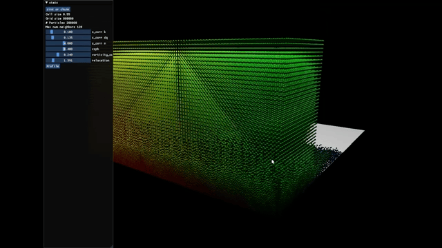

Group 6: Position-based Fluids, by Antoine De Gendt and Quentin Guignard

This is a Position-based Fluids (PBF) project running 200k particles at a frame rate of 60 FPS. The team also found that Taichi didn't support GPU sorting and raised a corresponding [issue](https://github.com/taichi-dev/taichi/issues/3764). Soon [AmesingFlank](https://github.com/AmesingFlank) implemented it in <https://github.com/taichi-dev/taichi/pull/3790>

- **Group 7**

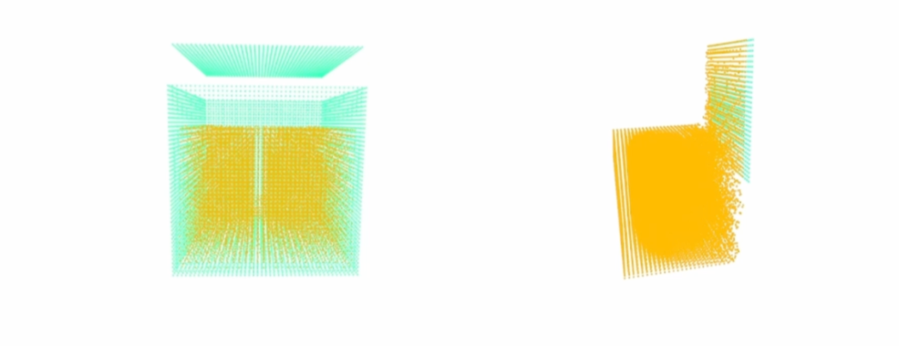

Group 7: SPH for Snow

This group even spotted a bug in a published paper when doing their project. Impressive. Their demo, hmm, is sort of on the thin side. Still, there's a beautiful simplicity to it.:-)

- **Group 15**

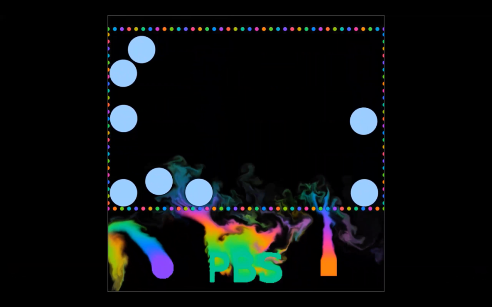

Group 15: Physically-based Simulation for Computer Graphics, by Joshua Aurand, Jasper Ermatinger, and Niall Siegenheim

This group used Taichi for fluid-structure interaction (FSI).

- **Group 16**

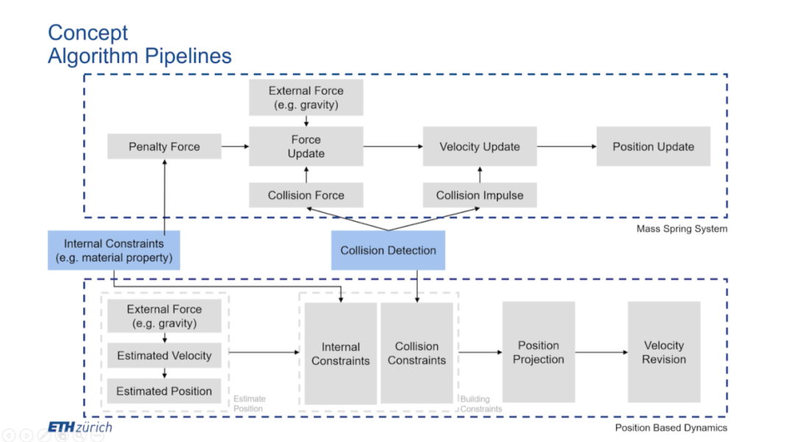

Group 16: Cloth Simulation - Position-based Dynamics, by Zeren Jiang, Zinuo You, and Yuhan Zhang

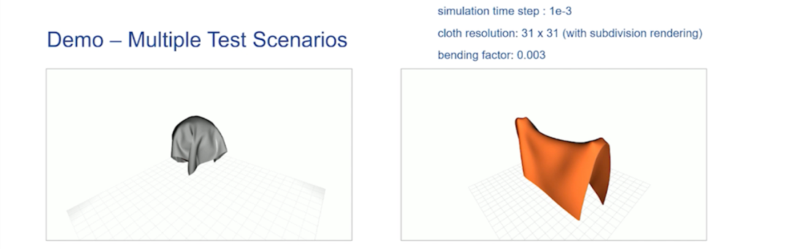
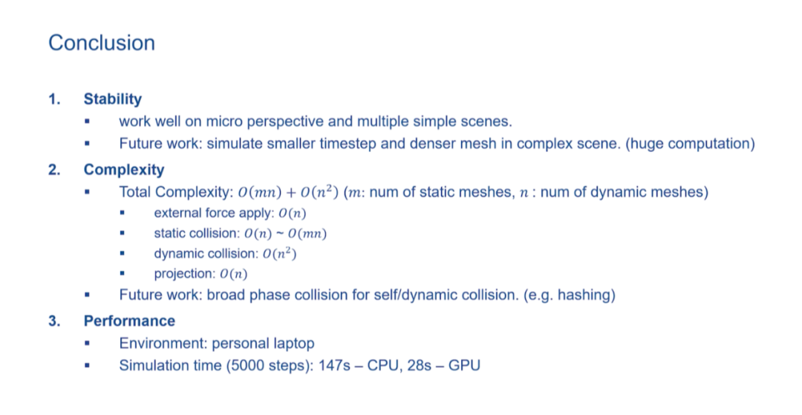
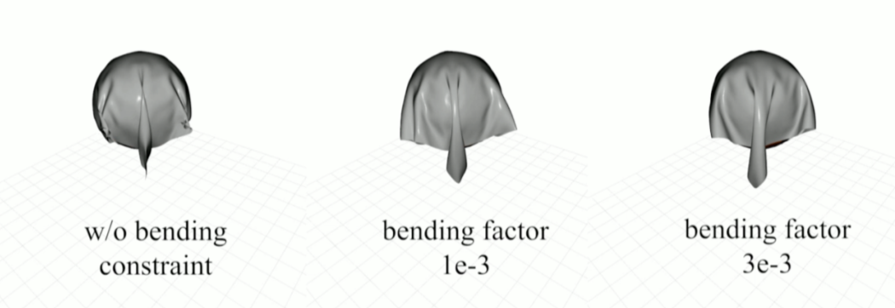

The performance becomes fivefold when running Taichi on GPU.

- **Group 24**

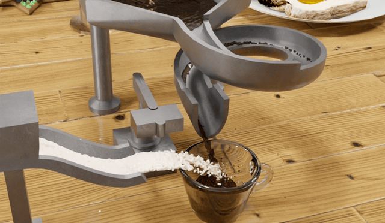

Group 24: Position-based Fluids, by Dano Roost, Jennifer Schurch, and Anne Marx

This group's project is artistic. They wrote a 3D PBF and exported a rendered video clip.

## What did the TA say?

According to Jingwei, the TA of the Physically-based Simulation project, a couple of years ago the students had to use the C++ framework, which requires much more scaffolding code when working with other frameworks. So, the students' assignments were mainly about implementing some very simple algorithms, such as rigid body and FLIP.

"The introduction of Taichi Lang in 2021 significantly increased productivity," Jingwei continued, "Now we can use Taichi Lang to implement more sophisticated algorithms, give them a paper list and leave them to implement one of these recent papers. Moreover, Taichi's automatic differentiation spared us the trouble of manual calculation."

I can tell from the interview that the user experience is by and large terrific and all of them have confidence in Taichi's future. Of course, there is room for improvement. I'll come to that shortly.

## Why did some not use Taichi Lang?

According to Jingwei, 2 out of the 30 groups didn't use Taichi Lang for their final projects. One group chose NumPy because they needed a direct solver. Taichi v0.8.7 does not support this but now we support it. See the [Sparse linear solver](https://docs.taichi-lang.org/docs/sparse_matrix#sparse-linear-solver). The other group needed to use second derivative and so switched to PyTorch. Well, I can also point out this feature is right on our [to-do list](https://github.com/orgs/taichi-dev/projects/1).

## What can be improved in Taichi and the future of Taichi

Taichi Lang is a new parallel programming language and it has a long way to go to become a de facto standard in parallel programming or high-performance computing. I collected many issues or requests from this interview. Some have been fixed in the recent Taichi releases, and some have not. Here I'll list some of the most frequently mentioned issues or questions:

- Many still put great importance on the quality of syntax errors. Though Taichi's overall user experience improved significantly according to the interview, we need to keep working on this feature.

- Taichi's compilation needs to be accelerated. Students usually need to debug their programs frequently. So it would put them off if they need to wait for a couple of seconds to see the results each time they update their programs. One straightforward solution is cache. You need to implement Ir serialization/deserialization. Our community has recently implemented this. See this issue: [Support offline-cache for llvm backend of Taichi · Issue #4401 · taichi-dev/taichi](https://github.com/taichi-dev/taichi/issues/4401)

- Some are uncertain about Taichi Lang's performance against other frameworks such as CUDA, and would require a comprehensive benchmarking report. Actually, we published a systematic [benchmarking report](https://github.com/taichi-dev/taichi_benchmark) when we released Taichi Lang v1.0.0. Taichi has more or less comparable performance to CUDA. But, for sure, you will have much fewer lines of code with Taichi Lang!

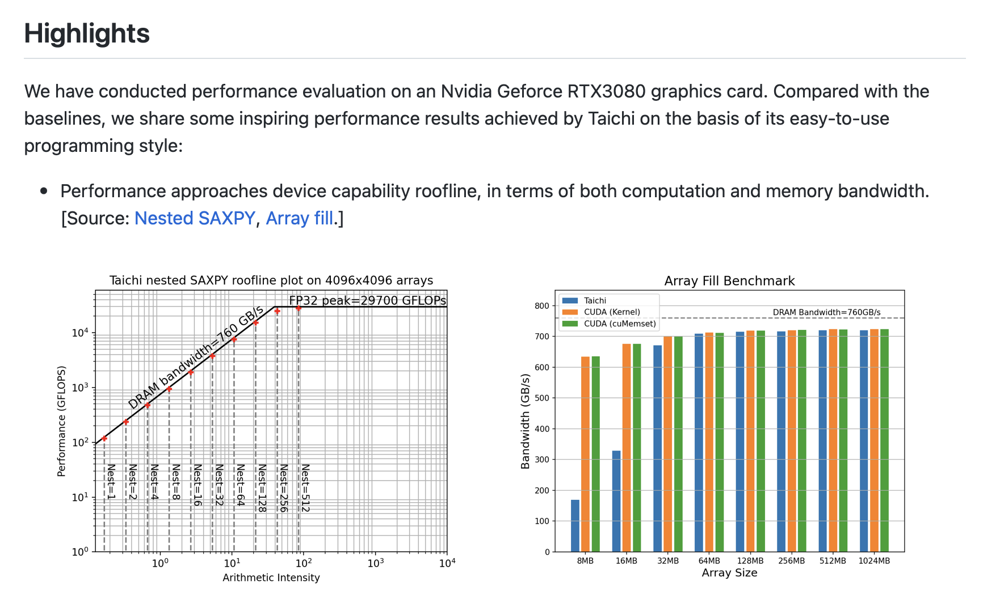
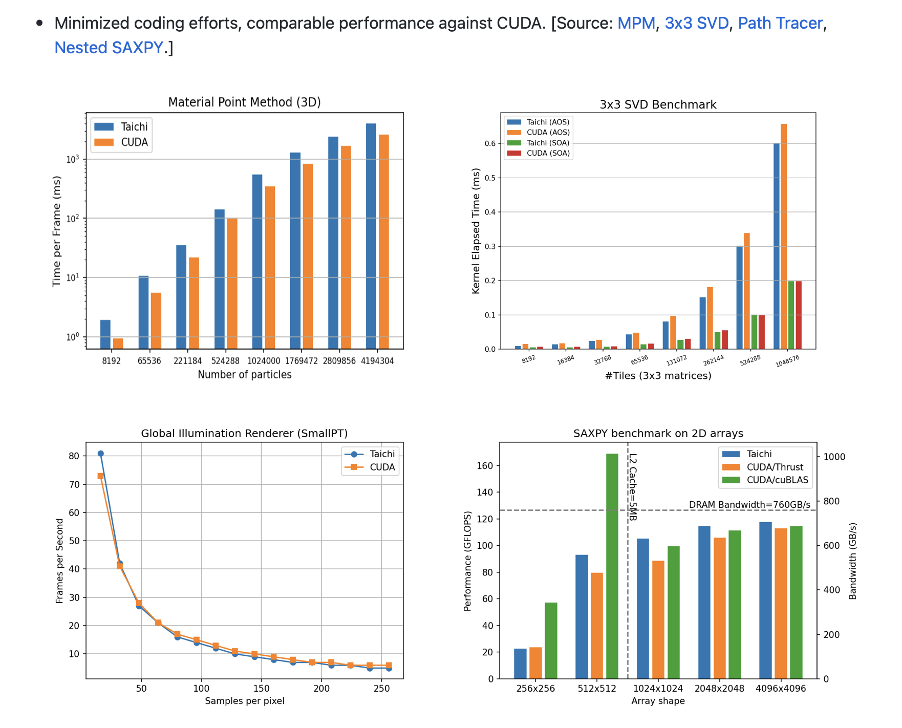
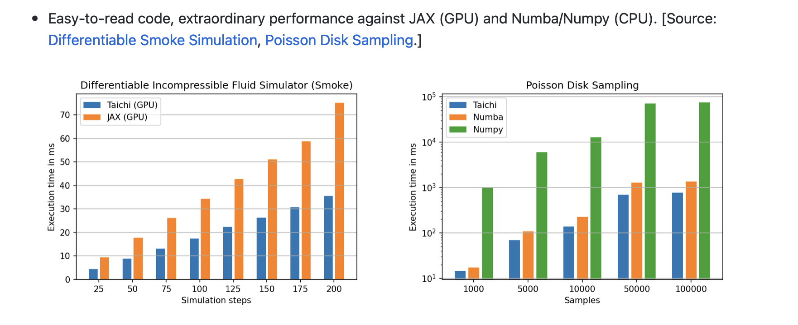

Taichi Lang vs. CUDA, JAX, C++

- Taichi's visualization tools such as GGUI need to be further improved. For example, they need to draw lines in Taichi's GGUI. Some complained they can't run GGUI on their Mac with v0.8.x. This is fixed as of v0.9.0.

- Serial mode. Sometimes, the user may not want the for-loops in the outermost scope to be parallelized. Previously, we worked around this by wrapping the for-loop with a `if 1`:. Hate to say it, it was a bit awkward. Now we've elegantly fixed this issue. See here: <https://github.com/taichi-dev/taichi/issues/4421>

- Second derivative. It is on our [to-do list](https://github.com/orgs/taichi-dev/projects/1/views/1).

- There are many, many more features we want to implement. If you are interested in us, welcome to join [our community](https://github.com/taichi-dev/taichi)! :-)

---

Oh, yes, if you have not yet used Taichi Lang, you are very welcome to try it out! It is just one command line away!

`python3 -m pip install --upgrade taichi`

To try out different Taichi demos:

`python3 -m taichi gallery`（or run `ti gallery` directly）

Note that, to try out these Taichi demos, your Taichi version needs to be at least later than v1.0.0.

Have fun, if you have any questions regarding Taichi Lang, I would be very happy to help!
