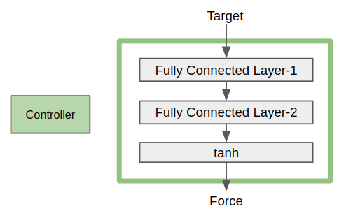

With the generated gradient information, a differentiable physical simulator can make the convergence of the machine learning process one order of magnitude faster than gradient-free algorithms, such as model-free reinforcement learning.

Therefore, it makes a lot of sense to keep simplifying or even revolutionizing the way to build high-performance differentiable physical simulators.

Taichi Lang is an open-source, parallel programming language embedded in Python, and can do the trick. The inbuilt Source Code Transformation (SCT) mechanism generates gradient kernels during compile time. To implement autodiff, Taichi uses the lightweight `tape` in the Python scope to record the launched Taichi kernels and then replay the gradient kernels in reverse order during backpropagation.


In the following part of this article, I will demonstrate how to create a "magic fountain" that learns by itself to hit a target with the least effort. Basically, the most essential components of the fountain are a **fluid simulator** and a **controller**: The former simulates fluid dynamics; the latter is the key to the magic - controlling the flow movements. The controller can be modeled with a neural network (NN), a "black box" that approximates decision functions under the hood without knowing the details of dynamics control. All is completed by Taichi Lang.


By the way, the complete code for the demo is available [here](https://github.com/taichi-dev/taichi/blob/master/python/taichi/examples/autodiff/diff_sph/diff_sph.py), just in case you want to skip the tedious reading (despite my efforts to make it a fun🥲) or think it serves you better to read along with the code.

## Simulator

A fountain is a typical free surface that can be ideally simulated with [smoothed-particle hydrodynamics (SPH)](https://en.wikipedia.org/wiki/Smoothed-particle_hydrodynamics)<sup>1</sup> because this method is purely Lagrangian, or particle-based. In addition, fluid simulation usually requires solving the Navier-Stokes equations, which involve the calculation of pressure and velocity. This section describes how to implement a differentiable fluid simulator based on the weakly compressible SPH (WCSPH).

- Differentiable physical simulator


A physical simulator that does not require gradients only needs to store a previous state and a new state, and this strategy is called double buffering. The two buffers are swapped each time the simulator conducts a timestep update. However, this strategy does not work with a differentiable physical simulator, which conforms to the chain rule and requires the entire history of the simulation states to compute derivatives. To preserve all historical states, the whole simulation is unrolled and every simulation step is recorded, as shown in the right part of the figure above.

- [Weakly Compressible Smooth Particle Hydrodynamics (WCSPH)](https://cg.informatik.uni-freiburg.de/publications/2007_SCA_SPH.pdf)<sup>2</sup>

WCSPH is a variant of SPH. Unlike common projection approaches that strictly enforce incompressibility, WCSPH avoids the time-consuming Poisson equation solvers by allowing small, user-defined density fluctuations[1] based on a state equation, such as the Tait equation.

I would not dive into the principles of SPH in this article. For readers who are interested, please refer to the [Eurographics Tutorial 2019](https://interactivecomputergraphics.github.io/SPH-Tutorial/pdf/SPH_Tutorial.pdf)<sup>3</sup> for details.

- Unrolled simulation

As mentioned above, differentiable physical simulation requires the whole story of the simulation. Therefore, an extra dimension `steps` is needed during the memory allocation of simulation-related physical quantities:

```
pos = ti.Vector.field(3, float)
vel = ti.Vector.field(3, float)
acc = ti.Vector.field(3, float)
den = ti.field(float)  pre = ti.field(float)
ti.root.dense(ti.ijk, (batch_size, steps, particle_num)).place(pos, vel, acc, den, pre)
```

- Density update

The density of a particle is determined by the summation of densities of its neighboring particles. Given that the number of particles in this case is limited (less than 10k), we do not apply any accelerated algorithm (such as the grid approach or compact hash) to the `neighbor search` process for simplicity.

- Pressure update

The pressure is updated based on the Tait equation. Densities lower than the rest density are clamped to avoid particle deficiency.

- Pressure and viscosity force

See [Reference](https://cg.informatik.uni-freiburg.de/publications/2007_SCA_SPH.pdf)<sup>2</sup> for the form of the pressure and viscosity force.

- Time integration

I apply the Symplectic Euler method to time integration and set the velocities of the particles in the target cube to the constant zero.

- Boundary handling

The boundary is handled using a collision-based method for simplicity. When fluid particles collide with a boundary, they bounce back to the simulation domain. The coefficient `damping` controls the rate of velocity loss during a collision.

## Neural network

Before getting down to the controller, I need to build the neural network training pipeline, which primarily consists of a **neural network** and an **optimizer**. I use a fully-connected layer to build the neural network and Stochastic Gradient Descent (SGD) as the optimization algorithm.

- A fully-connected network

A fully-connected network consists of an input, a hidden, and an output layer.

To construct the network, I should first decide on the input dimensions. In this case, the input layer handles four dimensions: `(n_models, batch_size, n_steps, n_input)`. They are chosen for good reason:

`n_models` can validate multiple trained models simultaneously, improving post-training validation efficiency;

`batching` improves the training efficiency;

`n_steps` tracks the value of each neuron as simulation steps are unrolled for gradient backpropagation;

`n_input` represents the input features of the neural network.

Two types of trainable parameters are involved here - weights and biases. `n_input * n_hidden` and `n_hidden` represent the number of weights and the number of biases, respectively.

The hierarchical memory layout for `weight`, `bias`, `hidden`, and `output` is shown below:


Though a fully-connected layer should not, in technical terms, contain non-linear activation functions, I use a non-linear activation function `tanh` here for simplicity.

- SGD

SGD is a popular optimizer for machine learning. We can quickly implement an SGD using Taichi Lang, which is quite straightforward as shown below:

```
@ti.data_oriented
class SGD:
    def __init__(self, params, lr):
        self.params = params
        self.lr = lr

    def step(self):
        for w in self.params:
            self._step(w)

    @ti.kernel
    def _step(self, w: ti.template()):
        for I in ti.grouped(w):
            w[I] -= min(max(w.grad[I], -20.0), 20.0) * self.lr

    def zero_grad(self):
        for w in self.params:
            w.grad.fill(0.0)
```

Note that I apply gradient clipping here to avoid exploding gradients as a result of the simulation being unrolled too many input timesteps.

## Controller

As shown in the figure below, I insert a controller before each WCSPH solver. The output of the controllers is fed into the solvers as part of the input.


A controller consists of two fully connected layers (fc1 and fc2) and an activation function `tanh`, as presented in the figure below. The input of the controller is `Target`, which represents the position of the center of the target cube. The output of the controller is `Force`, which is applied to the fluids inside the `actuation area` at the current step.



## Train it!

- Dataset

We can generate a training dataset, which contains targets at various positions within a specified region. For example, here I randomly generate 80 samples for training.

- Network and optimizer initialization

Then I construct a controller using a neural network with two fully-connected layers and initiate an SGD-based optimizer with the trainable parameters from the layers.

```
...
loss = ti.field(float, shape=(), needs_grad=True)
input_states = ti.field(float, shape=(model_num, steps, batch_size, n_input), needs_grad=True)

# Construct the fully-connected layers
fc1 = Linear(n_models=model_num, 
             batch_size=batch_size, 
             n_steps=steps, n_input=n_input, n_hidden=n_hidden,
             n_output=n_output, needs_grad=True, activation=False)
fc2 = Linear(n_models=model_num, 
             batch_size=batch_size, 
             n_steps=steps, n_input=n_output, n_hidden=n_hidden,
             n_output=n_output_act, needs_grad=True, activation=True)
fc1.weights_init()
fc2.weights_init()

# Feed trainable parameters to the optimizer
NNs = [fc1, fc2]
parameters = []
for layer in NNs:
    parameters.extend(layer.parameters())
optimizer = SGD(params=parameters, lr=learning_rate)
...
```

- Loss function

I design the magic fountain for two goals, which correspond to the loss term and the regularization term of the loss function, respectively.

The primary goal is to hit a specified target. In other words, the distances between fluid particles and the target center should be as short as possible. The loss term refers to the minimum distance between all particles and the target center throughout all simulation steps.

Additionally, I want the fountain to hit the target "with the least effort." Therefore, fluid particles are not expected to go too far away from the target center after hitting the target. I introduce the regularization term as the maximum distance between fluid particles and the target center throughout all simulation steps. Now, we are all set for training.

- Training

It takes 128 steps to go through a WCSPH simulation, and the fountain is supposed to hit the target by the end of the process. The optimizer updates the parameters of the neural network each time a simulation completes.

`with ti.ad.Tape(loss=loss)` captures all the Taichi kernels in the `with` scope and generates gradient kernels for computing the derivatives of `loss` with respect to the trainable parameters. The training is done within 10 optimization iterations.

```
for opt_iter in range(opt_iters):
    ...
    for current_data_offset in range(0, training_sample_num, batch_size):
        ...
        with ti.ad.Tape(loss=loss):
            for i in range(1, steps):
                initialize_density(i - 1)
                update_density(i - 1)
                update_pressure(i - 1)
                # Apply the NN based controller
                fc1.forward(i - 1, input_states)
                fc2.forward(i - 1, fc1.output)
                controller_output(i - 1)
                apply_force(i - 1)
                update_force(i - 1)
                advance(i)
                boundary_handle(i)
                compute_dist(i)
            compute_loss(steps - 1)
        optimizer.step()
        ...
```

Note: The trained model can be saved as Python pickle files.

## Play with the demo

To try out the demo of the trained model, please install the latest version of Taichi Lang:

```
pip install --upgrade taichi 
```

And run the demo:

```
ti example diff_sph
```

Here's hoping you have plenty of fun re-implementing the magic fountain or creating your own project with Taichi's autodiff!

### Reference:

1. <https://en.wikipedia.org/wiki/Smoothed-particle_hydrodynamics>

2. <https://cg.informatik.uni-freiburg.de/publications/2007_SCA_SPH.pdf>

3. <https://interactivecomputergraphics.github.io/SPH-Tutorial/pdf/SPH_Tutorial.pdf>
