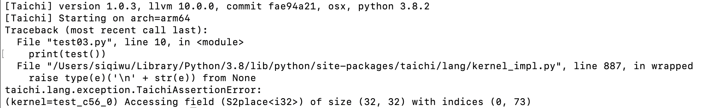

Hey guys! Welcome to my first Taichi cooking session!

From time to time, I hear our users ask questions like "how can I make my code cleaner and more straightforward" or "how can I further optimize the performance of my Taichi programs". So, I decided to share some very practical tips I myself often use when coding with Taichi, as well as a new feature `ti.dataclass`. Hopefully, you can make good use of them the next time you `ti.init`.

Before you proceed, make sure you are using the latest version of Taihci (v1.0.4). Upgrade and view our classy demos: 

```
pip install --upgrade taichi
ti gallery
```

If you have not installed Taichi, you can also run the demos below in [Colab](https://sourl.cn/GnGEEm).

## Five tips

### Tip 1: Auto-debug out-of-bound array accesses 

The array access violation issue is quite common during low-code programming (such as C++ and CUDA), and more often than not, a program would proceed regardless. You would not even realize it until you ended up with a wrong result. Even if, with a stroke of luck, you saw a segmentation fault triggered, you would find it hard to debug. Taichi solves this problem by providing an auto-debugging mode: just set `debug=True` when initiating Taichi. For example:

```
import taichi as ti

ti.init(arch=ti.cpu, debug=True)
f = ti.field(dtype=ti.i32, shape=(32, 32))

@ti.kernel
def test() -> ti.i32:
    return f[0, 73]
    
print(test())
```

And you will see an error appear:



To sum up: 

1. Bound checks are *not* available until you enable `debug=True`.

2. *Only* `ti.cpu` and `ti.cuda` are supported (you should switch to CPU/CUDA for bounds checking if you are using other backends).

3. Program performance may worsen after `debug=True` is turned on.

### Tip 2: Access a high-dimensional field by indexing integer vectors

It can be cumbersome to use `val[i, j, k, l]` to access an element in a high-dimensional field. Is there an easier way to do that? Well, we can index an integer vector directly (and conduct math operations based on such vectors) like this:

```
import taichi as ti
import matplotlib.pyplot as plt
import math

ti.init(arch=ti.cpu)
n = 512
img = ti.field(dtype=ti.i32, shape=(n, n))
img_magnified = ti.field(dtype=ti.i32, shape=(n, n))

@ti.kernel
def paint():
    for I in ti.grouped(img):
        f = (I / n) * math.pi * 10
        img[I] = ti.sin(f[0]) + ti.cos(f[1])

        
paint()
plt.imshow(img.to_numpy())
plt.show()

@ti.kernel
def magnify():
    for I in ti.grouped(img_magnified):
        img_magnified[I] = img[I // 2]

    
    # equivalent to
    # for i, j in img_magnified:
    #     img_magnified[i, j] = img[i // 2, j // 2]

magnify()
    
plt.imshow(img_magnified.to_numpy())
plt.show()
```

And run the program:


To sum up:

1. `for I in ti.grouped(img)`: Make sure you use `ti.grouped` to pack the index into `ti.Vector`.

2. If it is a floating-point vector, make sure you use `I.cast(ti.i32)` to cast it to an integer; otherwise, a warning would occur. 

3. The point of this tip is that your code becomes dimension-independent. You can apply the same set of code for either 2D or 3D.

### Tip 3: Serialize the outermost for loop

By default, Taichi automatically parallelizes the for loop at the outermost scope, but sometimes some programs need to be serialized. In this case, you just need `ti.loop_config(serialize=True)`:

```
import taichi as ti

ti.init(arch=ti.cpu)
n = 1024
val = ti.field(dtype=ti.i32, shape=n)

val.fill(1)

@ti.kernel
def prefix_sum():
    ti.loop_config(serialize=True)
    for i in range(1, n):
        val[i] += val[i - 1]

prefix_sum()
print(val)
```

And you will get the right result:


To sum up:

1. `ti.loop_config(serialize=True)` decorates the outermost for loop that immediately follows it. 

2. `ti.loop_config` works only for the *range-for* loop at the *outermost* scope. 

3. Inner for loops are serialized by default. 

In addition, you can try warp-level intrinsics to accelerate prefix sum if you are using CUDA: <https://github.com/taichi-dev/taichi/issues/4631>

### Tip 4: Interact with Python libraries, such as NumPy

"I really want to convert the output to the data types supported by NumPy so I can paint with Matplotlib or develop deep learning models with PyTorch!" 

Taichi provides a solution:

```
import taichi as ti
import matplotlib.pyplot as plt

ti.init(arch=ti.cpu)
n = 8192
factors = ti.field(dtype=ti.i32, shape=n)

@ti.kernel
def number_of_factors():
    for i in range(1, n):
        counter = 0
        for j in range(1, int(ti.floor(ti.sqrt(i))) + 1):
            if i % j == 0:
                if j * j == i:
                    counter += 1
                else:
                    counter += 2
        factors[i] = counter

number_of_factors()

plt.plot(factors.to_numpy(), '.')
# for i in range(n):
#     print(i, factors[i])
plt.show()

factors.to_torch()
```

I tried it out with Matplotlib and it went well: 


### Tip 5: Analyze performance with Taichi Profiler

"It takes a long time to run my program, but how can I figure out which Taichi kernel is the most time-consuming?"

Well begun is half done. It is crucial to locate the bottleneck before you start optimization, and Taichi's Profiler can do that for you: 

```
import taichi as ti

ti.init(arch=ti.cpu, kernel_profiler=True)
f = ti.field(ti.i32, shape=(32, 32))


@ti.kernel
def foo():
    for i in range(400000):
        f[0, 0] += i
        
    for i in range(100000):
        f[0, 1] += i


@ti.kernel
def bar():
    for i in range(1000):
        a = f[0, 31]

for i in range(10):
    foo()
bar()

ti.sync()
ti.profiler.print_kernel_profiler_info()
```

To give you an idea as to what the profiling report would look like:


To sum up: 

1. A kernel that has been fully optimized by the compiler would not generate profiling records (the   `bar` kernel mentioned above is a fully optimized one).

2. One kernel may generate multiple records of parallel for loops because they are divided into different tasks and assigned to separate devices.

3. Make sure you call `ti.sync()` before performance profiling if the program is running on GPU.

4. `jit_evaluator_xxx` can be ignored because it is automatically generated by the system.

5. Currently, `kernel_profiler` only supports CPU and CUDA. (But you are very encouraged to make contributions and add more backends!)

6. You are recommended to run performance profiling several times to observe the minimum or average execution time.

## Recent feature: ti.dataclass

This new feature is contributed by [bsavery](https://github.com/bsavery). It resembles `dataclasses.dataclass` introduced in Python 3.10 but functions in Taichi kernels.

A simple example of how to use this feature:

```
import taichi as ti
import taichi.math as tm
ti.init()

n_particles = 16

@ti.dataclass
class Particle:
    x: ti.types.vector(2, ti.f32) # position
    v: ti.types.vector(2, ti.f32) # velocity
    
    @ti.func
    def at(self, t):
        return self.x + self.v * t
    
    @ti.func
    def advance(self, dt):
        self.x = self.at(dt)

particles = Particle.field(shape=(n_particles, ))

dt = 0.1

@ti.kernel
def simulate():
    for i in particles:
        particles[i].x = tm.vec2(i, i)
        particles[i].v = tm.vec2(0, 100)

    for i in range(n_particles):
        particles[i].advance(5)

simulate()
for i in range(n_particles):
    print(particles[i].x)
```

Result:


*Hope you have fun with the following mpm99 demo written with this new feature!*

```
# MPM99 using ti.dataclass

import taichi as ti

ti.init(arch=ti.gpu)  # Try to run on GPU
quality = 1  # Use a larger value for higher-res simulations
n_particles, n_grid = 9000 * quality**2, 128 * quality
dx, inv_dx = 1 / n_grid, float(n_grid)
dt = 1e-4 / quality
p_vol, p_rho = (dx * 0.5)**2, 1
p_mass = p_vol * p_rho
E, nu = 0.1e4, 0.2  # Young's modulus and Poisson's ratio
mu_0, lambda_0 = E / (2 * (1 + nu)), E * nu / (
    (1 + nu) * (1 - 2 * nu))  # Lame parameters

@ti.dataclass
class Particle:
    x: ti.types.vector(2, ti.f32) # position
    v: ti.types.vector(2, ti.f32) # velocity
    C: ti.types.matrix(2, 2, ti.f32) # affine velocity field
    F: ti.types.matrix(2, 2, ti.f32) # deformation gradient
    Jp: ti.f32  # plastic deformation
    material: ti.i32  # material id

@ti.dataclass
class Grid:
    v: ti.types.vector(2, ti.f32) # grid node momentum/velocity
    m: ti.f32 # velocity

particles = Particle.field(shape=(n_particles, ))
grid = Grid.field(shape=(n_grid, n_grid))

@ti.kernel
def substep():
    for i, j in grid:
        grid.v[i, j] = [0, 0]
        grid.m[i, j] = 0
    for p in particles:  # Particle state update and scatter to grid (P2G)
        base = (particles.x[p] * inv_dx - 0.5).cast(int)
        fx = particles.x[p] * inv_dx - base.cast(float)
        # Quadratic kernels  [http://mpm.graphics   Eqn. 123, with x=fx, fx-1,fx-2]
        w = [0.5 * (1.5 - fx)**2, 0.75 - (fx - 1)**2, 0.5 * (fx - 0.5)**2]
        particles[p].F = (ti.Matrix.identity(float, 2) +
                dt * particles[p].C) @ particles[p].F  # deformation gradient update
        h = ti.exp(
            10 *
            (1.0 -
             particles[p].Jp))  # Hardening coefficient: snow gets harder when compressed
        if particles[p].material == 1:  # jelly, make it softer
            h = 0.3
        mu, la = mu_0 * h, lambda_0 * h
        if particles[p].material == 0:  # liquid
            mu = 0.0
        U, sig, V = ti.svd(particles[p].F)
        J = 1.0
        for d in ti.static(range(2)):
            new_sig = sig[d, d]
            if particles[p].material == 2:  # Snow
                new_sig = ti.min(ti.max(sig[d, d], 1 - 2.5e-2),
                                 1 + 4.5e-3)  # Plasticity
            particles[p].Jp *= sig[d, d] / new_sig
            sig[d, d] = new_sig
            J *= new_sig
        if particles[p].material == 0:  # Reset deformation gradient to avoid numerical instability
            particles.F[p] = ti.Matrix.identity(float, 2) * ti.sqrt(J)
        elif particles[p].material == 2:
            particles.F[p] = U @ sig @ V.transpose(
            )  # Reconstruct elastic deformation gradient after plasticity
        stress = 2 * mu * (particles[p].F - U @ V.transpose()) @ particles[p].F.transpose(
        ) + ti.Matrix.identity(float, 2) * la * J * (J - 1)
        stress = (-dt * p_vol * 4 * inv_dx * inv_dx) * stress
        affine = stress + p_mass * particles.C[p]
        for i, j in ti.static(ti.ndrange(
                3, 3)):  # Loop over 3x3 grid node neighborhood
            offset = ti.Vector([i, j])
            dpos = (offset.cast(float) - fx) * dx
            weight = w[i][0] * w[j][1]
            grid.v[base + offset] += weight * (p_mass * particles.v[p] + affine @ dpos)
            grid.m[base + offset] += weight * p_mass
    for i, j in grid:
        if grid.m[i, j] > 0:  # No need for epsilon here
            grid.v[i,
                   j] = (1 / grid.m[i, j]) * grid.v[i,
                                                    j]  # Momentum to velocity
            grid.v[i, j][1] -= dt * 50  # gravity
            if i < 3 and grid.v[i, j][0] < 0:
                grid.v[i, j][0] = 0  # Boundary conditions
            if i > n_grid - 3 and grid.v[i, j][0] > 0: grid.v[i, j][0] = 0
            if j < 3 and grid.v[i, j][1] < 0: grid.v[i, j][1] = 0
            if j > n_grid - 3 and grid.v[i, j][1] > 0: grid.v[i, j][1] = 0
    for p in particles.x:  # grid to particle (G2P)
        base = (particles.x[p] * inv_dx - 0.5).cast(int)
        fx = particles.x[p] * inv_dx - base.cast(float)
        w = [0.5 * (1.5 - fx)**2, 0.75 - (fx - 1.0)**2, 0.5 * (fx - 0.5)**2]
        new_v = ti.Vector.zero(float, 2)
        new_C = ti.Matrix.zero(float, 2, 2)
        for i, j in ti.static(ti.ndrange(
                3, 3)):  # loop over 3x3 grid node neighborhood
            dpos = ti.Vector([i, j]).cast(float) - fx
            g_v = grid.v[base + ti.Vector([i, j])]
            weight = w[i][0] * w[j][1]
            new_v += weight * g_v
            new_C += 4 * inv_dx * weight * g_v.outer_product(dpos)
        particles.v[p], particles.C[p] = new_v, new_C
        particles.x[p] += dt * particles.v[p]  # advection


group_size = n_particles // 3


@ti.kernel
def initialize():
    for i in range(n_particles):
        particles[i].x = [
            ti.random() * 0.2 + 0.3 + 0.10 * (i // group_size),
            ti.random() * 0.2 + 0.05 + 0.32 * (i // group_size)
        ]
        particles[i].material = i // group_size  # 0: fluid 1: jelly 2: snow
        particles[i].v = ti.Matrix([0, 0])
        particles[i].F = ti.Matrix([[1, 0], [0, 1]])
        particles[i].Jp = 1


def main():
    initialize()
    gui = ti.GUI("Taichi MLS-MPM-99", res=512, background_color=0x112F41)
    for i in range(400):
        for s in range(int(2e-3 // dt)):
            substep()
        gui.circles(particles.x.to_numpy(),
                    radius=1.5,
                    palette=[0x068587, 0xED553B, 0xEEEEF0],
                    palette_indices=particles.material)
        gui.show()


if __name__ == '__main__':
    main()
```

You are most welcome to give us your opinions on how to improve Taichi's features by opening an issue on GitHub: <https://github.com/taichi-dev/taichi>

Until next time, buy!👋
