It has been more than three years since I started working on a brand new programming language, Taichi-Lang, which is embedded in Python (but can perfectly run independently of Python) and designed for high-performance numerical computation. Two months ago, Taichi 1.0 was released, which is indeed a milestone for me personally and for our entire community. From an immature academic idea to an open-source project that has attracted hundreds of contributors, Taichi is committed to making graphics programming easier for content creators.

As I'm pondering over how to bring Taichi further and enlarge our creator community, I realize that many creators out there are looking for a handy tool yet remain unaware of Taichi. I decided that it definitely would help if I could explain Taichi's attributes, showcase what our users are doing with Taichi, and envision what we aspire to achieve in the long run.

(BTW, before you start, you may want to scan through the ToC or subheadings quickly and pick whatever you are interested in most. I'm trying to be informative, but as long as you find certain parts of this article helpful to your creation, then this article serves its purpose quite well!)

- [What is Taichi-Lang](#so--what-is-taichi-lang)
- [Application scenarios](#application-scenarios)
  - [Image processing](#image-processing)
  - [WebGPU](#webgpu)
  - [WebAssembly](#webassembly)
  - [Robotics](#robotics)
  - [Optics](#optics)
  - [Visual effects](#visual-effects)
  - [Numerical computing and fluid mechanics](#numerical-computing-and-fluid-mechanics)
  - [Molecular dynamics](#molecular-dynamics)
  - [Ahead of Time (AOT)](#ahead-of-time-aot-run-independently-of-python)
  - [Rendering](#rendering)
- [Where we are heading](#where-we-are-heading)

## So ... What is Taichi-Lang?

Initially positioned as a handy tool to support high-performance computer graphics, Taichi was designed based on the following three philosophies:

### Develop elegantly

1. Simple syntax: Python users can write Taichi code right away;
2. Naturally integrated into the Python ecosystem with easy interaction with packages like Numpy and PyTorch;
3. Automatic parallelization and differentiation spare you the implementation efforts;
4. Develop fancy computer graphics programs in considerably fewer lines of code.

### Run rapidly 

1. Born to harness parallelism in GPUs and multi-core CPUs;
2. Compiled Python just-in-time (JIT) to binary executable kernels;
3. Spatially sparse data structures: No wasted computation in empty space;
4. Quantized computation optimizes performance on mobile devices.

### Deploy universally

1. Supports multiple backends, including x64 & ARM CPUs, CUDA, Vulkan, Metal, and OpenGL Compute Shaders;
2. Ahead-of-time (AOT) compilation enables deployment on platforms without Python, including PCs, mobile devices, and even web browsers. 

Since its inception, Taichi has actually been applied to so many areas that we did not even imagine. Many of our users regard Taichi as *"a high-performance programming tool embedded in Python"* or *"a development system to deploy (mobile) compute shaders"*; and they represent the two major user groups of Taichi-Lang, depending on their reliance on Python (as discussed in the final part). 

Still, it does not mean that reality has gone astray; instead, it proves our foresight when we designed the vision for Taichi:

> Deploy parallel computing programs universally with the same set of code unchanged and high performance unscathed.

## Application scenarios

Not long ago, I was delightedly informed that ETH Zürich, which is acclaimed as the best university in continental Europe, [used Taichi in a computer graphics course](https://docs.taichi-lang.org/blog/eth-z%C3%BCrich-uses-taichi-lang-in-its-physically-based-simulation-source). Over the past year, Taichi has witnessed its user base enlarge fourfold. I myself am often surprised at our users' sophisticated use of Taichi and the creativity and vibrancy they injected into the community. 

To have a better understanding of the scenarios where Taichi is (spontaneously) applied, we launched [taichi-dev/awesome-taichi](https://github.com/taichi-dev/awesome-taichi) to collect and present top-notch Taichi-empowered projects. Most of the examples given below are available in this repo.

### Image processing

Poisson Image Editing (Pérez et al) is a frequently cited paper. [Trinkle23897](https://github.com/Trinkle23897/Fast-Poisson-Image-Editing/commits?author=Trinkle23897) and [shawnchan2014](https://github.com/shawnchan2014) implemented this [classic algorithm with Taichi as the backend](https://github.com/Trinkle23897/Fast-Poisson-Image-Editing):
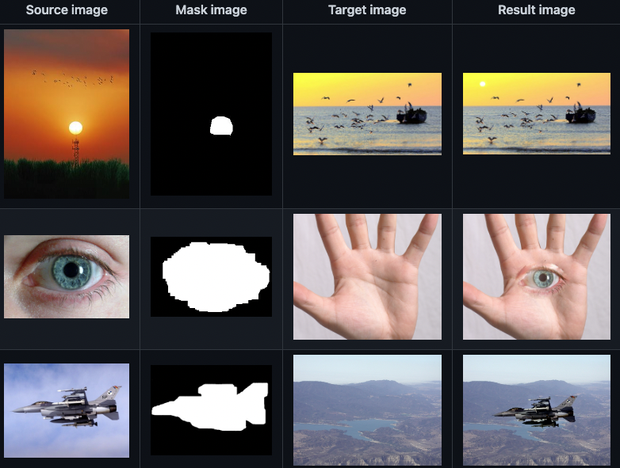

Fast Poisson Image Editing: How to grow an eye in your palm...

Advantages of using Taichi for image processing include: 

1. Portability: Programmed with Taichi and run on AMDGPU, CUDA, and multi-threaded CPU;
2. JIT compilation: No need to compile CUDA or C++ files on users' devices;
3. Development within Python: Just decorate the part of the code you want to parallelize with `@ti.kernel`.

### WebGPU

[Taichi.js](https://github.com/AmesingFlank/taichi.js) is a powerful project that adds a JS frontend to Taichi and compiles Taichi to WASM with Emscripten, allowing users to transform Javascript functions into WebGPU compute shaders for massive parallelization. If your browser supports WebGPU, you can try it out on [Playground | taichi.js](https://taichi-js.com/playground).
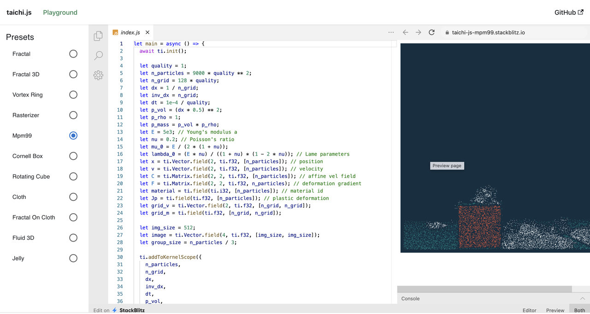

JS frontend compiles Taichi to WebGPU

### WebAssembly

[Taichi Zoo](https://zoo.taichi.graphics/) is another option to compile and run Taichi code on web pages, though WebASM is slightly outperformed by WebGPU in performance.
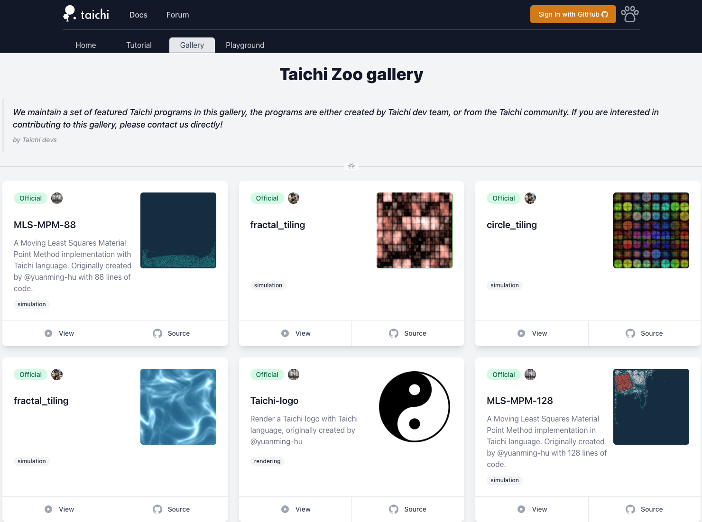

### Robotics

The following three projects all focus on differentiable physics. Relevant papers were accepted by the top machine learning conference ICLR. 

1. [DiffTaichi](https://github.com/taichi-dev/difftaichi), which optimizes robots' movements, is an early-stage trial of Taichi's AutoDiff feature:
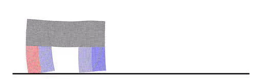

2. [PlasticineLab](https://github.com/hzaskywalker/PlasticineLab): A new differentiable physics benchmark, which includes a diverse collection of soft body manipulation tasks.
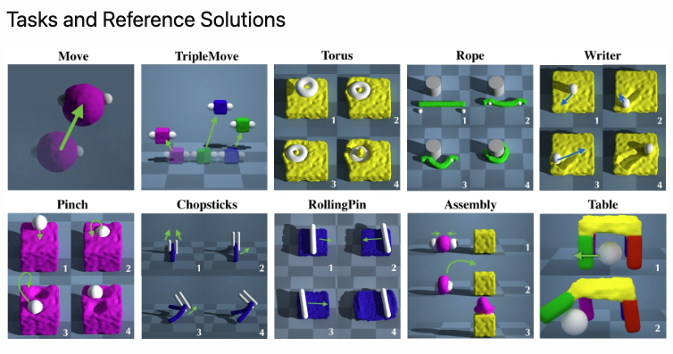

3. [CPDeform](https://github.com/lester0866/CPDeform): Contact Points Discovery for Soft-Body Manipulations with Differentiable Physics.
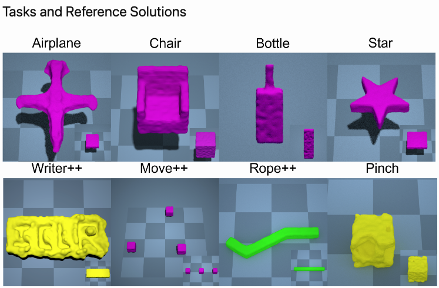

The updated version can control robots to shape objects at will

### Optics 

[Cameray](https://github.com/yslib/Cameray) is a project I personally find very intriguing. The author simulates SLR lenses with ray tracing, a feature enabled by Taichi, and offers a node editor as well. 

(I tried to run the project but DearPyGui didn't work properly! @[yslib](https://github.com/yslib) Could you plz update the project if you see this article because I'm kind of a shutterbug and really want to try it 🤣)
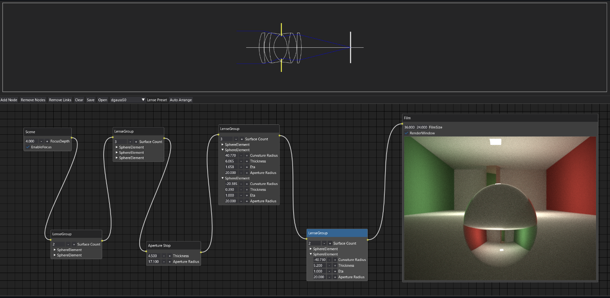

Hesitate to place an order for expensive SLR lenses? Experience the virtual ones first! You can even build a latest anti-dispersion model (though you have no choice but to stay in a Cornell box lol)

### Visual effects

You can use Taichi to create various physics solvers. A typical project is MLS-MPM-based [taichi_elements](https://github.com/taichi-dev/taichi_elements), which enables simulations with one billion particles on a single GPU - the highest precision ever achieved by MPM on a single GPU! And all it takes is about 1,000 lines of code.

Another notable project is [PyASFLIP](https://github.com/nepluno/pyasflip) by Raymond, showcasing a multi-scale model for coupling strands with shear-dependent liquid. You can refer to [the paper](http://yunfei.work/asflip/) accepted by SIGGRAPH 2021 for details.
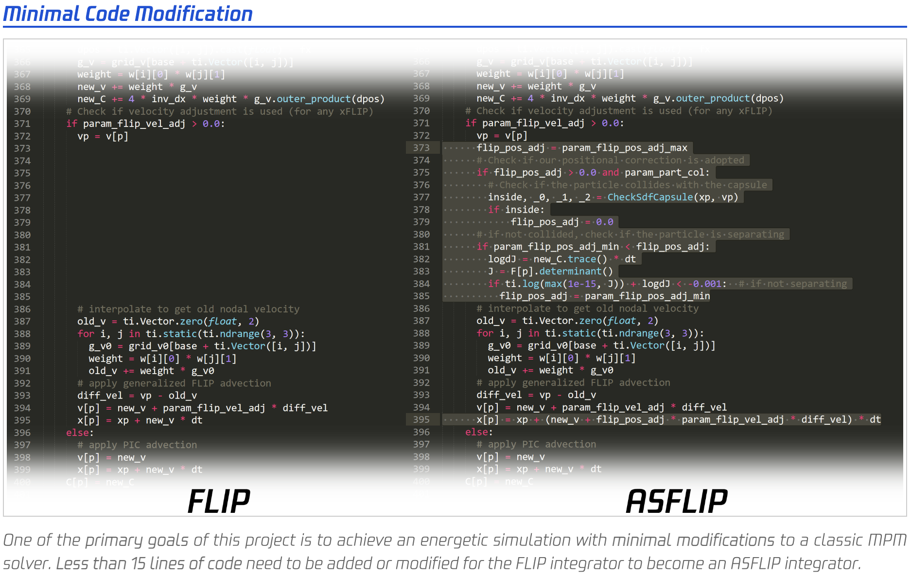

Deeply honored to find Taichi play a part in this project ...

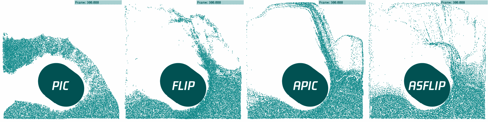

### Numerical computing and fluid mechanics

[LBM_Taichi](https://github.com/hietwll/LBM_Taichi) is one of the first computational fluid dynamics projects written in Taichi and still runs smoothly after two years.

Another beautiful project I want to share with you here is [2d-fluid-simulator](https://github.com/takah29/2d-fluid-simulator) contributed by a user from Japan, [takah29](https://github.com/takah29), based on the finite difference method:
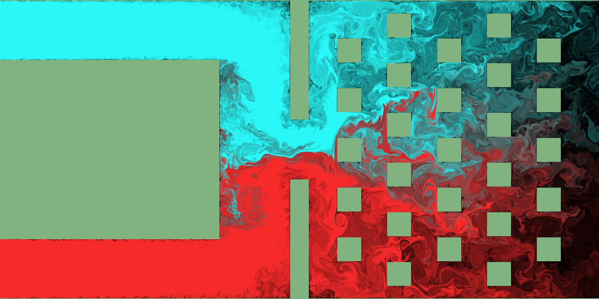
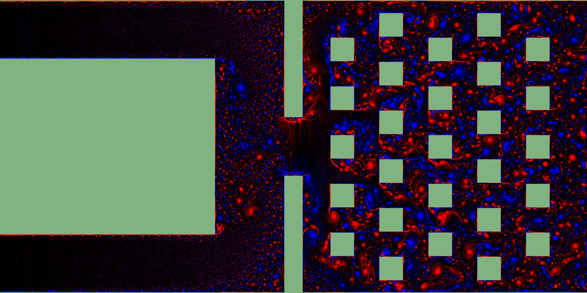

velocity field

### Molecular dynamics

[victoriacity](https://github.com/victoriacity) implemented a GPU-accelerated molecular dynamics project [Taichi MD](https://github.com/victoriacity/taichimd), as shown below:

Seems to be water molecules (if I didn't get it wrong 🤣)

### Ahead of time (AOT): Run independently of Python 

AOT compilation is an important feature to achieve easy deployment across backends, making Taichi readily adaptable to all kinds of real-world industrial scenarios. Backed by the strong support from the OPPO US Research Center, we are still working on the feature; you can have a rough idea of what we are doing by checking out [this article](https://docs.taichi-lang.org/blog/taichi-aot-the-solution-for-deploying-kernels-in-mobile-devices) or watching this demo:

### Rendering 

Renderers are not something we can avoid talking about since Taichi was designed for computer graphics at the very beginning. An impressive project is about the implementation of the classic [Ray Tracing in One Weekend using Taichi](https://github.com/bsavery/ray-tracing-one-weekend-taichi), by [bsavery](https://github.com/bsavery).
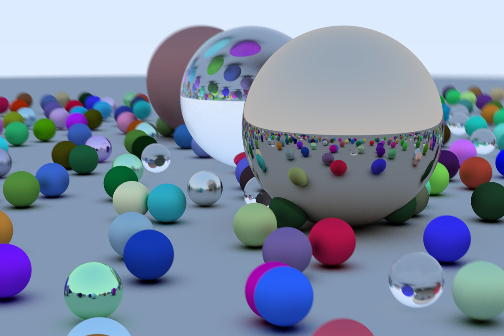

Ray Tracing in One Weekend, reproduced with Taichi

bsavery went on and explored more possibilities of Taichi in rendering: [Blender Python Renderer](https://github.com/bsavery/BlenderPythonRenderer), which is a GPU ray tracer embedded in Blender.
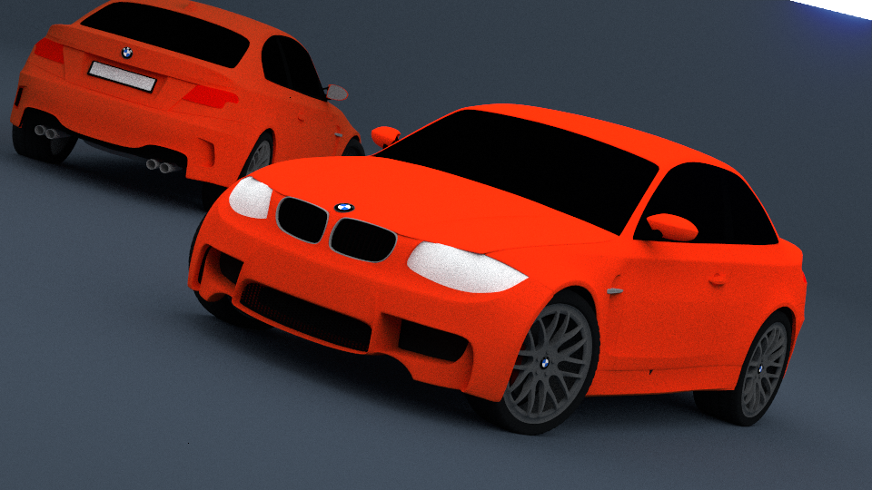

Some users are quite ambitious - in a good way :). For example, [theAfish](https://github.com/theAfish) simulates a black hole [accredition disk based on ray marching](https://github.com/theAfish/BlackHoleRayMarching) (regardless of rotation in this case). General relativity is also involved here - what a bonus!

Don't be intimidated by the Chinese README, though 😆

## Where we are heading 

As mentioned above, we recognize two major user groups of Taichi, depending on their reliance on Python. 

Group A consists of hardcore Python users who want to take advantage of Taichi's development efficiency and automatic parallelization. They are mostly students and researchers who often use Taichi together with other Python libraries, including Matplotlib, PyTorch, and OpenCV. Of course, they also care about portability and performance. For example, students at ETH Zürich need to ensure their CUDA programs can run on their classmates' AMDGPU effortlessly; they also want to achieve high-level performance comparable to CUDA.

Group B users are interested in using Taichi independently of Python to fuel productivity. They are attracted by Taichi's development efficiency, portability, and high performance and see its potential in settings like gaming, mobile applications, or browsers, where Python can hardly fit in. A lightweight Taichi that can be compiled easily into Metal, Vulkan, DirectX shader, and Neon/SSE would spare them a lot of effort. Particularly, Taichi's AOT feature can relieve their burden of executing compute shaders in real-time with limited power consumption. 

It is not hard to tell that the two groups have their needs overlapped to a large extent. To improve user experience, we will continue to optimize our CHI (Chi Hierarchical Instructions) IR, enhance modularization and reusability, and keep abreast of CUDA, Vulkan, and Metal developments. Specifically, we hope to further reduce the compile time for Group A users, and [CHI JIT Cache](https://github.com/taichi-dev/taichi/issues/4401) is one such attempt. Meanwhile, we are proceeding with the AOT development, including the Foreign Function Interface (FFI) feature, so that Group B users can use Taichi more comfortably.

We are proud that Taichi has proved its value to creators over the past three or so years. At the same time, we are more than aware that it is still a toddler (if compared with C++/CUDA/Rustc...) and has a long way to go to fulfill its vision. As an open-source language, Taichi evolves every time a user shares their experience or a contributor pulls requests. So, **if you are interested in Taichi** after reading this article, you can:

`pip install --upgrade taichi`

Experience our classy Taichi demos:
`ti gallery`

And join our developer community at <https://github.com/taichi-dev/taichi>.
