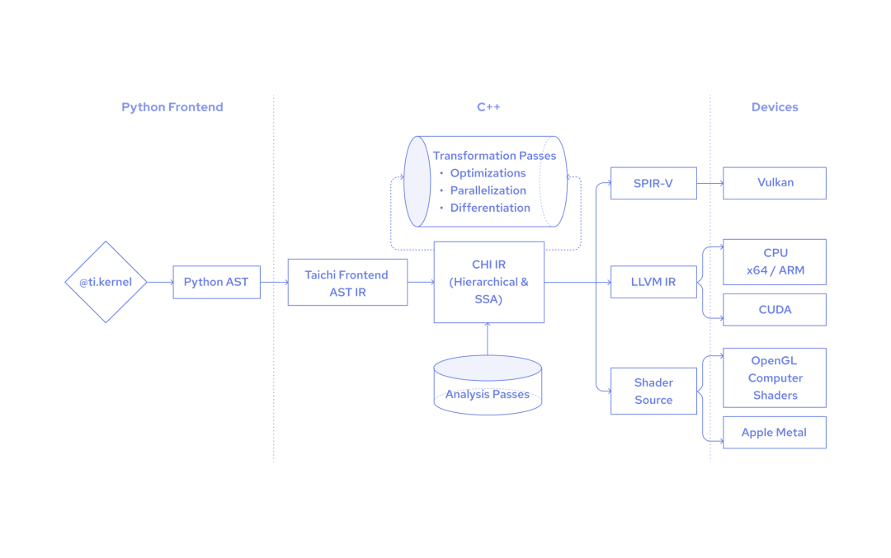

"How does Taichi differ from PyTorch? They are both embedded in Python and can run on GPU! And when should I choose Taichi over PyTorch or the other way around?"

Well, this is a question we are most frequently asked by Taichi community members - and expect to be asked by many potential users who are getting to know Taichi. As a former PyTorch developer and current Taichi compiler engineer, I think it would help a lot if I could walk through some of their basic concepts and draw a comparison between their working principles.

Let’s start with a simple fact: Except for some minor intersections, Taichi and PyTorch target almost completely different users. PyTorch is always your go-to option when it comes to *deep learning* tasks, such as computer vision and natural language processing; while Taichi specializes in *high-performance numerical computation* and really comes in handy for *physics simulation and visual computing* tasks. By combining their applications, we can exploit them simultaneously and save the trouble of reinventing the wheel, especially in scenarios like differentiable physics simulation or reinforcement learning.

## What do Taichi and PyTorch have in common?

From a high-level perspective, Taichi and PyTorch have the same aspiration - to further lower the bar for Python users. Compared with the static computational graph-based Tensorflow 1.0, PyTorch eager mode changes the game by building graphs on the fly as your Python program runs. Similarly, Taichi aims to enable more people to write high-performance parallel programs elegantly, even if they have little domain knowledge in CUDA, OpenGL, or Vulkan. 

Another feature they share in common is that they both take advantage of Python's ecosystem. You just need to type `pip install taichi` or `pip install torch`, and ta-da! You are all set!

## Where does the difference lie?

There is no point babbling on about how the two open-source projects start from Python and go beyond  - it all sounds a bit hollow. Let's move on to the exciting part: If we take a closer look at the design philosophies behind them, we can immediately spot a  fundamental difference between Taichi and PyTorch (or PyTorch eager mode, to be more accurate) right away.

For example:

```python
import torch
import torch.nn as nn
import torch.nn.functional as F
# Simplified version of https://github.com/pytorch/examples/blob/main/mnist/main.py#L21
class Net(nn.Module):
    def __init__(self):
        super(Net, self).__init__()
        self.conv1 = nn.Conv2d(1, 32, 3, 1)
        
     def forward(self, x):
        x = self.conv1(x)
        output = F.relu(x)
        return output
```

Python calls `nn.Conv2d()` from C++ to implement `x = self.conv1(x)`, and the output of convolution is returned to Python, which carries on to implement the next line of code: `output = F.relu(x)`. The gist is that everything is handled by the Python interpreter.

However, if you call a function `init()` in Taichi:

```python
x = ti.Vector.field(2, float, n_particles)
v = ti.Vector.field(2, float, n_particles)
C = ti.Matrix.field(2, 2, float, n_particles)
J = ti.field(float, n_particles)
@ti.kernel
def init():
    for i in range(n_particles):
        x[i] = [ti.random() * 0.4 + 0.2, ti.random() * 0.4 + 0.2]
        v[i] = [0, -1]
        J[i] = 1
init()
```

All Python needs to do is transform the function decorated with `@ti.kernel` to Python AST (Abstract Syntax Tree), and then Taichi kicks in, converting the Python AST to CHI IR and producing corresponding code/executables to run in the target backend. In other words, the `init()` function is executed by Taichi, and is independent of Python's runtime.


<center>Compilation process in a Taichi kernel</center>

It should be noted that the program entry point is still accessed by Python when you try to run `python taichi_demo.py`. In the code block above, the Python interpreter takes over after the function `init()` is executed.

Here I need to introduce a new concept, Taichi scope, to denote all the code decorated with `@ti.kernel`, as opposed to Python scope. When in the Python scope, you can easily index elements in a Taichi field or pass data from Numpy/PyTorch to a Taichi field. Still, you should pay extra attention to the boundary between the Taichi scope and the Python scope - you can import any Python library as you wish so long as you stay in the Python scope, but Taichi scope is managed by Taichi's own compiler and some libraries (like PIL and Matplotlib) are not supported.

The independent compilation and execution leaves Taichi with more possibilities. Though embedded in Python, Taichi is *not* Python-specific. In fact, our community developer [AmesingFlank](https://github.com/AmesingFlank/taichi.js/commits?author=AmesingFlank) is working on a Javascript frontend. You can check out some cool preliminary demos in the [taichi.js github repo](https://github.com/AmesingFlank/taichi.js).

## Taichi vs. TorchScript

So far, you may realize that Taichi compares more to TorchScript, which is part of the PyTorch ecosystem. Indeed, Taichi and TorchScript are both statically-typed DSLs (domain-specific languages); they are designed as a subset of Python language but can run independently of Python's runtime.

Similar to Taichi, TorchScript compiles the Python AST into an intermediate representation, which is internally optimized and decoupled from the Python runtime. We can easily convert the `NET` module presented above into the PyTorch script mode:

```python
scripted_module = torch.jit.script(Net())
# print(scripted_module.graph): generated IR graph
graph(%self : __torch__.Net,
      %x.1 : Tensor):
  %7 : Function = prim::Constant[name="relu"]()
  %6 : bool = prim::Constant[value=0]()
  %2 : __torch__.torch.nn.modules.conv.Conv2d = prim::GetAttr[name="conv1"](%self)
  %x.5 : Tensor = prim::CallMethod[name="forward"](%2, %x.1) # temp.py:11:12
  %output.1 : Tensor = prim::CallFunction(%7, %x.5, %6) # temp.py:12:17
  return (%output.1)
```

PyTorch users often do not treat eager mode and script mode separately because PyTorch ships them in one package. To make it easier to follow, I list the major differences among PyTorch eager mode, TorchScript, and Taichi in the following form:

|                    | Language used | Execution |
| ------             | ------        | ------    |
| PyTorch eager code | Python        | Python's runtime|
| TorchScript code (decorated by `@torch.jit.script`) | Statically-typed; a subset of Python | TorchScript's runtime |
| Taichi code (decorated by `@ti.kernel`) | Statically-typed; a subset of Python, yet with minor differences in syntax | Taichi's runtime|

Now you might wonder why we bother to devise all kinds of language subsets that can run independently when we already have Python, which is such a versatile tool. Well, Python's GIL and interpreter can be too clumsy to deploy in industrial scenarios that have stringent requirements for performance. Therefore, it is critical for users to be able to gain freedom from Python's runtime without coding all over again.

---
To recap, Taichi and Torchscript are statically-typed DSLs. Both look like Python code but specialize in completely different areas. Let me conclude my first blog with the following:

- TorchScript was designed to bridge research and production and based on a smooth transition from  eager mode. In this spirit, the decorator `@torch.jit.script` would not alter the behavior of any Python code.

- Taichi, on the other hand, was invented to facilitate high-performance parallel computing by overcoming Python's own limitations. Therefore, the decorator `@ti.kernel` changes the way Python code is executed. For example, the for loop at the outermost scope in a Taichi kernel is automatically parallelized.

I think there is enough information to digest, so I will stop here. If you are interested and want to learn more, check out my next blog on Taichi and PyTorch, where I dive deep into their data containers.