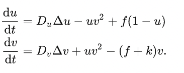

Python has become the most popular language in many rapidly evolving sectors, such as deep learning and data sciences. Yet its easy readability comes at the cost of performance. Of course, we all complain about program performance from time to time, and Python should certainly not take all the blame. Still, it's fair to say that Python's nature as an interpreted language does not help, especially in computation-intensive scenarios (e.g., when there are multiple nested for loops).

If you were ever caught up in one of the following situations, then this article is definitely for you.

- It takes forever to run a massive for loop in my Python program...
- My program has a bottleneck at some computation tasks. Rewriting the code in C++ and calling C++ with the ctypes module can work, but it's not straightforward enough and risks compilation failures when the code is transplanted to other devices. It would be much better if I could keep all the work done in a Python script.
- I am a loyal C++/Fortran user but would like to try out Python as it is gaining increasing popularity. However, rewriting code in Python is a nightmare - I feel the performance must be more than 100x slower than before!
- I need to process lots of images, and OpenCV cannot give me what I want. So I have to write nested loops manually. This is not very enjoyable.

If you can relate, then you might want to learn more about Taichi. For those who have not heard of Taichi: Taichi is a DSL embedded in Python but has its own compiler to take over the code decorated with `@ti.kernel`, achieving high-performance execution on all kinds of hardware, including CPU and GPU. One of the most notable advantages it delivers is speeding up Python code, hence no need to envy the performance of C++/CUDA any more. (See the [benchmark report](https://docs.taichi-lang.org/blog/is-taichi-lang-comparable-to-or-even-faster-than-cuda).)

The developers in the Taichi community put a lot of effort into improving Taichi's compatibility with Python. So far, all Taichi features can function perfectly after you `import taichi as ti`; You can easily install Taichi via the `pip install` command and interact with other Python libraries, including NumPy, Matplotlib, and PyTorch.

I am not exaggerating when I say Taichi can be your solution. In this blog, I'm going to explain how Taichi manages to accelerate Python code by at least 50 times through three examples:

- Count the number of primes less than N
- Find the longest common subsequence (LCS) via dynamic programming
- Solve reaction-diffusion equations

A shortcut to the source code of the three cases: <https://github.com/taichi-dev/faster-python-with-taichi>.

## Count the number of primes

I don't want my first example to be intimidating: let's write a small program that counts all the prime numbers less than a designated positive integer N. So long as you have some experience with Python, you can try to write your own version and see if it works.

Now, let me reveal a standard answer:

```python
"""Count the number of primes in range [1, n].
"""

def is_prime(n: int):
    result = True
    for k in range(2, int(n ** 0.5) + 1):
        if n % k == 0:
        result = False
        break
    return result
    
def count_primes(n: int) -> int:
    count = 0
    for k in range(2, n):
        if is_prime(k):
        count += 1
        
    return count
    
print(count_primes(1000000))
```

The logic behind this approach is intuitive. We first define a function `is_prime` to tell whether a positive integer N is a prime number - if yes, return 1; otherwise, return 0. Then we iterate over the integers from 2 to `sqrt(n)` and check whether they can divide N. Finally, collect the results. Done! Save the code above as a PY file (say, `count_primes.py`) and run the file with the command:

```plaintext
time python count_primes.py
```

This is what I got on my computer:

```plaintext
78498

real        0m2.235s
user        0m2.235s
sys        0m0.000s
```

When N is one million, it takes 2.235 seconds to get the final result. Maybe this is not a difficult task for your computer as well. But what about setting N to 10 million? I bet you have to wait for at least 30 seconds before you receive a response.

Now, let me show you the real magic. You do not need to modify the function body at all. Just import a Python library and add two decorators to the functions, and you have made all the difference:

```python
"""Count the number of primes below a given bound.
"""
import taichi as ti
ti.init()

@ti.func
def is_prime(n: int):
    result = True
    for k in range(2, int(n ** 0.5) + 1):
        if n % k == 0:
            result = False
            break
    return result

@ti.kernel
def count_primes(n: int) -> int:
    count = 0
    for k in range(2, n):
        if is_prime(k):
            count += 1

    return count

print(count_primes(1000000))
```

Again, run `time python count_primes.py`. This time, I saw the same answer but a much shorter processing time:

```plaintext
78498

real        0m0.363s
user        0m0.546s
sys        0m0.179s
```

Almost six times faster! I also changed N to 10 million, and Taichi takes 0.8s to compute, whereas Python uses 55s - a 70x speed-up! Taichi does not stop here. It also allows you to specify the backend to run the program, offering more options to optimize your program performance. For example, you can specify `ti.init(arch=ti.gpu)` when initiating Taichi. To share my first-hand data, Taichi consumes 0.45s to count all the prime numbers less than 10 million when running on GPU, a 120x improvement compared with Python.

Well, some may argue that this example may be good enough for students or entry-level Python users but is not very convincing for well-versed engineers who are facing complex real-life scenarios. I agree. Now you can expect something trickier in the following two cases.

## Dynamic programming

Dynamic programming is a handy algorithmic technique for optimization. The main idea of the approach is to sacrifice some storage for faster execution, i.e., storing the intermediate computation results to reduce execution time. Here, I take the longest common subsequence (LCS) problem as an example - a typical application case of dynamic programming from the book *Introduction to Algorithms*.

> A small distraction 😆: I just love the book like many others! I bought a Chinese translation of *Introduction to Algorithms* long, long ago (when I was far from being a proper programmer), and the book mentioned that the four authors were from MET. I was so perplexed at the time, wondering how four artists could be so good at programming. Later I realized that I must have bought a pirate. Ten years later, I became a doctoral student at MIT, and one of the RQE (Research Qualifying Exam) committee members was Professor Leiserson, a renowned "MET" scholar who co-authored *Introduction to Algorithms*.

Back to the point.

A subsequence is a subset of a sequence, with the relative ordering of elements unchanged. For instance, `[1, 2, 1]` is a subsequence of `[1, 2, 3, 1]`, but `[3, 2]` is not. Based on this concept, an LCS is defined as the longest subsequence common to all given sequences. It should be noted that there might be more than one LCS shared by given sequences, but the length of the LCS should be unique.

For sequence `a`:

```plaintext
a = [0, 1, 0, 2, 4, 3, 1, 2, 1]
```

and sequence `b`:

```plaintext
b = [4, 0, 1, 4, 5, 3, 1, 2]
```

Their LCS is:

```plaintext
LCS(a, b) = [0, 1, 4, 3, 1, 2]
```

LCS is widely applied to various scenarios where pattern comparison is involved. For example, LCS is used in the Linux diff or git diff tools to compare two texts; replacing numbers with ACGT, biologists can use LCS to compare genomic segments.

To find the LCS of two given sequences via dynamic programming, we can progressively find the length of the LCS of the first `i` elements of sequence `a` and the first `j` elements of sequence `b`. Then, increase `i` or `j` in turn and repeat the step till the final result is derived.

We use `f[i, j]` to refer to the length of this subsequence `LCS((prefix(a, i), prefix(b, j)`. `prefix(a, i)` denotes the first `i` elements of sequence `a`, i.e., `a[0], a[1], ..., a[i - 1]`. So, we can get the following recurrence relation:

```
f[i, j] = max(f[i - 1, j - 1] + (a[i - 1] == b[j - 1]),
              max(f[i - 1, j], f[i, j - 1]))
```

The full solution can be coded as:

```python
for i in range(1, len_a + 1):
    for j in range(1, len_b + 1):
        f[i, j] = max(f[i - 1, j - 1] + (a[i - 1] == b[j - 1]),
                      max(f[i - 1, j], f[i, j - 1]))
```

Now, accelerate it with Taichi:

```python
import taichi as ti
import numpy as np

ti.init(arch=ti.cpu)

benchmark = True

N = 15000

f = ti.field(dtype=ti.i32, shape=(N + 1, N + 1))

if benchmark:
    a_numpy = np.random.randint(0, 100, N, dtype=np.int32)
    b_numpy = np.random.randint(0, 100, N, dtype=np.int32)
else:
    a_numpy = np.array([0, 1, 0, 2, 4, 3, 1, 2, 1], dtype=np.int32)
    b_numpy = np.array([4, 0, 1, 4, 5, 3, 1, 2], dtype=np.int32)


@ti.kernel
def compute_lcs(a: ti.types.ndarray(), b: ti.types.ndarray()) -> ti.i32:
    len_a, len_b = a.shape[0], b.shape[0]

    ti.loop_config(serialize=True) # To forbid automatic parallelism
    for i in range(1, len_a + 1):
        for j in range(1, len_b + 1):
            f[i, j] = max(f[i - 1, j - 1] + (a[i - 1] == b[j - 1]),
                          max(f[i - 1, j], f[i, j - 1]))

    return f[len_a, len_b]


print(compute_lcs(a_numpy, b_numpy))
```

Save the code above as a PY file `lcs.py` and run it in the terminal:

```
time python lcs.py
```

The result on my computer:

```
2721

real        0m1.409s
user        0m1.112s
sys        0m0.549s
```

You can try to [implement the LCS solution using Taichi and Numpy](https://github.com/taichi-dev/faster-python-with-taichi/blob/main/lcs.py), respectively, to compare program performance. When `N=15000`, my Taichi program finishes in 0.9s, while the NumPy version takes 476s - a drastic disparity of over 500x! This is because NumPy specializes in array-based operations while Taichi features a higher level of granularity by directly manipulating elements in data containers.

## Reaction-diffusion equations

Spots of cheetahs, stripes of zebras, dots and lines of pufferfish... The intriguing patterns that make creatures so distinguishable (or inconspicuous) make us wonder about the secrets of mother nature.


The elements in such patterns are irregularly distributed, yet not in a state of disorder at all. From the evolutionary perspective, they are a result of natural selection over the centuries. But is there an underlying rule that "draws" the patterns? Alan Turing (inventor of the Turing Machine) was the first to come up with a model to describe the phenomenon. In his paper *The Chemical Basis of Morphogenesis*, he introduces two chemical substances (U and V) to simulate the generation of the patterns. The relationship between U and V resembles that between prey and predator. They move on their own and interact with each other:

1. Initially, U and V are randomly dispersed over a domain;
2. At each timestep, they diffuse into neighboring space;
3. When U and V meet, a proportion of U is swallowed by V. Consequently, the concentration of V increases;
4. To avoid U being eradicated by V, we add a certain percentage (f) of U and remove a certain percentage (k) of V at each timestep.

The process described above can be summarized in the following reaction-diffusion equation:



There are four key parameters: `Du` (diffusion speed of U), `Dv` (diffusion speed of V), `f` (short for feed, which controls the addition of U), and `k` (short for kill, which controls the removal of V).

To simulate the process in Taichi, we first need to create a grid to cover the domain and use `vec2` to represent the concentration of U and V in the grid. The numerical computation of the Laplace operator requires access to the neighboring grids. To avoid updating and reading data in the same loop, we should create two grids of the identical shape `W × H × 2`. Each time we access data from one grid, we write the updated data into the other and then switch grids. I design the data structure as such:

```
W, H = 800, 600
uv = ti.Vector.field(2, float, shape=(2, W, H)) 
```

In the beginning, we set the concentration of U in the grid to 1 everywhere and place V in 50 randomly-selected locations:

```python
import numpy as np

uv_grid = np.zeros((2, W, H, 2), dtype=np.float32)
uv_grid[0, :, :, 0] = 1.0
rand_rows = np.random.choice(range(W), 50)
rand_cols = np.random.choice(range(H), 50)
uv_grid[0, rand_rows, rand_cols, 1] = 1.0
uv.from_numpy(uv_grid)
```

The actual computation can be done within 10 lines of code:

```python
@ti.kernel
def compute(phase: int):
    for i, j in ti.ndrange(W, H):
        cen = uv[phase, i, j]
        lapl = uv[phase, i + 1, j] + uv[phase, i, j + 1] + uv[phase, i - 1, j] + uv[phase, i, j - 1] - 4.0 * cen
        du = Du * lapl[0] - cen[0] * cen[1] * cen[1] + feed * (1 - cen[0])
        dv = Dv * lapl[1] + cen[0] * cen[1] * cen[1] - (feed + kill) * cen[1]
        val = cen + 0.5 * tm.vec2(du, dv)
        uv[1 - phase, i, j] = val
```

We use an integer `phase` (either 0 or 1) to control which grid we read data from. Correspondingly, `1-phase` directs to the other grid that accepts updated data.

The final step is to dye the substances according to the concentration of V. The final effects are striking:


The interesting thing is that we can always end up with similar patterns despite that the initial concentration of V is randomly set.

We also provide [two implementations based on Taichi and Numba](https://github.com/taichi-dev/faster-python-with-taichi/blob/main/reaction_diffusion_taichi.py), respectively. Though both packages use their own compilers, the Taichi version chooses GPU as the backend, exceeding 300fps with ease; while Numba relies on CPU and only reaches about 30fps.

## Taichi vs. other Python packages

So far, I have elaborated on three cases to prove that Taichi can effectively, if not dramatically, accelerate Python programs. Simply put, Taichi's strength in high-performance computation boils down to its design philosophy:

1. Taichi is a compiled language.
2. Taichi can automatically execute your code in parallel, while Python is usually single-threaded.
3. Taichi can run on both CPU and GPU, while Python runs on CPU.

Of course, Python is an inclusive universe where many tools are available to expedite native Python code. It makes no sense to boast about Taichi if I safely ignore other Python libraries. Hence, I summarize the pros and cons of Taichi and similar packages as follows:

**Taichi vs. NumPy/JAX/PyTorch/TensorFlow**: The latter group is highly dependent on array-based operations, and thus is friendly to users interested in data science and deep learning. However, they are much less flexible than Taichi when it comes to scientific computing. In the prime number case above, it would be less straightforward to complete the calculation with arrays. In terms of the granularity of math operations, Taichi compares more to C++ and CUDA as it can directly manipulate each iteration of the loops.

**Taichi vs. Cython**: Cython is also used frequently to improve Python code performance. In fact, many modules in the official NumPy and SciPy code are written and compiled in Cython. On the flip side, readability is compromised, and Cython does not support switching to GPU (although it allows parallel computing to a certain degree).

**Taichi vs. Numba**: As its name indicates, Numba is tailored for Numpy. Numba is recommended if your functions involve vectorization of Numpy arrays. Compared with Numba, Taichi enjoys the following advantages:

- Taichi supports multiple data types, including `struct`, `dataclass`, `quant`, and `sparse`, and allows you to adjust memory layout flexibly. This feature is extremely desirable when a program handles massive amounts of data. However, Numba only performs best when dealing with dense NumPy arrays.
- Taichi can call different GPU backends for computation, making large-scale parallel programming (such as particle simulation or rendering) as easy as winking. But it would be hard even to imagine writing a renderer in Numba.

**Taichi vs. PyPy**: PyPy is a JIT compiler launched as early as in 2007. Similar to Taichi, PyPy also accelerates Python code via compilation. PyPy is attractive because users can keep Python code as it is without even moderate modification, which leaves restricted options for optimization, though. PyPy is alluringly painful in this sense. If you expect a greater leap in performance, Taichi can achieve the end perfectly. But you need to familiarize yourself with Taichi's syntax and assumptions, which differ from Python's slightly.

**Taichi vs. ctypes**: ctypes allows users to call C functions from Python and run programs written in C++/CUDA in Python through a C-compatible API. However, ctypes further elevates the usage barrier: To write a satisfactory program, users need to command C, Python, CMake, CUDA, and even more languages. It is much more reassuring to keep everything in Python.

To sum up, there is no universal solution to all optimization problems. That's partially why Python is fascinating. You can always find/create an easy-to-use tool that can precisely solve your problem at hand. In terms of scientific computing, Taichi is an ideal option within Python that can help you achieve performance comparable to C/C++.

