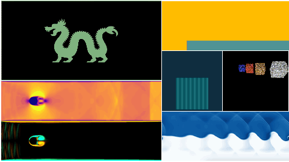
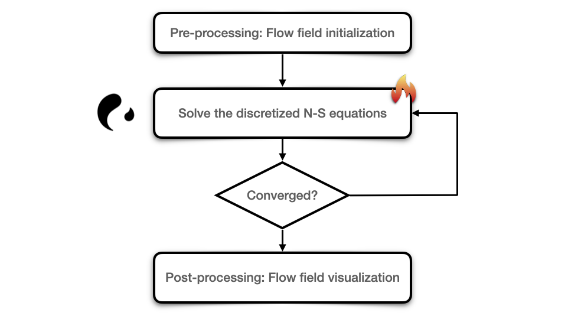
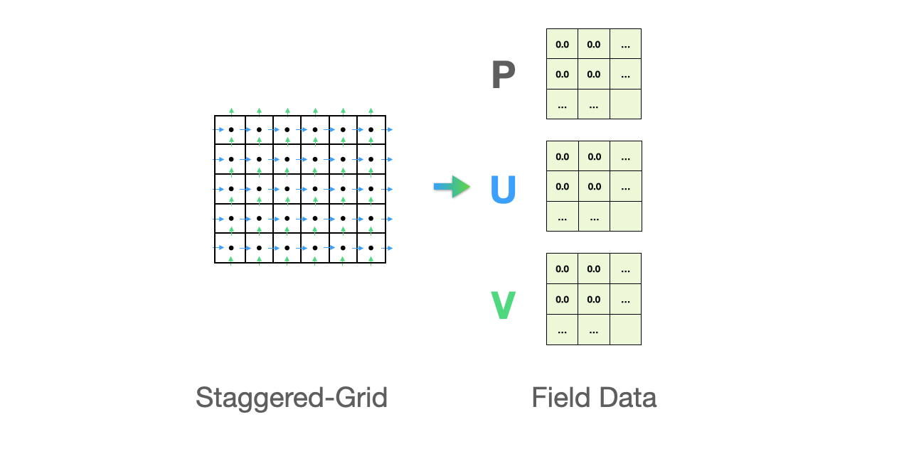
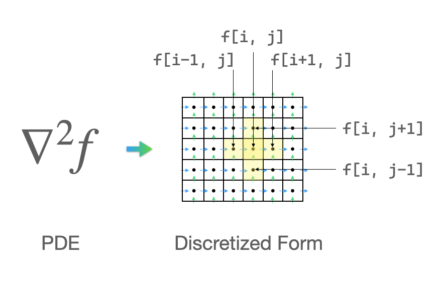
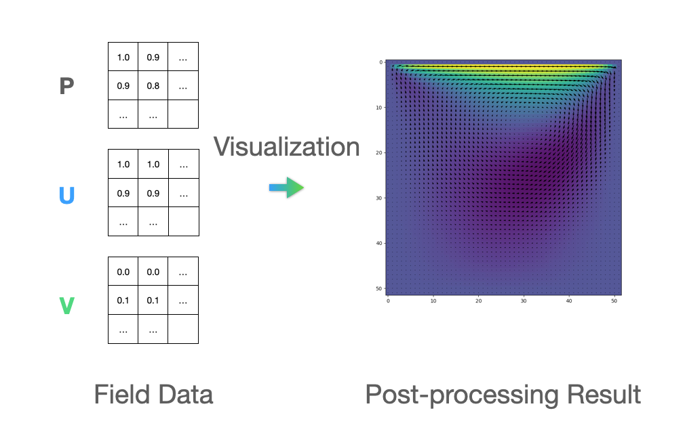
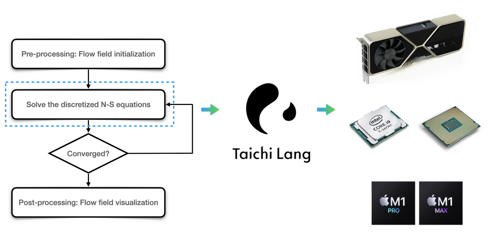

Computational fluid dynamics (CFD) is a branch of fluid mechanics that endeavors to precisely reproduce the behavior of liquid/gas flows and their interaction with solid boundaries. It plays a vital role in such sectors as visual effects, virtual reality, and industrial design. 


<center>Enlivened ocean simulation in the movie Moana</center>

Although we are delightedly seeing an increasing number of impressive CFD projects implemented with Taichi (as presented in Taichi's [CFD repo](https://github.com/houkensjtu/taichi-fluid)), it remains confusing for outsiders as to how a programming language designed for computer graphics can facilitate high-performance computation and even write CFD programs directly.


<center>Selected CFD demos</center>

Well, this blog will answer this question by explaining how Taichi fits in with the needs of CFD. And hopefully, you will find it worth a try in your next project.

## What CFD expects a programming language to do?

Before touching upon how Taichi addresses numerical computation, we first need to figure out what a typical CFD simulation entails. The image below illustrates the four major steps of a CFD simulation based on the Eulerian method:



Let me explain the whole process step-by-step.

First, pre-processing requires us to define the data structures (in most cases, 2D/3D arrays) that save the physical parameters of the flow field, such as velocity components (U and V), pressure (P), and density, and then set initial values for the flow variables.



To find the solution to the discretized Navier-Stokes equations is the most time-consuming part we need to deal with.  Navier-Stoke equations are partial differential equations that describe the flow of incompressible fluids. Discretization means using the algebraic polynomials of discrete values to approximate the solutions to differential equations. For example, the Laplace operator of a scalar function can be denoted with the five-point discrete scheme:

$$\nabla ^2 f \approx
\frac {1}{\Delta x ^2}（4\cdot f_{i,j} - f_{i-1,j} - f_{i+1,j} - f_{i,j-1} - f_{i,j+1}）$$



Now, we need to work out the solution to the discretized equations. Given that this is a linear system Ax=b in question, we can choose from either a direct solver or an iterative solver, depending on the size and sparsity of the matrix A, to derive the unknown vectors. One thing worth our attention here: *Both the discretization of differential equations and the solution to the linear system entail similar but mutually-independent computations of the vast amount of elements in the target field, which can be effectively accelerated if parallelized*. We will come back to this point later.

Finally, in the post-processing stage, we need to visualize the flow field data derived from the aforementioned steps into the more intuitive vector plots or contour plots. The image below right is visualized in Matplotlib, representing the velocity vector of the lid-driven cavity flows. Apart from Matplotlib, there are multiple tools available for visualization, including Taichi's built-in GUI system.



Faced with the demanding computational complexity, an ideal programming language for CFD should be able to help with discretization and visualization efficiently. Now, let's see what Taichi can do to save our efforts and improve the computation efficiency.

## Can Taichi meet the needs?

Designed for computer graphics, Taichi is equipped with data structures friendly to large-scale numerical computation as well as and an automatic parallelism parallelization mechanism for performance speedup. At the same time, as a domain-specific language (DSL) embedded in Python, Taichi is integrated seamlessly with the Python ecosystem. So, we can leave the part that needs high-performance parallel computing to Taichi while keeping everything else in native Python code.


<center>Taichi can accelerate large-scale parallel computing in Step 2</center>

Now, we take the same Eulerian method as an example.

### Data structures

Taichi provides a data container `field`, which is essentially a multi-dimensional array of elements. To parallelize the solution process, we need to save the flow field data in a Taichi field. Luckily, `field` accepts scalars and vectors, which makes it straightforward to represent a flow field. For example, we can define a 640x480 scalar field of floating-point numbers as follows:

```python
f_2d = ti.field(float, shape=(640, 480))
```

Similarly, the line of code below represents a 2D vector field of in the shape 640x480:

```python
v_2d = ti.Vector.field(n=2, dtype=float, shape=(640, 480))
```

Other valid data structures include matrices and user-defined structs, as detailed in the [doc site](https://docs.taichi-lang.org/docs/field).

### Parallelization

Suppose we want to apply the Laplace operator to the scalar field f_2d. We should first create a new field for storing the results:

```python
f_2d_grad2 = ti.field(float, shape=(640, 480))
```

Then, we need to traverse the elements in the new field when calculating the Laplace operator. Taichi provides an easy-to-use struct-for statement to make traversing much more convenient:

```python
for i,j in f_2d_grad2:
    f_2d_grad2[i,j] = 4 * f_2d[i,j] - f_2d[i-1,j] \
                      - f_2d[i+1,j] - f_2d[i,j-1] - f_2d[i,j+1]
```

However, the struct-for statement is a special syntax unique to Taichi and cannot be processed by Python. Therefore, we need to have Taichi take this over and accelerate the computation by wrapping the statement inside a Taichi kernel:

```python
@ti.kernel
def fgrad2():
    for i,j in f_2d_grad:
        f_2d_grad2[i,j] = 4 * f_2d[i,j] - f_2d[i-1,j] \
                          - f_2d[i+1,j] - f_2d[i,j-1] - f_2d[i,j+1]
```

The decorator `@ti.kernel` serves as an entry point when Taichi kicks in and does the trick. We can understand its job as such: the decorator takes in and analyzes a function and returns an automatically parallelized version:

```python
fgrad2_ti = ti.kernel(fgrad2)
```

When we call the function, the program hands over control from Python to Taichi and performs computation tasks on multiple cores in parallel, resulting in a considerable improvement in computational speed.

### Data visualization

Taichi also has an elementary built-in GUI system that you can use as a visualization tool to quickly inspect the flow field dynamics when coding numerical computation tasks. For instance, the following concise lines generate a grayscale image to visualize the field `f_2d`. Note that `gui.set_image` can accept both Taichi fields and NumPy ndarrays:

```python
gui = ti.GUI('Title', (640, 480))
while gui.running:
    gui.set_image(f_2d)
    gui.show()
```

Taichi's GUI system can meet the most basic needs for visualization. You may still need other post-production software to achieve more complex rendering or animation effects. You can refer to the [doc site](https://docs.taichi-lang.org/docs/gui_system) to check the complete features of the GUI system.

## Application of Taichi kernels to CFD

### When to bring @ti.kernel into play

For those unfamiliar with the term "kernel": A kernel is a fraction of code designed for GPU computing. To run on GPU cores, a kernel is expected to contain a large amount of repetitive or similar but mutually-independent computation tasks. For example, when devising functions to traverse all pixels on the screen and update the color of each pixel, graphics engineers would designate such functions as kernels so that they can be recognized by the compiler and deployed to multiple cores for parallelization. 

### Scenarios where @ti.kernel do not apply

Obviously, not all loops can be parallelized. A typical exception is the Fibonacci sequence where each number is the sum of the two preceding ones. Hence, the calculation of a Fibonacci number cannot be dealt with independently. When it comes to CFD, the update of time increments is determined by the preceding time step and should thus be performed serially, whereas computation within the same iteration at the same time step is an ideal scenario for parallelization.

We will further elaborate on the application of Taichi kernels in the upcoming blogs on CFD.

## Recap

The most computation-intensive step in CFD is the discretization of differential equations, which involves massive operations of 2D or 3D data arrays. Taichi's data container makes the representation of a flow field intuitive and the *automatic parallelization mechanism significantly saves the computational time*. In addition, the built-in GUI system offers a convenient visualization solution to track fluid dynamics with only a few lines of code.

Here's hoping that Taichi can become a good companion for your CFD simulation projects. We look forward to seeing your fluid simulation demos, which may secure a place in our [CFD repo](https://github.com/houkensjtu/taichi-fluid)!
