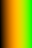
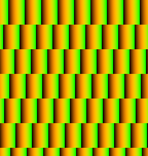
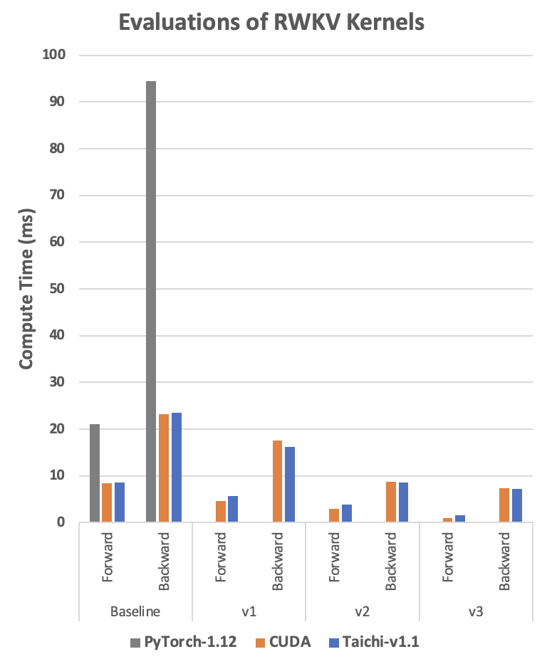

Our previous blogs (Taichi & PyTorch [01](../08/08/Taichi_and_Torch_01.md) and [02](../08/15/Taichi_and_Torch_02.md)) pointed out that Taichi and Torch serve different application scenarios: Taichi can provide finer control over parallelization and enables more 'granular' (element-level) operations, giving its users much more flexibilities; Torch abstracts such details into Tensor-level operations like LEGO bricks, enabling its users to focus on building Machine Learning (ML) models. Taichi is one of the most sought-after frameworks in Computer Graphics, so is Torch in ML. The question is: can they complement each other? And the answer is an unequivocal yes! In this blog, we will use two simple examples to explain how to use Taichi kernel to implement data preprocessing operators or custom ML operators. With Taichi, you can accelerate your ML model development with ease and get rid of the tedious low-level parallel programming (CUDA for example) for good.

## Case 1: Data preprocessing

Padding is a commonly used data preprocessing technique in machine learning. For example, users need to pad the input image to prevent convolution operations from changing its size. Sadly, from time to time, when users need padding in a specific customized pattern, they often end up finding that there is not a single PyTorch operator designed specifically for such scenarios.

To work around this, they can use Python or PyTorch to iterate over matrix elements. Alternatively, they can write a C++/CUDA operator and connect it to PyTorch via Python's custom operator extension.

The former has very poor efficiency and could well become a drain of neural network training performance; the latter requires a large amount of domain-specific knowledge about the underlying hardware architectures and it could take a long while to get started. So, is there a better alternative?

Now, we'll show you how to use Taichi to do padding for a brick wall of a specific texture.

### Synergy: Complement PyTorch with Taichi

Step 1: Create a 'brick' in PyTorch as shown in the following image. Note that we fill the 'brick' with changing colors so that you can better observe the pattern of the brick wall that we create.



Step 2: As the following image shows, repeat the bricks horizontally with a fixed offset to form a staggered layout.



Because PyTorch does not provide native operators for such operations, one has to turn the padding process into a series of native PyTorch matrix operations to improve efficiency.

```python
def torch_pad(arr, tile, y):
    # image_pixel_to_coord
    arr[:, :, 0] = image_height - 1 + ph - arr[:, :, 0]
    arr[:, :, 1] -= pw
    arr1 = torch.flip(arr, (2, ))
    # map_coord
    v = torch.floor(arr1[:, :, 1] / tile_height).to(torch.int)
    u = torch.floor((arr1[:, :, 0] - v * shift_y[0]) / tile_width).to(torch.int)
    uu = torch.stack((u, u), axis=2)
    vv = torch.stack((v, v), axis=2)
    arr2 = arr1 - uu * shift_x - vv * shift_y
    # coord_to_tile_pixel    
    arr2[:, :, 1] = tile_height - 1 - arr2[:, :, 1]
    table = torch.flip(arr2, (2, ))
    table = table.view(-1, 2).to(torch.float)
    inds = table.mv(y)
    gathered = torch.index_select(tile.view(-1), 0, inds.to(torch.long))
    return gathered
   
with Timer():
    gathered = torch_pad(coords, tile, y)
    torch.cuda.synchronize(device=device)
```

Such matrix operations are not very intuitive and require loads of intermediate matrices to be stored in the GPU memory. One direct consequence is that they may not be able to run on old GPUs with less RAM. But, with Taichi, we can write matrix operations in a much more readable way. 

```python
@ti.kernel
def ti_pad(image_pixels: ti.types.ndarray(), tile: ti.types.ndarray()):
    for row, col in ti.ndrange(image_height, image_width):
        # image_pixel_to_coord
        x1, y1 = ti.math.ivec2(col - pw, image_height - 1 - row + ph)       
        # map_coord
        v: ti.i32 = ti.floor(y1 / tile_height)
        u: ti.i32 = ti.floor((x1 - v * shift_y[0]) / tile_width)
        x2, y2 = ti.math.ivec2(x1 - u * shift_x[0] - v * shift_y[0],
                 y1 - u * shift_x[1] - v * shift_y[1])
        # coord_to_tile_pixel
        x, y = ti.math.ivec2(tile_height - 1 - y2, x2)       
        image_pixels[row, col] = tile[x, y]
with Timer():
    ti_pad(image_pixels, tile）
    ti.sync()
```

The logic behind the above code snippet is pretty straightforward. The program iterates over the pixels in the output image, works out each pixel's corresponding position in the input 'brick', and fills the pixel with the RGB color in that position. It looks as if Taichi is writing pixels one by one, but actually Taichi automatically runs the top-level for-loops in parallel. And, as you can tell, the Taichi kernel `ti_pad()` takes in the PyTorch tensors directly so that it can reuse the memory allocated by PyTorch and would not cause extra overhead from the data transfer between the two frameworks. 

Now, let's take a look at the final results: the PyTorch kernel (v1.12.1) took 30.392 ms[1] to complete padding on RTX3090; the Taichi kernel took 0.267 ms only[2]. Taichi outruns PyTorch by more than 100x.

|  Kernel function  |  Average time (ms)  |  CUDA kernels launched (No.)  |
| :---------------: | :-----------------: | :---------------------------: |
| `torch_pad()`     | 30.392              | 58                            |
| `ti_pad()`        | 0.267               | 1                             |

> The actual acceleration rate may vary depending on your implementation and GPU setup.

The above PyTorch kernel launched 58 CUDA kernels, whilst Taichi compiled all computation into one CUDA kernel. The fewer the CUDA kernels, the less GPU launch overhead is incurred. Moreover, the Taichi kernel manages to save a lot more redundant memory operations than the PyTorch kernel. As you know, GPU memory operations are a lot more 'expensive' than normal arithmetic operations. The GPU launch overhead and the redundant memory operations are the potential source for optimization and acceleration. We encourage the 'Mega Kernel' principle, i.e., using one big kernel for handling as many arithmetic operations as possible. This also coincides with the 'operator fusion' philosophy commonly seen in ML system design.

When it comes to data preprocessing, Taichi enables more 'granular' operations, which give researchers more room for handling various knotty problems, and, at the same time, provides much higher computing capacity to significantly accelerate the process. Still, data preprocessing is but a small part of ML. Researchers in this area normally spend a large amount of time designing model architectures. So, in customizing high-performance ML operators, can Taichi still play a part?

## Case 2: Customize high-performance ML operators

Likewise, researchers in ML can hardly find decent support for their newly-designed or customized operators from PyTorch. Given the large amount of computation involved in ML training and inference, they are often left with no choice but to spend time studying CUDA for fine tuning and to improve efficiency. But writing in CUDA is hard, tuning CUDA code is even harder, and accelerating model iteration with CUDA is just difficult.

[This repo](https://github.com/BlinkDL/RWKV-CUDA) introduces an interesting example of customizing an ML operator in CUDA. The author developed an RWKV language model using sort of a one-dimensional depthwise convolution custom operator. The model in itself does not involve large amounts of computation, but still runs slow because PyTorch does not have native support for it.  So, the author customized the operator in CUDA and used a set of optimization techniques, such as loop fusion and Shared Memory, achieving a performance 20x better than he did with PyTorch. 

We referred to the above CUDA code and implemented a customized Taichi depthwise convolution operator in the RWKV model using exactly the same optimization techniques. So, how does this version compare to the others? Let's take a look at the following diagram:



<center>The RWKV compute time in the diagram is in milliseconds. The less the compute time, the better the performance is. 'Baseline' here means that the code is a faithful implementation of the algorithm without any modification. v1 to v3 refer to the three different optimized implementations. See reference [3] for the CUDA reference code and reference [4] for the Taichi reference code.</center>

You can tell that, with the same optimization techniques, Taichi always shows a performance that is comparable to its CUDA counterpart or even better under certain circumstances. Now you may wonder how we achieved such a performance and how simple the code could be. 

Next, we will take the Baseline implementations as an example to show you how to implement a depthwise convolution operator with Taichi. The logic of the operator is pretty straightforward: It iterates over two input Tensors `w` and `k`, adds up the product of respective elements in `w` and `k` into `s`, and saves it to an output Tensor `out`.

### Python reference code - readable but the slowest

```python
def run_formula_very_slow(w, k, B, C, T, eps):
    out = torch.empty((B, C, T), device='cpu')
    for b in range(B):
        for c in range(C):
            for t in range(T):
                s = eps
                for u in range(t-T+1, t+1):
                    s += w[c][0][(T-1)-(t-u)] * k[b][c][u+T-1]
                out[b][c][t] = s
    return out
```

The Python reference code is straightforward and easy to understand, but it runs so slow that the result can hardly make itself into the diagram above. 

### PyTorch reference code - slow and hard to understand

```python
out = eps + F.conv1d(nn.ZeroPad2d((T-1, 0, 0, 0))(k), w.unsqueeze(1), groups=C)
```

It is quite challenging to translate the Python reference code above to this line. To come up with this, you have to know the underlying logic of these PyTorch operators like the back of your hands. 

### Taichi reference code - fast and readable

```python
@ti.kernel
def taichi_forward_v0(
        out: ti.types.ndarray(field_dim=3),
        w: ti.types.ndarray(field_dim=3),
        k: ti.types.ndarray(field_dim=3),
        eps: ti.f32):
        
    for b, c, t in out:
        s = eps
        for u in range(t-T+1, t+1):
            s += w[c, 0, (T-1)-(t-u)] * k[b, c, u+T-1]
        out[b, c, t] = s
```

The Taichi reference code is almost identical to its Python counterpart. Further, a good advantage that Taichi has over CUDA is that, without worrying about low-level details like parallelization and pointer offsets, one can easily use Taichi to achieve comparable performance. 

For your reference, we also put the **CUDA reference code** below. However, it has much poorer readability: The outmost loop is implicitly defined by thread parallelism. The index calculation is rather complicated, and each element's position in the matrix is not clear at a glance. Moreover, it could be rather error-prone to implement more sophisticated algorithms with CUDA.

```C++
__global__ void kernel_forward(const float* w, const float* k, float* x,
                               const float eps, const int B, const int C, const int T)
{
    const int i = blockIdx.y;
    const int t = threadIdx.x;
    float s = eps;
    const float* www = w + (i % C) * T + (T - 1) - t;
    const float* kk = k + i * T;
    for (int u = 0; u <= t; u++){
        s += www[u] * kk[u];
    }
    x[i * T + t] = s;
}
```

Further, you need a proper compile environment to run your CUDA code! If you have precompiled your CUDA code into a dynamic link library, then you also need to spend time wrestling with trivial matters like environment settings and Python API encapsulation. Similar to PyTorch, Taichi comes as part of the Python ecosystem and can be installed via `pip`. Code in Taichi is readable and conveniently portable, encouraging reproducible code sharing among the community. And, in many cases, Taichi runs much faster. All this combined gives Taichi a distinct advantage in customizing ML operators.

## Summary

PyTorch is efficient in handling a large proportion of computation tasks in machine learning . Still, there are niches and needs that it falls short of addressing, such as native support for many operators and unsatisfactory runtime performance. 

As a high-performance programming language embedded in Python, Taichi features easy readability, optimized memory consumption, and runtime performance comparable to that of CUDA. The two examples provided in this blog give you a glimpse as to how Taichi and PyTorch can complement each other to solve real-world high-performance programming issues.

Here's hoping Taichi will spare more ML researchers the obscure coding and the tedious tuning and debugging usually twinned with high-performance programming and continue freeing up creativity from every one of them.

## Reference

1. [Pure PyTorch padding](https://github.com/ailzhang/blog_code/blob/master/tile/demo_torch.py)
2. [Padding PyTorch tensor in Taichi kernel](https://github.com/ailzhang/blog_code/blob/master/tile/demo_taichi.py)
3. [RWKV-CUDA](https://github.com/BlinkDL/RWKV-CUDA/tree/main/depthwise_conv1d)
4. [RWKV-Taichi](https://github.com/ailzhang/blog_code/tree/master/rwkv)
