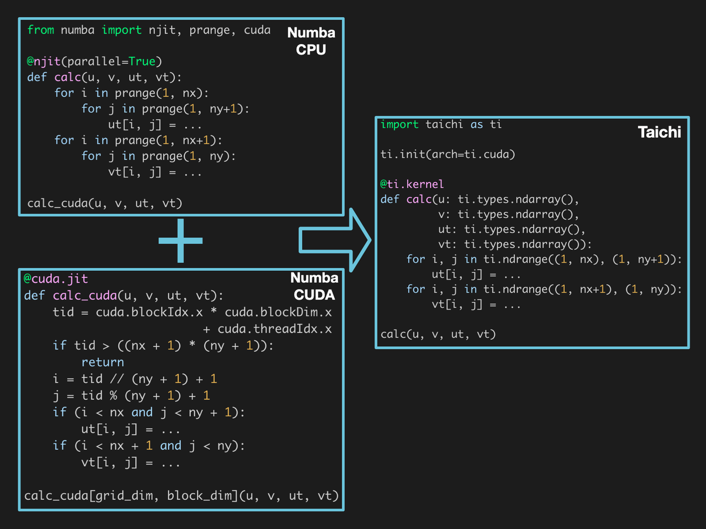

In the [previous blog](https://docs.taichi-lang.org/blog/can-taichi-play-a-part-in-cfd), we learned that Taichi, a high-performance computing language embedded in Python, goes beyond a development tool for computer graphics and renderers but also comes in handy for numerical computation that involves massive operations on 2D and 3D arrays. Computational fluid dynamics (CFD) is a typical scenario where Taichi can play a part. 

Now, the question is how much Taich can improve the performance of numerical computation programs. This blog applies Taichi and other acceleration solutions to some arithmetic operations frequently used in numerical computation and compares their performance and user-friendliness.

## An entry-level case: Performance comparison in summation operations

A summation operation computes the sum of all elements in a given array. It is a common arithmetic operation in numerical computation.

This section takes a summation operation as an example to compare the computing performance of Taichi, CUB, Thrust, CuPy, and Numba.

Let's start with a bit background information. Developed by Nvidia, both CUB and Thrust provide common utilities for parallel computing. Despite similarities they share in the usage, CUB was designed specially for Nvidia GPUs and resembles the underlying instructions of CUDA, while Thrust features a higher level of abstraction for compatibility with multiple platforms, hence a slower performance than CUB in most cases.

The common GPU acceleration solutions available to Python users include CuPy and Numba. The former provides an interface similar to NumPy, allowing users to call CuPy in the same way they call NumPy. Here, we choose the most performant CUB as the acceleration backend for the CuPy implementation. The Numba implementation performs the reduction operation in accordance with the instructions provided by its official documentation.

We also implement the summation operation in Taichi, and it is quite straightforward:

```python
@ti.kernel
def reduce_sum_kernel():
    sum = 0.0
    for i in f:
        sum += f[i]
```

Having experimented with different data sizes and compared the performance of the various implementations mentioned above, we present the results in the graph below. The higher the column is, the closer the implementation approaches the upper limit of the hardware. 


<center>Hardware: i9-11900K + RTX 3080; OS: Ubuntu 20.04. The performance metric adopted in the test is the actual memory bandwidth achieved. A higher memory bandwidth indicates better performance.</center>

The graph shows that the computing performance of all implementations is less than satisfactory when the data size is minimal. There are two reasons for the low performance: 1) small arrays cannot fully utilize the capacity of the GPU; 2) calling the libraries inevitably incurs overhead to varying degrees. As the data size increases, the proportion of fixed overhead lowers, and the performance improves significantly. Notably, the CUDA/CUB and CuPy implementations achieve impressive performance, both exceeding 90% of the peak bandwidth of the hardware. Taichi's performance is comparable to the highly optimized CUB and CuPy versions and outruns Thrust at all data sizes by a large margin.

In fact, Taichi's compiler relies on heavy underlying engineering to enable high performance. In the aforementioned code snippet, the summation is actually an atomic operation, which cannot be parallelized and is thus subject to limited operation efficiency. The most commonly used method of parallel computing optimization in vector summation is reduction, which is one of the must-have skills to learn parallel computing. Thanks to automatic reduction optimization implemented by its compiler, Taichi achieves a performance comparable to manually implemented CUB and way better than Numba. See the [benchmark report](https://github.com/taichi-dev/taichi_benchmark). 

In the case of a simple arithmetic operation, Taichi can rival the highly optimized CUDA and CUB implementations and outperform Thrust and Numba effortlessly with very intuitive code. But can we trust Taichi in real-life numerical computation tasks involving more complex formulas? Now let's move on to a more advanced case in CFD. 

## An advanced case: Performance comparison in velocity field calculations

When dealing with complex computing tasks, users find that their hands are tied not only by computing performance but also directly by coding efficiency. Here, to compare the computing performance and user-friendliness of different solutions, we take the velocity field calculations based on the marker-and-cell (MAC) method as an example. The MAC method entails calculating the changes of two 2D fluid velocity fields along the timeline as convection and viscosity are applied. We can denote the changes of each velocity field using the following formulas:


Writing this formula with CUB is nothing but inefficient for lack of an API to support it. It is possible to write it in Thrust, which is a template library, but template programming makes debugging a nightmare. As for CuPy, it can implement complex operations through CUDA code only. When there is no readily available library, what we need is a high-performance programming language to implement this formula. Therefore, we limit the performance comparison scope within the set of Numba, CUDA, and Taichi.

To begin with, both Taichi and Numba are programming languages embedded in Python, allowing users to build algorithms by simply following Python's syntax. However, Numba can utilize only the computing power of CPUs with Python code; to access the GPU, one is expected to understand the CUDA programming model and handle thread scheduling by oneself. In contrast, Taichi does not require any prior experience with CUDA. Users only need to specify the CUDA backend in the `ti.init()` call to offload the code to GPU.


<center>Numba vs. Taichi: Taichi can apply the same code to CPUs and GPUs, but Numba needs to tailor functions for CPUs and GPUs separately.</center>

When it comes to the native CUDA implementation, we finished writing the kernels in half an hour but spent almost two hours aligning the values. But this is not the end of the story. Calling CUDA code from Python also entails additional tooling code for compilation, interface encapsulation, memory allocation and deallocation, and CPU-GPU data transfer. The whole process still imposes a considerable burden on programming efficiency although there are various libraries available for simplification. 

With all the programming convenience Taichi offers, how does it rank in terms of performance? We run each implementation 1,000 times consecutively and took the average time consumed per call as the performance metric. The results are presented below. The lower the column is, the better the performance is.


<center>Hardware: i9-11900K + RTX 3080; OS: Ubuntu 20.04. The performance metric adopted in the test is the time consumed per call - the shorter the time is, the better the performance is. "Time" here refers to the wall-clock time, taking into account the overhead of function launches and device synchronization.</center>

Apparently, the three GPU-accelerated implementations significantly outperform the Numba version on CPUs. When the edge length of the velocity fields reaches 2,048 or larger, Taichi takes only 1/3 of the time Numba (CUDA version) takes to finish the computation and runs even faster than the native CUDA implementation. The high performance can be attributed to faster memory access enabled by Taichi's compiler, which automatically exploits hardware features. CUDA can achieve comparable performance after optimizations, provided that users are equipped with a deep understanding of its underlying hardware.

The source code of different implementations is available at [this repo](https://github.com/houkensjtu/MAC-taichi/tree/main/benchmark).

## Summary

In this blog, we examine Taichi's performance in vector summation and fluid field operations and compare Taichi with other common acceleration solutions. Our findings are as follows:

- In the case of simple summation operations, Taichi's performance is on par with that of the mainstream highly-optimized GPU-accelerated libraries. 
- In the case of complex fluid field operations, Taichi outperforms Numba (CUDA version) by 3x-4x and slightly surpasses the manually implemented and semantically equivalent CUDA version
- In terms of coding efficiency, Taichi provides a much more straightforward and easier coding experience than Numba (CUDA version) and CUDA do; it also allows seamless backend switching, saving the trouble of rewriting the code.

Now that you have some knowledge about Taichi's advantages in performance and user-friendliness, you must want to give it a try in your own numerical computing programs.

Our next blog will demonstrate how to write a CFD program within 99 lines of Taichi code. Stay in the loop!