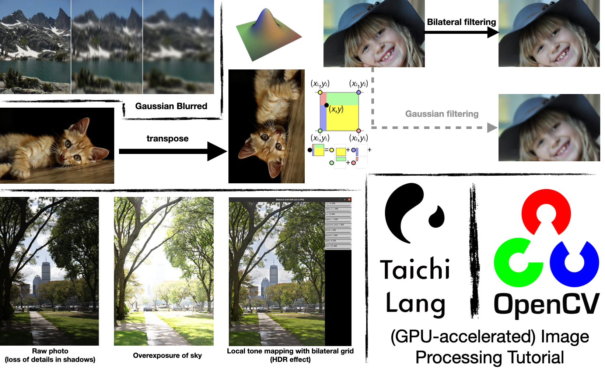
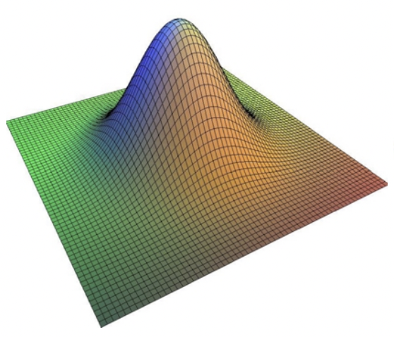
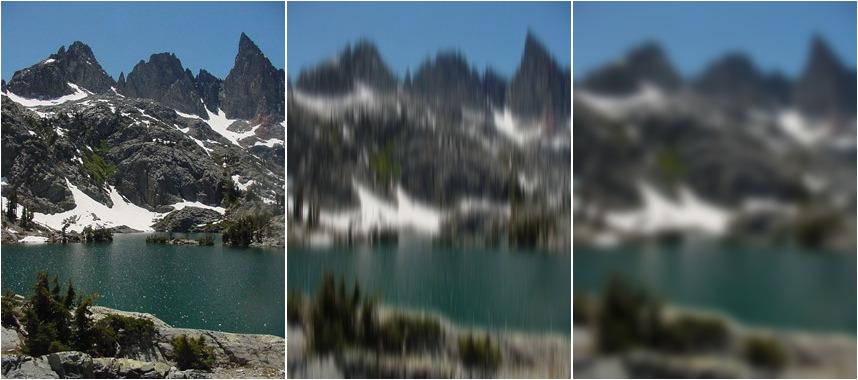

In the [previous blog](https://docs.taichi-lang.org/blog/accelerate-python-code-100x), we talked about how to use Taichi to accelerate Python programs. Many of our readers are curious about whether Taichi can fuel specifically *image processing tasks*, work together with OpenCV (`import cv2`), and even process images in parallel on GPUs. Well, in this article we will strive to provide answers to these questions. 

To make your reading experience less tedious, we will take the beauty filters and the HDR effect of the popular console game *Ghost of Tsushima* as examples to elaborate on image processing algorithms, including the Gaussian filter, the bilateral filter, and the bilateral grid, in ascending order of difficulty. You are recommended to write code as you read on, and we're sure you will not close this page empty-handed whether you are familiar with image processing or not. We hope that this article can serve you well, and we look forward to your feedback, positive or negative :)

## Introduction

Python is one of the most widely used languages for image processing. In computer vision and other rapidly evolving sectors, Python is considered the go-to option for many researchers when they conduct fast algorithm prototyping and verification, especially in scenarios like image pre-processing and model training. OpenCV, a popular image processing library, also provides a Python encapsulation so that users can write Python code to call underlying C++ algorithms and get performance gains.

<center>


</center>

However, real-life R&D does not always go as expected. More often than not, an OpenCV interface alone is far from being a panacea: You will find Python less attractive when you have to implement by yourself some image processing algorithms that OpenCV does not supply. It is unbearably slow to run for loops in Python to iterate over the pixels of images, which are usually stored in memory as NumPy arrays. In addition, the overhead incurred by the Python interpreter constitutes an annoying performance bottleneck when real-time processing (such as camera feeds) or large amounts of data are involved.

Here's when Taichi comes into play:

- The outermost for loops in a Taichi kernel are automatically parallelized, and users won't be bothered with thread allocation or management.
- Taichi's just-in-time (JIT) compiler compiles the Taichi code to fast machine code, which is executed on the multi-core CPU or GPU backend. Users are freed from compilation and system adaptation pitfalls.
- Taichi switches effortlessly between CPU and GPU execution.
- Taichi saves the need to call separately written C++/CUDA code in Python via ctypes or pybind 11 and thus enhances coding convenience and portability. Users can switch freely back and forth between OpenCV implementations and Taichi implementations, keeping everything within one Python program.

With the features listed above, Taichi not only maximizes the simplicity of coding in Python, but also achieves high performance on par with C++/CUDA. 

So much for the theory. Let's get down to practice. This article is composed of three sections to explain how Taichi accelerates image processing in Python:

I. [An entry-level case: Image transposition and bilinear interpolation](#an-entry-level-case-image-transposition-and-interpolation)
II. An intermediate case:  Gaussian filtering and bilateral filtering
III. An advanced case: Bilateral grid and high dynamic range (HDR) tone mapping

We will demonstrate, step by step, how image processing algorithms evolve, and explore some of their fascinating applications. In the end, we will summarize things you need to keep in mind when using Taichi for image processing and also discuss Taichi's current limitations for future improvement.

One final thing before the kick-start: Make sure you have installed the latest Taichi and opencv-python on your machine:

```bash
pip3 install -U taichi opencv-python
```

All source code used in this article is available at this repo: [Image processing with Taichi](https://github.com/taichi-dev/image-processing-with-taichi).

## An entry-level case: Image transposition and interpolation

### Image transposition

Let's start with a basic example, image transposition, to familiarize you with the essential steps of image processing with Taichi.

Similar to matrix transposition, image transposition entails swapping the positions of the pixels at $(i, j)$ and $(j, i)$.


We first import the libraries we need. An indispensable step for each Taichi program is initiation via `ti.init()`:

```python
import cv2
import numpy as np
import taichi as ti

ti.init()
```

Then, read the cat image into memory:

```python
src = cv2.imread("./images/cat.jpg")
h, w, c = src.shape
dst = np.zeros((w, h, c), dtype=src.dtype)

img2d = ti.types.ndarray(element_dim=1) # Color image type
```

Most of the image processing libraries available in Python assume that images exist in the form of NumPy arrays, and so does OpenCV. A (single-channel) grayscale image is represented with a 2D array of the shape (height, width); a (multi-channel) color image corresponds to a 3D array of the shape (height, width, channels). In the code snippet above, the image `src` read by OpenCV is a 3D NumPy array, and we subsequently declare `dst`, which is of the same data type as `src` yet with swapped height and width, for storing the transposed image. 

Now, we involve the function `transpose()` to deal with the transposition. Looking exactly like a Python function, `transpose()` actually serves as a Taichi kernel here since it is decorated with `ti.kernel`:

```python
@ti.kernel
def transpose(src: img2d, dst: img2d):
    for i, j in ti.ndrange(h, w):
        dst[j, i] = src[i, j]
```

This is a neat but important kernel. To write it properly, we need to understand the following:

- `src` and `dst` in Line 2 represent the input and output images, respectively. They are both type-annotated by `img2d = ti.types.ndarray(element=1)`. Taichi allows you to pass a NumPy array as an argument to a kernel through `ti.types.ndarray()`. You can ignore the meaning of `element_dim` for now, except that it enables us to manipulate the three channels of a pixel at the same time. The array is *passed by pointer* without generating an extra copy (but automatic CPU/GPU data transfer occurs on the GPU backend). In this way, any modification of the passed argument in the kernel affects the original array.
- `for i, j in ti.ndrange(h, w)` is the outermost for loop in the kernel. It automatically iterates over all the elements in the array in parallel. Specifically, `i` traverses all the rows and `j` all the columns. 

Finally, call the kernel and save `dst` as an image:

```python
transpose(src, dst)
cv2.imwrite("cat_transpose.jpg", dst)
```

*And the output is the transposed image.*

Source code: [image_transpose.py](https://github.com/taichi-dev/image-processing-with-taichi/blob/main/image_transpose.py)

### Bilinear interpolation 

Image transposition is friendly enough for beginners, isn't it? Now we are ready to increase the difficulty level a bit.

Bilinear interpolation is a technique frequently used for image upsampling. Suppose the cat image we have has a size of 96x64 pixels only, and now we want to enlarge it five times into 480x320 pixels. Magnifying each pixel into a 5x5 mosaic may not be a good idea:

<center>


Upsampling by enlarging each pixel five times
</center>

For a pixel $(i, j)$ in the output image, its corresponding position in the original image is $P=(i/5, j/5)$, which does not necessarily coincide with any pixel of the input. Rounding $P$ up or down to the nearest pixel produces the mosaic effect as above.

Bilinear interpolation takes a different approach. It captures the four pixels around $P$ and returns the weighted mean of their pixel values:

<center>


Image source: [Wikipedia](https://en.wikipedia.org/wiki/Bilinear_interpolation)
</center>

The four pixels surrounding $P=(x,y)$ are:
$$Q_{11}=(x_1,y_1),\ Q_{12}=(x_1,y_2),\ Q_{21}=(x_2,y_1),\ Q_{22}=(x_2,y_2)$$ 

They form a unit square, whose area (equivalent to the sum of the areas of the four rectangles) is 1. The weight of each pixel is the area of the rectangle in the same color as the pixel. For example, if $P$ moves closer to the yellow pixel $Q_{12}$ in the upper left corner, the yellow rectangle at the bottom right will become larger, assigning a larger weight to $Q_{12}$. 

We can now perform three 1D linear interpolations. We first adopt the weight $x-x_1$ to perform interpolations on the pairs $(Q_{11},Q_{21})$ and $(Q_{12},Q_{22})$, respectively, and get the results $R_{1}$ and $R_{2}$. Then, interpolate $(R_{1},R_{2})$ with the weight $y-y_1$.

```python
import taichi.math as tm

@ti.kernel
def bilinear_interp(src: img2d, dst: img2d):
    for I in ti.grouped(dst):
        x, y = I / scale
        x1, y1 = int(x), int(y)  # Bottom-left corner
        x2, y2 = min(x1 + 1, h - 1), min(y1 + 1, w - 1)  # Top-right corner
        Q11 = src[x1, y1]
        Q21 = src[x2, y1]
        Q12 = src[x1, y2]
        Q22 = src[x2, y2]
        R1 = tm.mix(Q11, Q21, x - x1)
        R2 = tm.mix(Q12, Q22, x - x1)
        dst[I] = ti.round(tm.mix(R1, R2, y - y1), ti.u8) # Round into uint8
```

In the code snippet above, the 2D index `I`, which denotes the coordinate of a pixel in the output image dst, traverses all the pixels in `dst`. `I/scale` returns $(x,y)$, which is `I`'s corresponding position in the input image `src`. $R_1$ represents the horizontal interpolation between the pixels $Q_{11}=(x_1,y_1)$ and $Q_{21}=(x_2, y_1)$, and $R_2$ represents the horizontal interpolation between the pixels $Q_{12}=(x_1,y_2)$ and $Q_{22}=(x_2, y_2)$. The final output pixel value is derived after finishing the vertical interpolation between $R_1$ and $R_2$.

`tm.mix()` above is the function that performs the 1D interpolation. It is provided by the `taichi.math` module and defined as follows:

```python
@ti.func
def mix(x, y, a): # also named "lerp" in other libraries
    return x * (1 - a) + y * a
```

*A comparison of the mosaic effect and bilinear interpolation:*

<center>


Enlarging each pixel five times


Bilinear interpolation
</center>

*Obviously, the output image of bilinear interpolation is more natural.*

Source code: [image_bilinear_inpterpolation.py](https://github.com/taichi-dev/image-processing-with-taichi/blob/main/image_bilinear_inpterpolation.py)

## An intermediate case: Gaussian filtering and bilateral filtering

### Gaussian filtering

Gaussian filtering is one of the most widely used filtering algorithms in the field of image processing. It attenuates the high-frequency information to smoothen and blur an image. A Gaussian filter convolves a 2D image with a matrix named a Gaussian kernel, whose elements are derived from the sampling of the 2D Gaussian distribution.

<center>


A 2D Gaussian convolution kernel. 
Image source: *Fast Bilateral Filtering for the Display of High-Dynamic-Range Images* by Durand and Dorsey, SIGGRAPH 2006
</center>

The probability density function of the 2D Gaussian distribution is 
$$G(x,y) = \frac{1}{2\pi\sigma^2}\mathrm{e}^{-\frac{x^2+y^2}{2\sigma^2}}$$

For a $(2k+1)\times (2k+1)$ Gaussian kernel $K$, its elements are derived from $G(x,y)$ sampled at the points falling within ${(i,j)\mid-k\leq i,j\leq k}$. For example, the following is a 3x3 Gaussian kernel:
$$K = \begin{bmatrix}G(-1,-1
)&G(0, -1) & G(1,-1)\\ G(-1,0)& G(0,0) & G(1, 0)\\ G(-1, 1)& G(0,1) & G(1, 1)\end{bmatrix}$$

Given that $G(x,y) = \frac{1}{\sqrt{2\pi\sigma^2}}\mathrm{e}^{-\frac{x^2}{2\sigma^2}} \cdot \frac{1}{\sqrt{2\pi\sigma^2}}\mathrm{e}^{-\frac{y^2}{2\sigma^2}} = G_1(x)G_1(y)$ denotes the product of two 1D density functions, the Gaussian kernel is separable. $K$ can be represented as the product of a 1D vector $v=(G_1(-k),G_1(-k+1),\ldots,G_1(k))^T$ and the transpose of the vector:
$$K=v\cdot v^T$$

Accordingly, the convolution between an image and the kernel $K$ can be separated into two 1D convolution operations, i.e., convolution of each column using $v$ and convolution of each row using $v^T$ ([this website](http://www.songho.ca/dsp/convolution/convolution.html#convolution_2d) provides a proof). In this way, the 2D convolution $O(m*n*k^2)$ is simplified into $O(m*n*k)$.

<center>


From left to right: the original image, the intermediate result of vertical filtering, and the final result of complete Gaussian filtering ($\sigma$=5.0)
Input image source: [Wikipedia](https://en.wikipedia.org/wiki/Bilateral_filter)
</center>

To write the program in Taichi, we should first create a 1D field (essentially a 1D data array) for storing the 1D Gaussian kernel:

```python
weights = ti.field(dtype=float, shape=1024, offset=-512)
```

The field's shape is set to 1,024, which would suffice to meet the needs of most scenarios. Note that `offset=-512` means that the field index starts from -512 and ends with 511. The offset feature provided by Taichi helps simplify coding by ensuring the index range is symmetrical about the origin.

Initialize this field using `@ti.func`:

```python
@ti.func
def compute_weights(radius: int, sigma: float):
    total = 0.0
    ti.loop_config(serialize=True)
    for i in range(-radius, radius + 1):
        val = ti.exp(-0.5 * (i / sigma)**2)
        weights[i] = val
        total += val

    ti.loop_config(serialize=True)
    for i in range(-radius, radius + 1):
        weights[i] /= total
```

The parameter `radius` controls the size of the Gaussian kernel – the element index of the kernel ranges between `[-radius, radius]`. `sigma` represents the variance of the Gaussian density function.

One thing worth attention is that `ti.loop_config(serialize=True)` disables the parallelization of the immediately following for loop. It is more efficient to serialize the for loops for non-intensive computation tasks to avoid the heavy thread overhead generated on CPUs/GPUs. We can safely ignore the coefficient $1/{2\pi\sigma^2}$ when computing each element of the Gaussian kernel, and use the variable `total` for the final normalization.

We now get down to the two 1D convolution operations. Declare a 1,024x1,024 vector field (essentially a 2D data array whose elements are RGB values) for storing the intermediate image after the first filtering:

```python
img = cv2.imread('./images/mountain.jpg')
img_blurred = ti.Vector.field(3, dtype=ti.u8, shape=(1024, 1024))
```

Conduct the vertical and horizontal 1D filtering, consecutively:

```python
@ti.kernel
def gaussian_blur(img: img2d, sigma: float):
    img_blurred.fill(0)
    blur_radius = ti.ceil(sigma * 3, int) 
    compute_weights(blur_radius, sigma)

    n, m = img.shape[0], img.shape[1]
    for i, j in ti.ndrange(n, m):
        l_begin, l_end = max(0, i - blur_radius), min(n, i + blur_radius + 1)
        total_rgb = tm.vec3(0.0)
        for l in range(l_begin, l_end):
            total_rgb += img[l, j] * weights[i - l]

        img_blurred[i, j] = total_rgb.cast(ti.u8)

    for i, j in ti.ndrange(n, m):
        l_begin, l_end = max(0, j - blur_radius), min(m, j + blur_radius + 1)
        total_rgb = tm.vec3(0.0)
        for l in range(l_begin, l_end):
            total_rgb += img_blurred[i, l] * weights[j - l]

        img[i, j] = total_rgb.cast(ti.u8)
```

In the code snippet above, Lines 3-5 set the post-filtering image to 0 and initialize the Gaussian filter. The following two for loops, as defined by Lines 7-14 and Lines 16-22, respectively, are essentially the same, except that the first for loop saves the column filtering results in `img_blurred` and the second for loop saves results back to the input image `img`.

With preparation done, we can compute the product of the filter's elements and the elements of `img`. It is as simple as that!

Source code: [gaussian_filter_separate.py](https://github.com/taichi-dev/image-processing-with-taichi/blob/main/gaussian_filter_separate.py)

### Bilateral Filtering

Adopting fixed weights, Gaussian filtering effectively smoothens images but inevitably losses some details. As a result, image edges are usually blurred.

Can we *preserve the details on the edges* when smoothening an image? An idea is that an additional weighting factor can be introduced to reflect the difference in pixel values since Gaussian filtering only considers the distance between pixels. This is what bilateral filtering does.

<center>


Image source: *Fast Bilateral Filtering for the Display of High-Dynamic-Range Images* by Durand and Dorsey, SIGGRAPH 2006
</center>

As the image above shows, we create a 3D surface plot out of a 2D (single-channel) grayscale image, with the heights representing pixel values. Thanks to bilateral filtering, the output image has smooth slopes and preserves clear cliffs (i.e., the edges).

$$I^{\text{filtered}}(x) = \frac{1}{W_p}\sum_{x_i\in\Omega}I(x_i)G_{\sigma_r}(\|I(x_i)-I(x)\|)G_{\sigma_s}(\|x_i-x\|)$$

$G_{\sigma_s}$ refers to the distance-based Gaussian kernel, as explained in the last section, and $G_{\sigma_r}$ is a new Gaussian kernel determined by the difference in pixel values: 
$$G_{\sigma_r}(|I(x_i)-I(x)|)=\frac{1}{\sqrt{2\pi\sigma_r^2}}\mathrm{e}^{-\frac{|I(x_i)-I(x)|^2}{2\sigma_r^2}}$$

$W_P$ is the normalization coefficient. The weight carried by the pixel $(k,l)$ for filtering the pixel $(i,j)$ can be denoted as
$$w(i, j, k, l) = \mathrm{exp}\left({-\frac{(i-k)^2+(j-l)^2}{2\sigma_s^2} -\frac{|I(i, j)-I(k, l)|^2}{2\sigma_r^2}}\right)$$

The equation indicates that the bigger the difference in pixel values $|I(i,j)-I(k,l)|$ is, the smaller the weight is allocated to $I(k,l)$. Therefore, the image edges are kept relatively intact.

<center>


Left: Original image. Right: Output image of bilateral filtering
</center>

The bilateral filter cannot be separated into two 1D convolution operations. So we have to write the 2D convolution patiently:

```python
img_filtered = ti.Vector.field(3, dtype=ti.u8, shape=(1024, 1024))

@ti.kernel
def bilateral_filter(img: img2d, sigma_s: ti.f32, sigma_r: ti.f32):
    n, m = img.shape[0], img.shape[1]

    blur_radius_s = ti.ceil(sigma_s * 3, int)

    for i, j in ti.ndrange(n, m):
        k_begin, k_end = max(0, i - blur_radius_s), min(n, i + blur_radius_s + 1)
        l_begin, l_end = max(0, j - blur_radius_s), min(m, j + blur_radius_s + 1)
        total_rgb = tm.vec3(0.0)
        total_weight = 0.0
        for k, l in ti.ndrange((k_begin, k_end), (l_begin, l_end)):
            dist = ((i - k)**2 + (j - l)**2) / sigma_s**2 + (img[i, j].cast(
                ti.f32) - img[k, l].cast(ti.f32)).norm_sqr() / sigma_r**2
            w = ti.exp(-0.5 * dist)
            total_rgb += img[k, l] * w
            total_weight += w

        img_filtered[i, j] = (total_rgb / total_weight).cast(ti.u8)

    for i, j in ti.ndrange(n, m):
        img[i, j] = img_filtered[i, j]
```

Overall, the bilateral filtering process resembles Gaussian filtering. But there are some slight differences we should be aware of. The bilateral filtering involves one for loop only to process all the pixels in parallel; before normalization, we use `total_weights` to count the weights of the pixels covered by the Gaussian kernel and `total_rgb` to calculate the weighted sum of these pixel values.

### Application: Beauty filters... or actually bilateral filters

Among all the diverse applications of bilateral filtering, the most typical ones should be image denoising and smoothing, with the latter often seen in *beauty filters*.

<center>


Image source: Pixarbay
</center>

We can see that the bilateral filter smoothens the skin by removing local details and preserving the sharp edges. For contrast, we also apply a Gaussian filter with the same radius to the same original image, and it can barely beautify the face since all the edges are blurred.

Source code: [bilateral_filter.py](https://github.com/taichi-dev/image-processing-with-taichi/blob/main/bilateral_filter.py)

## An advanced case: Bilateral grid

### Performance bottleneck of bilateral filtering

Although bilateral filtering prevents image edges from being blurred, it has an unignorable performance bottleneck. Normally, we can optimize Gaussian filtering by separating a 2D filter into two 1D filters and applying the fast Fourier transform (FFT) to large convolution kernels. However, neither option works for a bilateral filter, which is inseparable and rules out FFT because of its dependence on the image content.

Can we retrofit a bilateral filter to make it separable? Well, the answer lies in the *bilateral grid*.

The bilateral grid was proposed in the [SIGGRAPH 2007 paper by Chen et al.](https://people.csail.mit.edu/sparis/publi/2007/siggraph/Chen_07_Bilateral_Grid.pdf) It is basically an accelerated version of the bilateral filter. The method is brilliant in that it manages to simplify filtering by resorting to higher-dimensional spaces. All the following steps we have to go through to implement the bilateral grid may seem intimidating at first sight, but we assure you that the idea behind is straightforward.

A bilateral filter cannot be separated because the convolution kernels contain pixel values. But what if we create a third dimension for the independent convolution of pixel values? This is what the bilateral grid is about - involving higher dimensions to separate a bilateral filter.

Take a grayscale image as an example. The image is a 2D grid $I$, with each element storing a grayscale pixel value. We now transform the grid into a 3D one $\widetilde{I}$, whose third dimension equals the pixel value range [0, 255] in length. That is to say, the new grid has a shape of $w\times h\times 255$. The pixel value at the position $(i, j, k)$ is denoted as follows:
$$\widetilde{I}(i, j, k) = \begin{cases}(I(i,j),1), & \text{if } k=I(i,j)\\ (0, 0). & \text{otherwise}\end{cases}$$

Apply a 3D Gaussian filter to this grid, and the result is a new 3D grid $\widetilde{\Gamma}:\widetilde{\Gamma}(i,j,k) = (z, w)$. $\Gamma(i,j)=z/w$ is what we can derive from the bilateral filtering of $I$.

A useful technique: The grid $I$ stores the 2-tuple $(I(i,j),1)$to record the weighted sum of pixel values, i.e., $\sum w_iI(x_i)$, into the first entry and the sum of weights, i.e., $\sum w_i$, into the second entry during convolution. The division of the two results gives the normalized value. 

The figure below is excerpted from the paper, illustrating how to upgrade a 1D image to 2D. The process involves three steps: create, process, and slice.

<center>


The bilateral grid "trio": create, process, and slice.
Image source: [SIGGRAPH 2007 paper by Chen et al.](https://people.csail.mit.edu/sparis/publi/2007/siggraph/Chen_07_Bilateral_Grid.pdf)
</center>

The leftmost image (a) in the figure shows the input 1D signal, where an evident break between the two segments represents the image edges. The second image on the left (b) was a 2D grid generated based on (a), converting the segments into two disconnected regions. The pixels on the tag end of the region above are far away from those on the starting point of the region below, hence little or even no weight they exert on each other during 2D Gaussian filtering. The edge information of the bilateral grid is preserved as such.

This figure chooses a 1D signal as an example for simplicity. In practice, we can input a 2D image and upgrade it to 3D.

Real-life scenarios can be tricky, though. A 1,024x1,024 (1MB) grayscale image would occupy 256MB of memory after being transformed into a 1,024x1,024x256 grid. It is also unnecessary to maintain such a large and precise grid since what we need is filtered results only. Therefore, we can scale down the generated grid proportionally through downsampling and restore it through oversampling after the filtering.

We provide a step-by-step guide below to filter a *grayscale* image with the bilateral grid.

### Step 1: Create a grid (downsampling and higher dimensions)

To begin with, declare two 512x512x128 (32MB) vector fields, which store the 3D grid and its intermediate filtering results, respectively. To store the coefficients of filters, declare another field of the shape (2x512), where 2 stands for the two filters applied to the spatial space of the image and the range space of pixels, respectively.

```python
grid = ti.Vector.field(2, dtype=ti.f32, shape=(512, 512, 128))
grid_blurred = ti.Vector.field(2, dtype=ti.f32, shape=(512, 512, 128))
weights = ti.field(dtype=ti.f32, shape=(2, 512), offset=(0, -256))
```

Executed inside a Taichi kernel, the following code snippet initializes `grid`. We leave out the initialization of `weights` here because it has been discussed in the Gaussian filtering part.

```python
grid.fill(0)
for i, j in ti.ndrange(img.shape[0], img.shape[1]):
    lum = img[i, j]
    grid[ti.round(i / s_s, ti.i32),
         ti.round(j / s_s, ti.i32),
         ti.round(lum / s_r, ti.i32)] += tm.vec2(lum, 1)

grid_blurred.fill(0)
grid_n = (img.shape[0] + s_s - 1) // s_s
grid_m = (img.shape[1] + s_s - 1) // s_s
grid_l = (256 + s_r - 1) // s_r
```

`s_s` is the scale factor of the image resolution, and `s_r` is the scale factor of the range space [0, 255]. `grid_blurred` is initialized to 0.

We also compute the actual size of the scaled 3D grid, as denoted by `grid_n`, `grid_m`, and `grid_l`.

### Step 2: Process the grid (Gaussian blurring)

We are now ready to apply a 3D Gaussian filter to the 3D grid `grid`. The code snippet below may look lengthy and daunting, but it is merely a repetition of the Gaussian filtering we have discussed in the first section, only with one more filter involved.

Note that the classic bilateral filter operator is separated into three filters. The following code is executed inside a Taichi kernel.

```python
blur_radius = ti.ceil(sigma_s * 3, int)
for i, j, k in ti.ndrange(grid_n, grid_m, grid_l):
    l_begin, l_end = max(0, i - blur_radius), min(grid_n, i + blur_radius + 1)
    total = tm.vec2(0, 0)
    for l in range(l_begin, l_end):
        total += grid[l, j, k] * weights[0, i - l]

    grid_blurred[i, j, k] = total

for i, j, k in ti.ndrange(grid_n, grid_m, grid_l):
    l_begin, l_end = max(0, j - blur_radius), min(grid_m, j + blur_radius + 1)
    total = tm.vec2(0, 0)
    for l in range(l_begin, l_end):
        total += grid_blurred[i, l, k] * weights[0, j - l]
    grid[i, j, k] = total

blur_radius = ti.ceil(sigma_r * 3, int)
for i, j, k in ti.ndrange(grid_n, grid_m, grid_l):
    l_begin, l_end = max(0, k - blur_radius), min(grid_l, k + blur_radius + 1)
    total = tm.vec2(0, 0)
    for l in range(l_begin, l_end):
        total += grid[i, j, l] * weights[1, k - l]

    grid_blurred[i, j, k] = total
```

The three outermost for loops correspond to the three filters: the former two act on the spatial space using the weight `weights[0]` and the latter one on the range space using the weight `weights[1]`.

We write the intermediate filtering results into `grid_blurred` and `grid` in turn, and the final results after three rounds of filtering are stored in `grid_blurred`.

### Step 3: Slice the grid (trilinear interpolation)

Finally, we obtain the filtered image from the down-sampled grid `grid_blurred` through oversampling. This step is nothing but straightforward. Again, the code below is executed inside a Taichi kernel.

```python
for i, j in ti.ndrange(img.shape[0], img.shape[1]):
    lum = img[i, j]
    sample = sample_grid(i / s_s, j / s_s, lum / s_r)
    img[i, j] = ti.u8(sample[0] / sample[1])
```

For the position `[i, j, img[i,j]]` in the pre-scaling 3D grid, we derive its value by passing the value of `[i / s_s, j / s_s, lum / s_r]` in the post-scaling grid into the interpolation function `sample_grid`. The result should be a 2-tuple $(z,w)$, where $z$ represents the weighted sum of pixels and $w$ the sum of weights. The division of $z$ and $w$ gives the filtered value.

Wait... Have we missed out something? You may wonder what the interpolation function `sample_grid` is. It is not invented out of nowhere but merely an upgrade of the bilinear interpolation that we have explained in the first section. It is trilinear in nature, and similar to bilinear interpolation, it calculates the weighted sum of the eight vertices of a unit cube. The function consists of two steps: bilinear interpolations of the top and bottom faces of the cube, respectively, followed by a linear interpolation operation on the results derived from the aforementioned step. 

Source code: [bilateral_grid.py](https://github.com/taichi-dev/image-processing-with-taichi/blob/main/bilateral_grid.py)

**A quick recap:** The higher-dimension approach replaces an inseparable 2D convolution with a separable 3D convolution. Performance-wise, it is recommended for the following reasons:

- The XY resolution of the 3D grid is much lower than that of the original image, which means that the number of the voxels of the 3D grid is not necessarily more than that of the pixels of the 2D image. 
- At the same time, separating the expensive 2D convolution dramatically reduces the computation workload. 
- Another attractive advantage of the approach is that it is GPU-friendly, especially when implemented with Taichi :-).

### Application: Real-time local tone mapping (HDR effect)

The *dynamic range*, i.e., the ratio between the maximum and minimum light intensities, that can be perceived by human eyes is $1:10^9$. However, an ordinary display screen can only display images with a dynamic range limited to $1:100 \sim 1:1000$, while an advanced camera captures a range lower than what human eyes are capable of but better than display screens. As a result, displaying high dynamic range (HDR) pictures on low dynamic range (LDR) devices without any processing often leads to a loss of details in the shadows or in the highlights.

<center>


The dilemma about processing scenes with a great contrast between lights and shadows: A low brightness loses details in the shadows (e.g., branches in complete darkness), but a higher brightness causes overexposure of the sky.
</center>

We can solve the problem with a technique called tone mapping. Generally, there are two kinds of tone mapping: global tone mapping, which adjusts the brightness of all the pixels with the same function, and local tone mapping, which is context-based adjustment depending on individual pixels' neighbors. Local tone mapping is usually considered the better option. 

It all sounds terrific. But what is the relationship between local tone mapping and bilateral filtering? Bilateral filtering was introduced in the first place to *preserve the edges and blur the local details*, while local tone mapping serves the opposite purpose - *preserving the local details and blurring the edges*. To put it simply, local tone mapping can be regarded as a *reversed* version of bilateral filtering. Therefore, it can be used to compress HDR images as human eyes tend to pay more attention to local details.

Follow the steps below to implement local tone mapping with the bilateral grid:

1. Calculate the log luminance of an RGB image (i.e., logarithm of the weighted sum of the RGB values) and name the new image $L$.
2. Apply bilateral filtering to $L$ and get the blurred image, i.e., log luminance base: $B =$ bilateral_filter$(L)$.
3. Calculate the luminance detail layer: $D = L - B$, which is the brightness part we want to preserve.
4. Compress B: $B' = \alpha B$, ($0 < \alpha < 1$). B is the major cause of the wide dynamic range, and compressing it would not affect viewers' perception.
5. Recalculate the log luminance of the adjusted image: $L' = B' + D + \beta$, where $\beta$ is a constant standing for exposure compensation.
6. Compute the new image based on $L'$, ensuring that the RBG values of each pixel are in proportion to the original values and that the luminance is the same as $L'$.

*At last, we get a more natural picture where shadows and highlights are balanced and vividly presented.*

Source code: [bilateral_grid_hdr.py](https://github.com/taichi-dev/image-processing-with-taichi/blob/main/bilateral_grid_hdr.py)

<center>


Image captured on the MIT campus.
Save and run the source code on your device. Play with the parameters to see how the effects change. You may see haloing at some point. The parameter "blend" controls tone mapping.
</center>

A well-known case where the bilateral grid is used for tone mapping is the adventure game *Ghost of Tsushima*, where it takes only 250us to process a scene for display on a 1080P PS4 screen:


>Image source: *Advances in Real-Time Rendering: Real-Time Samurai Cinema: Lighting, Atmosphere, and Tonemapping in Ghost of Tsushima*, SIGGRAPH 2021 
This [Youtube video](https://www.youtube.com/watch?v=GOee6lcEbWg) elaborates on the post-processing pipelines of the game in great detail.

## Notes 

- **Storage and visualization:** OpenCV stores image channels in the BGR format by default for some historical reasons, while Taichi's visualization system adopts the RGB format. In addition, OpenCV's visualization tool `imshow()` sets the upper left corner of an image as the origin `(0, 0)` with i representing the y-axis and j the x-axis; Taichi's `gui.set_image` creates a slightly different coordinate system by taking the bottom left corner as the origin with i representing the x-axis and j the y-axis. This article does not go into the details of the coordinate system because Taichi is mainly used for computation instead of visualization here. 
- **Debugging:** You can activate debug mode by setting `debug=True` in the `ti.init()` call to automatically detect common errors like out-of-bound array accesses at the cost of slight performance loss. If you use a raw CUDA, these errors are harder to detect.  
- **Data types:** Images are often stored as NumPy arrays of the data type `np.uint8`, which corresponds to `ti.u8` in Taichi. Similarly, `np.float32` corresponds to Taichi's `ti.f32` or simply `float`.
- **Performance:** Taichi's advantage in GPU-accelerated computation may not come into full play when it is used to process low-resolution images because the launch of GPU kernels, JIT compilation, and the overhead from pybind11 would offset any acceleration. You can feel its high performance more evidently in scenarios involving high-resolution images and complex computations.

## Summary

Is Taichi better positioned to accelerate image processing compared with other tools? The answer is affirmative. If you ever had experience with implementing classic algorithms like the bilateral grid in Python, you would agree that it used to be extremely laborious to achieve GPU-powered high performance.

At the same time, we admit that Taichi can do better in the following aspects:

- There are too many APIs with long names (such as `ti.types.ndarray(element_dim=1)`) for users to remember.
- Users often have needs of deployment after prototyping, and Taichi expects to support deployment with an AOT system, which is still under development. 
- The overhead incurred by calling pybind11 for processing low-resolution images may compromise the performance. 
- Taichi outperforms other tools in customization but does not stand out in terms of the productivity of some simple and standard operations, such as Gaussian blurring, which can be conveniently implemented in Matlab/OpenCV with one line of code only. In the future, Taichi may incorporate these operations as well. 

Although Taichi is not perfect yet as an image processing tool, we cannot deny its irreplaceable value for users. As our open-source community keeps improving its features and user experience, Taichi will surely secure a place and gain increasing popularity in this sector.

All the source code and input images are available in [this repo](https://github.com/taichi-dev/image-processing-with-taichi).

It is already a lengthy article, and we have to leave out any rigorous evaluation of the programs, attempts at optimization, or ahead-of-time (AOT) deployment to mobile devices. Hopefully, we can touch upon these topics soon. If you are interested, subscribe to our monthly newsletter for the latest blogs and other useful information!

## References

- MIT tutorial on bilateral filtering: <https://people.csail.mit.edu/sparis/bf_course/>
- Original paper that proposes the bilateral grid: <https://people.csail.mit.edu/sparis/publi/2007/siggraph/Chen_07_Bilateral_Grid.pdf>
- Real-time post-processing of *Ghost of Tsushima*: *Advances in Real-Time Rendering: Real-Time Samurai Cinema: Lighting, Atmosphere, and Tonemapping in Ghost of Tsushima*, SIGGRAPH 2021
- Taichi Lang documentation: <https://docs.taichi-lang.org/>
- Some of the images cited in this article are from Wikipedia

