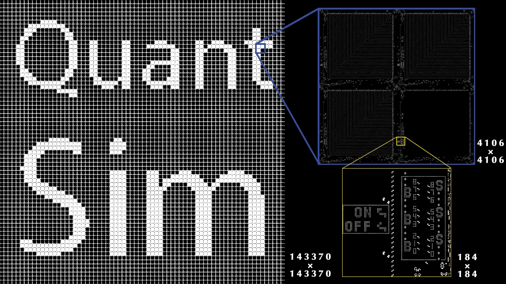

Starting from v1.1.0, Taichi provides quantized data types. But why is quantization important, especially in scenarios where Taichi stands out, such as physical simulation? This blog demonstrates how this new feature reduces your GPU memory usage significantly and requires *zero* change to your computational code.

## What is quantization?

Quantization, a concept introduced for digital signal processing, refers to the process of mapping a large set of input values to a smaller set of output values. For example, rounding real signals into integer signals can reduce the numbers to represent, thus occupying less memory space. Of course, the released memory comes at a price - quantized data inevitably loses precision.

The thing is, precision loss is not necessarily undesirable under certain circumstances. For instance, lower-precision results are totally fine for image processing tasks as long as the difference in visual effects is too minimal to be noticed by human eyes. In addition, quantization has been increasingly used in neural networks for better computation efficiency in recent years.

When it comes to physical simulation, where Taichi is frequently used to improve performance, a trade-off between precision and GPU memory is usually acceptable. The higher the resolution is, the better the visual effects will be. However, resolutions are subject to the limits of the GPU memory capacity. Therefore, it makes much sense to reduce GPU memory consumption, and to this end, Taichi enabled quantized data types. *With this feature, you can store data of arbitrarily low precision bits without changing the code for computation. In some cases, Taichi's quantized data types can reduce the use of GPU memory by up to 8x.*

<center>


Game of Life: 20 billion cells; 7 GB of GPU memory (8x less after quantization)


Smoke simulation: 400 million voxels; 29 GB of GPU memory (1.6x less after quantization)


Elastic body simulation: 200 million particles; 17 GB of GPU memory (1.7x less after quantization)

</center>

## Write your first quantized Taichi program

Let's write your first quantized Taichi program together and see whether the new feature is as good as it sounds. In this section, we take a classic Taichi demo, the Euler equations, as an example, and slim it down by rewriting the data declaration part only.

Run the original program: `examples/simulation/euler.py`

<center>


</center>

Most of the Taichi fields in this program are defined in the following way:

```python
Q = ti.Vector.field(4, dtype=ti.f32, shape=(N, N))
```

This example field is composed of `ti.f32` elements, i.e., single-precision floating-point numbers. If we lower the precision by reducing the binary bits allocated to the four elements of a vector from 128 to 64, we can halve the GPU memory the field occupies.

It is time Taichi's quantized data types came into play:

```python
float_8_8 = ti.types.quant.float(exp=8, frac=8)
```

As we know, a floating-point number consists of an exponent, a mantissa (also known as a fraction or significand), and a sign. For example, a single-precision floating-point number contains an 8-bit exponent, a 23-bit mantissa, and a 1-bit sign, as defined by the IEEE 754 Standard. Taichi's quantized data types allow you to customize the number of bits for the exponent and mantissa (The sign bit is made part of the mantissa for convenience of manipulation). The line of code above creates a float type `float_8_8` with an 8-bit exponent (`exp`) and an 8-bit mantissa (`frac`). To halve the GPU memory consumption, we need to convert each element of a field to the `float_8_8` type.

Quantized data types cannot be stored in a standalone fashion as they are not Taichi's primitive types. To overcome this problem, Taichi provides an API `ti.BitpackedFields` for packing a group of quantized fields into the AOS (array-of-structure) layout. In other words, several quantized data types are combined and stored as one primitive type. After specifying the components of `ti.BitpackedFields`, you can place it under a random SNode as if each member field is placed individually.

```python
Q = ti.Vector.field(4, dtype=float_8_8)
bitpack = ti.BitpackedFields(max_num_bits=64)
bitpack.place(Q)
ti.root.dense(ti.ij, (N, N)).place(bitpack)
```

That's all we need to do to re-define the data types in this program. Run the revised program, and *we will get the following*:

<center>


Left: Original program. Right: Quantized program

</center>

Unfortunately, we observe a significant difference in the output animations. This is because we have sacrificed too much precision by reducing the number of bits allocated to the mantissa from 24 to 8 although the exponent width remains unchanged. But let's not jump to the hasty conclusion that the quantized data types do not work. Can we preserve more precision bits for the mantissa? Given that the field elements are physical quantities, some closely-tied ones, such as vector components, can share the same exponent, as specified by `shared_exponent`. In this way, we can assign more bits to the mantissa (and in this case, up to 14 bits).

```python
float_8_14 = ti.types.quant.float(exp=8, frac=14)
Q = ti.Vector.field(4, dtype=float_8_14)
bitpack = ti.BitpackedFields(max_num_bits=64)
bitpack.place(Q, shared_exponent=True)
ti.root.dense(ti.ij, (N, N)).place(bitpack)
```

*This time, we can hardly tell the difference between the two versions:*

<center>


Left: Original program. Right: Second quantized program

</center>

So far, you have successfully modified a Taichi program with quantization, saving half of the GPU memory consumption and exerting little impact on the final visual effects. Hopefully, this neat example has demonstrated *how convenient and efficient it is to experiment on different data types while keeping the computational code intact*.

Here, we only introduced the basics of Taichi's quantized data types. You can refer to our [document](https://docs.taichi-lang.org/docs/quant) for detailed explanation, more examples, and advanced uses. You can start with Taichi examples (`ti example`) and share with us how you manage to minimize their GPU memory consumption without tampering with the output quality.

## Conclusion

Now that you have some initial understanding of quantization and Taichi's quantized data types, you may wonder how this idea of combining quantization and simulation came from and evolved. Well, the feature was first proposed by Taichi team in the paper [*QuanTaichi: A Compiler for Quantized Simulations*](https://yuanming.taichi.graphics/publication/2021-quantaichi/quantaichi.pdf), published at SIGGRAPH 2021, and continuously restructured and refined before the final release of Taichi v1.1.0. Taichi always stands at the forefront of academic research and strives to apply the latest findings to real-life scenarios.

At the same time, we delightedly found that the academia recognizes the value of QuanTaichi and keeps exploring its potential. For example, [Jiafeng Liu](https://hanke98.github.io/), a PhD student and Taichi contributor, further improved the approach by designing a framework for automatic quantization scheme selection. His paper [*Automatic Quantization for Physics-Based Simulation*](https://arxiv.org/abs/2207.04658) has been accepted by SIGGRAPH 2022. We will continue to contribute to academic research and industrial applications.

Don't forget to upgrade to the latest Taichi version before running the reference programs in this article:

```bash
python3 -m pip install taichi --upgrade
```
