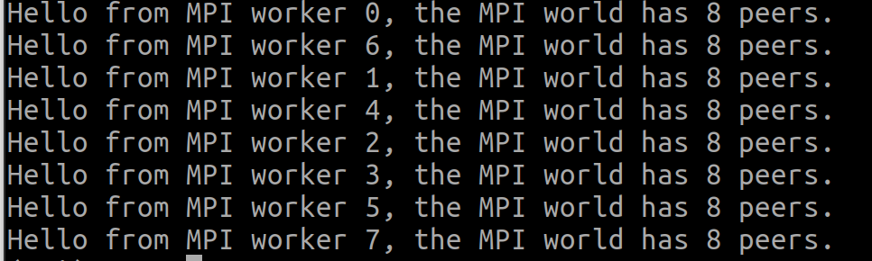
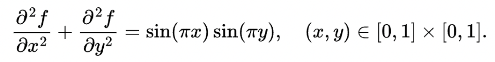
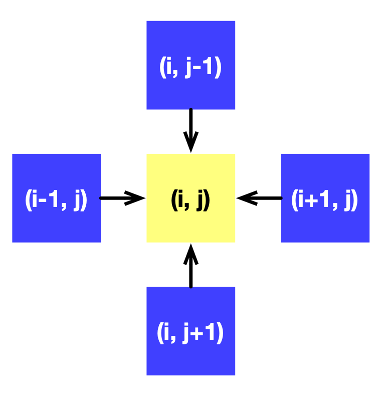
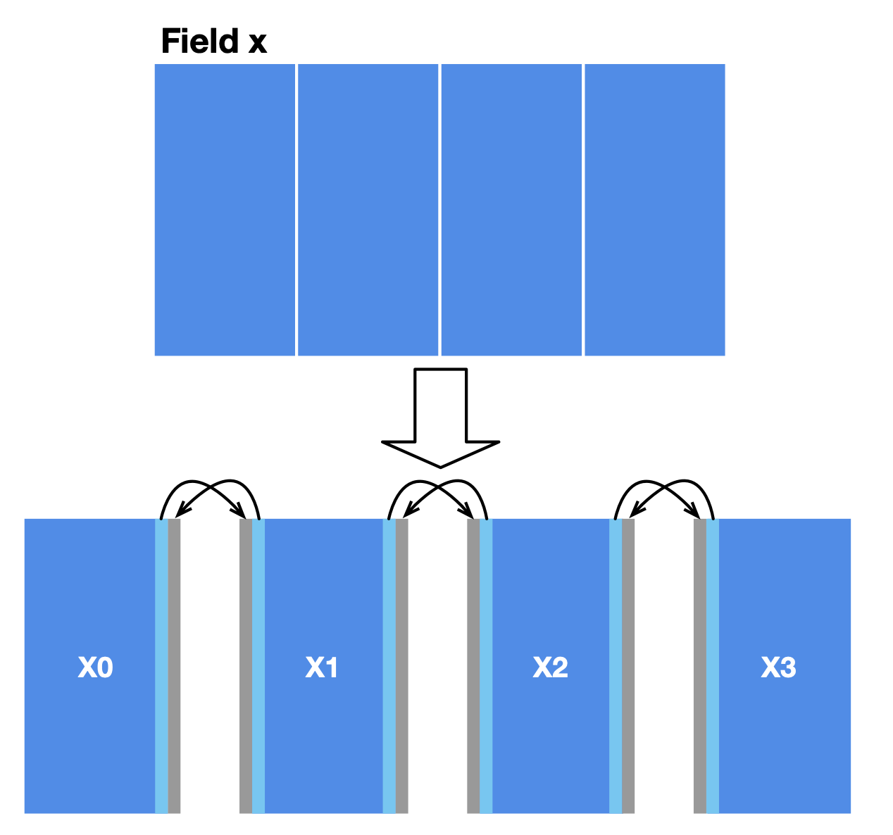
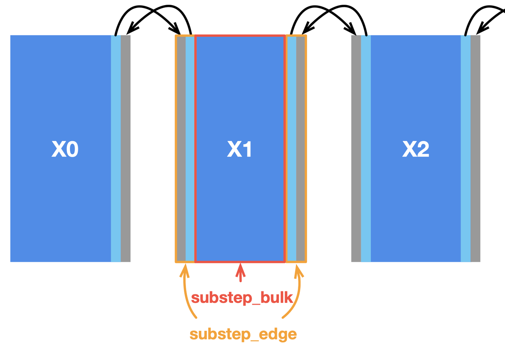
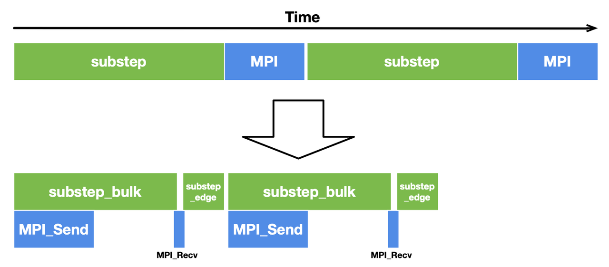
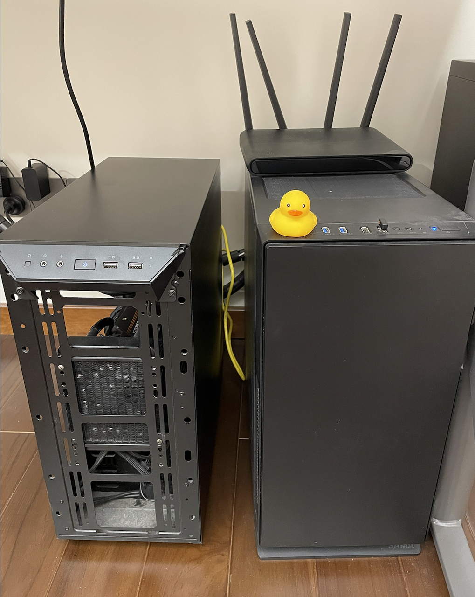
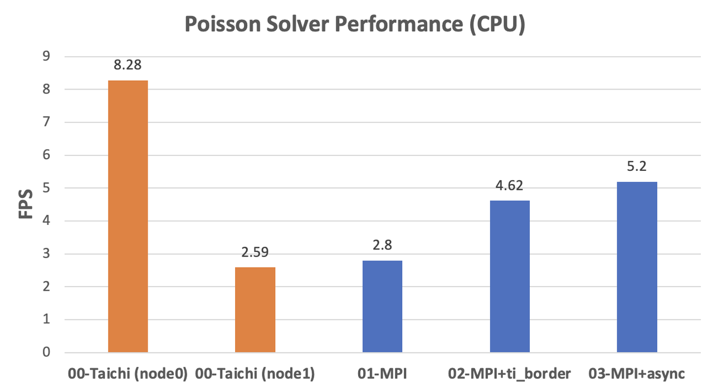
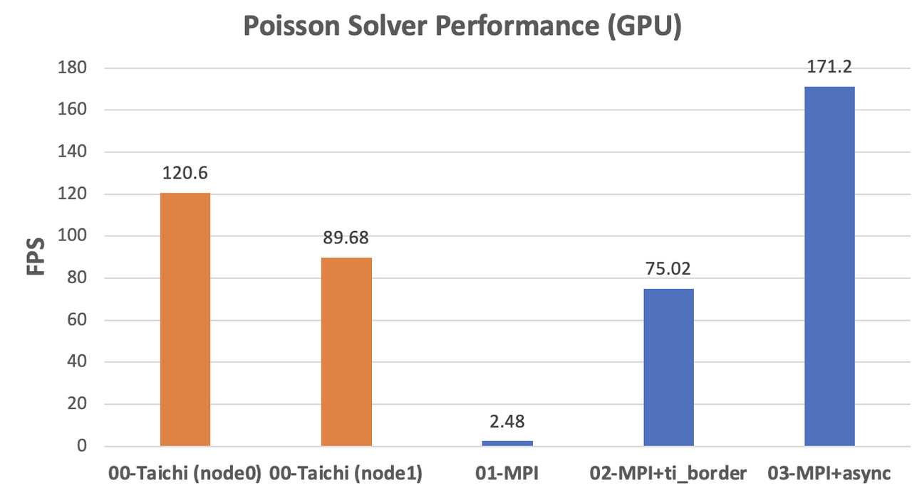

Nvidia unveiled its Tesla V100 GPU accelerator, which has since become a must-have model for deep learning, at GTC (GPU Technology Conference) 2017 in Beijing. It was on the same occasion that Jensen Huang, Nvidia's CEO, solemnly gave us the most sincere advice, which kept resonating in our heads for years to come:


And we all know what happened afterward. A few Internet giants piled tens of thousands of V100 chips up in their data centers. Artificial intelligence (AI) grows increasingly intelligent: facial and speech recognition becomes more accurate; machine translation delivers more humanlike results; AI gamers defeat professional players in the blink of an eye. Behind the scenes, massive R&D resources and top-notch expertise have been channeled to the development of distributed machine learning frameworks, which automatically break down a heavy learning workload into smaller tasks to run on multiple graphics cards.

Can distributed frameworks be applied to sectors other than machine learning? Taichi community members often find that they need to deal with ultra-large grids for fluid or particle simulations, where the data volume far exceeds the capacity of a single GPU. A distributed solution that allows a Taichi program to run on multiple GPU cards or even multiple GPU machines would largely improve the efficiency of large-scale computation.

Well, it proves that parallel computing and distributed computing can be perfectly combined and neatly achieved in a few lines of code, and this blog demonstrates how. Spoiler alert: The secret lies in Taichi plus MPI4Py.

## A quick start with MPI4Py

MPI (message passing interface) is a standardized communication interface initiated over two decades ago and has since been continuously improved. It enables thousands of computers to communicate and coordinate with each other, circulate data, and facilitate large-scale computations. Therefore, you cannot possibly bypass MPI as long as you use supercomputing. Implementing an MPI program from scratch is not easy. Luckily, MPI is available through a Python package, MPI4Py, and the following snippet shows a most basic MPI4Py program:

```python
# mpi_hello.py
from mpi4py import MPI

comm = MPI.COMM_WORLD
print(f"Hello from MPI worker {comm.rank}, the MPI world has {comm.size} peers.")
```

This code snippet contains the most essential concept in MPI – `MPI_COMM_WORLD`, as introduced in Line 4. All worker processes created by MPI are uniquely identified with `rank`, no matter whether they are placed on the same device or not. For instance, `rank=0` refers to the first worker, `rank=1` refers to the second, and so on. The total number of workers is stored in `comm.size`. The `print` statement would be executed separately by each worker, printing their identity `comm.rank` in `MPI_COMM_WORLD` as well as the aggregate amount `comm.size`.

To run this program, add `mpirun` ahead of the python command as follows. `-np` specifies how many workers to fire up, and `--hosts` names the machines involved in distributed computing.

```python
mpirun -np 8 --hosts node1,node2 python mpi_hello.py
```

*You should see the following information if everything goes smoothly:*



That's all we need to know about MPI4Py basics to understand the following sections. For more information about the Python package, see [this page](https://mpi4py.readthedocs.io/en/stable/). Now, we can get down to a simple Taichi program and explore how it can be split into several smaller tasks and run on multiple machines via MPI4Py.

## A simple Taichi program

Let's implement a simple Poisson solver in Taichi. The Poisson solver solves the following Laplace's equation:



The boundary condition is naturally given by *f(x,y) = 0*.

You do not have to be crystal clear about the rationale of this solver. It is essentially a Taichi kernel for stencil computing. It is more than straightforward to write such a kernel:

```python
x = ti.field(dtype=float, shape=(N + 2, N + 2))
xt = ti.field(dtype=float, shape=(N + 2, N + 2))

@ti.kernel                                                                                                                          
def substep():                                                                                                                  
    for i,j in ti.ndrange((1, N+1), (1, N+1)):                                                                            
        xt[i,j] = (-b[i,j]*dx**2+x[i+1,j]+x[i-1,j]+x[i,j+1]+x[i,j-1]) / 4.0                  
    for I in ti.grouped(x):                                                                                                    
        x[I] = xt[I]
```

A Taichi field `x` of shape `(N+2) x (N+2)` is defined to represent *f*. `+ 2` provides padding to avoid erroneous out-of-bound indexing. The calculation of each point depends on its four adjacent neighbors, as the following image illustrates:



We can gradually approximate the solution to *f* by calling `substep` repeatedly.

Now that we have a Taichi program, which currently relies on a single processor and a single device, we are ready to introduce MPI4Py and distribute this program to multiple machines.

## Original MPI version: Resolve data dependencies and achieve distributed computing

The first step in distribution to multiple processors is data partitioning. There are two major considerations: the shape of data partitions and the data dependencies among partitions.

In our case, a simple approach to data partitioning is to divide the field `x` into four horizontally aligned subfields. The computation of internal cells in each subfield is independent of other subfields since the `substep` function only involves the four neighbors of a point. However, two adjacent subfields share a boundary, where data dependencies arise. We also reserve extra space for each subfield (grey areas in the image below) to store the border data shared with the adjacent subfield(s). MPI synchronizes border data among multiple machines.



After partitioning, MPI launches multiple workers. A subfield is only visible in the worker it is allocated to. We should modify the field declaration accordingly:

```python
n = N // 4
x = ti.field(dtype=float, shape=(N + 2, n + 2))
```

`x` is no longer the complete field as defined in the last section. Instead, it now represents a subfield allocated to one of the four workers. In other words, `x` differs in different workers.

MPI4Py supports the use of NumPy's `ndarray` as the buffer areas of data transmission as long as the NumPy arrays passed are contiguous in the memory. We can exchange data between Taichi fields and NumPy arrays using the functions `to_numpy` and `from_numpy`.

The following code snippet demonstrates how to *send the right border of a subfield to its right-hand worker:*

```python
comm = MPI.COMM_WORLD

x_arr = x.to_numpy()
x_right = np.ascontiguousarray(x_arr[:, -2])

if comm.rank < num_workers - 1:
    comm.Send(x_right, dest=comm.rank+1)
```

Suppose the four subfields X0, X1, X2, and X3 correspond to Workers 0, 1, 2, and 3, respectively. `comm.rank+1` denotes the worker to the right of the current subfield. The `if` statement ensures that only Workers 0, 1, and 2 send data to their right-hand neighbor, as Worker 3 is the rightmost one.

We also need to use `recv` and `send` in pairs; otherwise, a communication deadlock arises without warning when MPI cannot locate the data receiver. The following code snippet takes care of the receiving logic, i.e., `Recv`.

```python
shadow_left = np.zeros(N + 2)
if comm.rank > 0:
    comm.Recv(shadow_left, source=comm.rank-1)

# Fill in the left edge
x_arr[:, 0] = shadow_left
x.from_numpy(x_arr)
```

`shadow_left` is a buffer area for storing the data received.

The receiving logic is the reversed version of data sending: each worker receives data from their *left-hand neighbor* and fills the data in the *left border* of its subfield. Mind that Worker 0 does not receive any data as it is the leftmost one, and the `if` statement above should ensure only Workers 1, 2, and 3 satisfy the data receiving condition.

Sending and receiving edge data in the opposite direction is similar to the process described above, so I won't dive into details. The complete code can be found [here](https://github.com/turbo0628/Taichi-MPI/tree/main/poisson).

Now, our program can run on multiple machines, yet with unsatisfactory performance due to the following problems:

1. Calling `field.to_numpy()` converts the entire field into a NumPy array, but it is the border data only that needs to be transmitted. Therefore, we can copy data on a smaller scale. 
2. Currently, each subfield will not proceed to the next iteration until `Recv` receives data. But actually, they do not have to wait for data transfers as most of the computation happens internally.

Let's tackle the problems one by one.

## Optimization 01: Copy border data with Taichi

In the original version, we first copy the entire field to a NumPy array and then slice the array to extract and transfer the border data. But we do not have to operate on the entire field; instead, we can accurately target the boundaries with several neatly-written Taichi kernels. The following code snippet shows how to fill in the border data in the grey areas:

```python
@ti.kernel
def fill_shadow(shadow_left : ti.types.ndarray(), 
                shadow_right : ti.types.ndarray()):
    for i in ti.ndrange((0, N + 2)):
        x[i, 0] = shadow_left[i]
        x[i, n+1] = shadow_right[i]
```

`shadow_left` and `shadow_right` are the NumPy buffers for receiving data. They can be passed directly to Taichi kernels, incurring no extra overhead apart from CPU-GPU data transfers – or no extra overhead at all if you are using the CPU backend where Taichi kernels operate on NumPy arrays directly.

## Optimization 02: Asynchronous communication

Most stencil computing cases have only a small region subjected to data dependencies. In this Poisson solver, the inner cells of the subfields have no dependency on the border cells and thus play no part in communication. We can split `substep` into two functions to deal with them separately, i.e., `substep_edge` for computing border cells and `substep_bulk` for inner cells, as illustrated below.



In this way, internal cells can be computed in parallel with communication, saving considerable overhead. To overlap communication with computation, we need to slightly change the implementation by replacing the blocking primitives `Send` and `Recv` with the non-blocking ones `Isend` and `Irecv`. The latter pair does not block the execution of subsequent statements until it encounters `wait`. We also need an additional parameter `tag` to label the data sent and received in each group of communications.

Accordingly, the communication code for data sending should be modified as follows:

```python
if comm.rank < num_workers - 1:
    comm.Isend(edge_right, dest=comm.rank+1, tag=11)
```

And the receiving part is updated as well:

```python
if comm.rank > 0:
    comm.Irecv(shadow_left, source=comm.rank-1, tag=11).Wait()
```

To reduce the total overhead, we call `substep_bulk` after data is sent and call `substep_edge` after the communication is done.

The computation and communication process is concluded as below:

```python
def step():
    mpi_send_edges() # Trigger communication
    substep_bulk() # Compute the bulk
    mpi_recv_edges() # Wait for communications
    substep_edge(shadow_left, shadow_right) # Compute the edges
```

With this optimization, the computation time for `substep_bulk` and the MPI communication time overlap with each other, hence a more compact timeline and a decent performance gain.



## Performance evaluation

To evaluate and compare the performance of different implementations, I configured an MPI environment by connecting two GPU workstations head-to-head with the same router. One (`node0`) is equipped with one Nvidia RTX3080 GPU and Intel i9-11900k CPU, while the other (`node1`) has a GTX1080Ti and E3-1230v5. Both installed the Ubuntu 20.04 system.



I tested against the 8192 &times; 8192 fields on the connected machines and evaluated the CPU and GPU performance, respectively. With Taichi, we can switch between the CPU and GPU implementations effortlessly by simply specifying `arch=ti.cpu` or `arch=ti.gpu` upon initialization.

Ideally, distributed computing can achieve *linear scalability*, i.e., the performance gain in proportion to the number of machines added.

What is the gap between our optimized implementation and the ideal linear scalability, then?

- CPU implementations

    We can observe a significant difference in the CPU performance of the two computers, as indicated by the orange columns. As the fields are partitioned evenly, `node0` needs to wait for `node1` at every computing step. As the data shows, the performance of the fully optimized MPI version is roughly twice as fast as `node1`. Assuming that the two machines are mounted with the same CPU model, our MPI implementation can ideally achieve linear scalability.

    

- GPU implementations

    The original MPI implementation on the GPU backend even lags behind the CPU versions due to the extra overhead from CPU-GPU data transfers. After optimization with Taichi-aided data copy and asynchronous communication, the performance improved dramatically to almost twice as fast as `node1` (171.2 / 89.68 = 1.91). The acceleration approaches the ideal scenario.

    

If we want to achieve linear scalability over hardware platforms with great performance difference, we need to re-partition the fields into uneven proportions. However, this is beyond the scope of this blog, and I will drop the discussion here.

## Conclusion

In this blog, I demonstrate how to use Taichi and MPI4Py to implement parallel and distributed computing. The complete program takes only 100 or so lines of Python code, yet achieves satisfactory scalability. Hopefully, this blog can inspire those faced with large-scale numerical computations. Nevertheless, I touched upon the most basic case here. Real-life MPI programs can be much trickier, especially when it involves random data access or complex data dependencies that are hard to solve.

If you encounter any difficulties in leveraging MPI and Taichi or have better solutions, share them with us in the [slack channel](https://taichicommunity.slack.com/ssb/redirect#/shared-invite/email) or our [subreddit community](https://www.reddit.com/r/taichi_lang/)!

Reference code: <https://github.com/turbo0628/Taichi-MPI/tree/main/poisson>
