Numerical simulation and computer graphics usually involve collision detection of a massive number of particles (in many cases, millions of particles). Regular operations, such as particle movement and boundary handling, can be handled in *O(N)* time complexity (N refers to the number of particles). But the complexity of collision detection can easily escalate to *O(N^2)* if no optimization is made, imposing an algorithmic bottleneck. A commonly-used technique is grid-based neighborhood search. By confining the search for collision-prone particles to a small area, we can reduce the computational complexity of collision detection back to *O(N)*. This article takes a minimal 2D discrete element method (DEM) solver as an example and presents a highly efficient implementation of neighborhood search using Taichi's data structures.

## What is DEM

DEM is a family of numerical methods for treating a large number of rigid bodies as non-continuum and simulating their motion according to Newton's laws of motion. DEM can be applied to various scenarios, such as geotechnical engineering, food production, and geosciences, if complemented by different materials and contact mechanics models.

>To clarify, the authors are not DEM experts. This article is to present a common approach to accelerating collision detection. Feel free to reach us if you find we got something wrong or missed out important information.

<center>

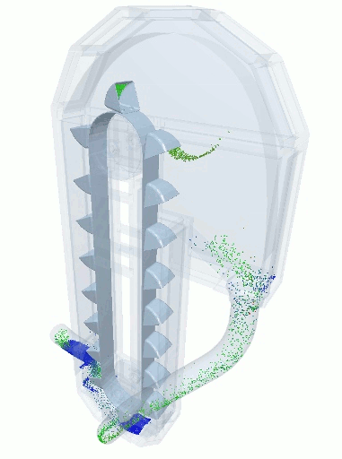
A blender simulation made by commercial DEM software
</center>

A typical DEM simulation goes through the following steps: 

<center>

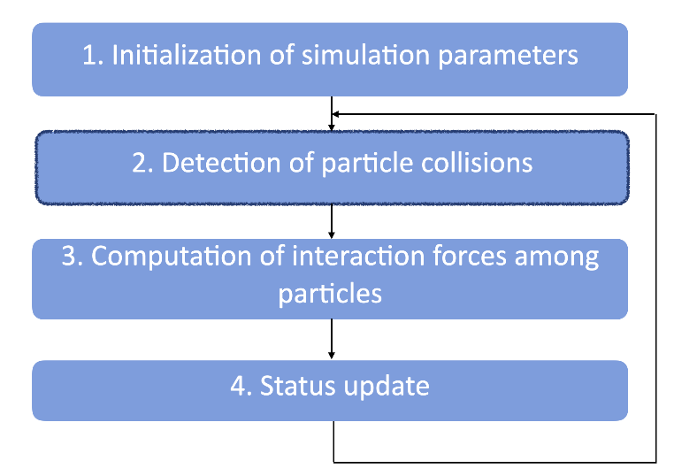
</center>

Since collisions may happen between any two random particles during this process, we need to cover *O(N^2)* pairs of grains in step 2 for collision detection, which creates a heavy computational workload and may play a critical part in the overall algorithmic performance. The good news is, we can reduce the time complexity of this step into an *O(N)* calculation with the proper acceleration algorithm, and this is what we want to achieve in this article. Given that a particle is always surrounded by a limited number of neighbors, we need an algorithm that can involve precisely the nearest neighbors for collision detection.

For those who want to skip the elaboration below and make sense of our implementation directly, please check out the [source code](https://github.com/taichi-dev/taichi_dem/blob/main/dem.py), which contains fewer than 200 lines of code in total.

Based on our implementation, you can further optimize it and add more features to create your own real-time DEM simulation of tens of thousands of particles on either CPU or GPU backends.

The following sections first give a brute-force implementation that traverses *O(N^2)* pairs globally. We then propose a grid-based collision detection method to accelerate computation, using static memory allocation instead of the traditional dynamic approach. Finally, we parallelize the process and achieve a performance hundreds of times faster than the original brute-force version.

>Note: Taichi can also easily parallelize dynamic memory allocation on CPU and GPU backends. You can refer to [this document](https://docs.taichi-lang.org/docs/sparse) for more information. We can apply the dynamic approach to the acceleration algorithm given in this article as well, but extra overhead comes along.

### Particle collisions in the context of DEM

<center>

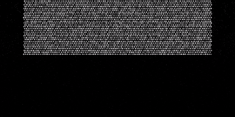
</center>

The gif above demonstrates the falling of 8,192 rigid particles. Collision detection requires us to locate all particles that have contact with a random particle. To better focus on collision detection, we make the following assumptions:

- All particles involved in the computation are round in shape yet with varied diameters.
- After a collision, only the normal stress among particles is factored in, while the tangential force is not considered.
- Deformation of the particles is not included.
- The translational motion of particles is factored in, while angular momentum is not considered.

To begin with, we need `@ti.dataclass` to represent the particles.

```python
@ti.dataclass
class Grain:
    p: vec     # position
    m: ti.f32  # mass
    r: ti.f32  # radius
    v: vec     # velocity
    a: vec     # acceleration
    f: vec     # forces
```

We can create a one-dimensional `StructField` with n elements to gather all the particles in the computational domain:

```python
gf = Grain.field(shape=(n, ))
```

Now, we get to deal with the collision detection part. We can tell whether a collision occurs from the distance between two particles and their radii:

<center>

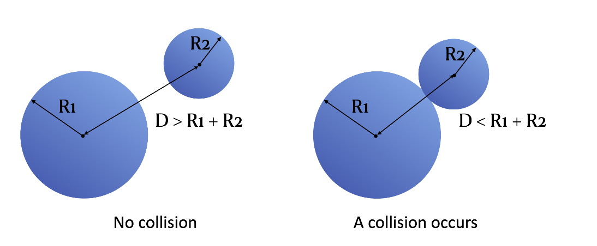
</center>

```python
def resolve(i, j):
    rel_pos = gf[j].p - gf[i].p
    dist = ti.sqrt(rel_pos[0]**2 + rel_pos[1]**2)
    delta = -dist + gf[i].r + gf[j].r  # delta = - d + r1 + r2
    if delta > 0:  # If delta > 0, a collision occurs
        normal = rel_pos / dist
        f1 = normal * delta * stiffness
        # Details of the calculation are not included here
```

However, how can we find all the particles that interact with a random particle `gf[i]`?

The most straightforward way is to iterate over all the other particles in `gf` apart from `gf[i]` and examine any possible collision with `gf[i]`:

```python
# Brute-force detection
for i in range(n):
    for j in range(i + 1, n):
        resolve(i, j)
```

Note that we ensure `i < j` here so as to rule out any repeated collision detection between the same particle pairs. For example, for the two particles `gf[2]` and `gf[3]`, this program would only compute `resolve(2, 3)` and exclude `resolve(3, 2)`. However, this approach has to traverse hundreds of millions of particle pairs when the number of particles involved exceeds 10,000, leading to unbearably slow performance. Can we narrow down the search area for collision detection and improve algorithmic efficiency? The following section provides an acceleration option by cleverly utilizing Taichi's data structures.

### Accelerating collision detection with Taichi's data structures

The problem of the brute-force implementation lies in the large detection area that covers the whole computational domain. Ideally, we want to involve only the surrounding particles of a given object. A common method of narrowing down the search area is to partition the computational domain into a fixed grid. In this way, we only need to examine the 3 x 3 cells with the given particle in the center. *One caveat here is to make sure the side length of a cell is greater than particle diameters; otherwise, we need to expand the search area a bit to 5x5 cells or even larger.*

<center>

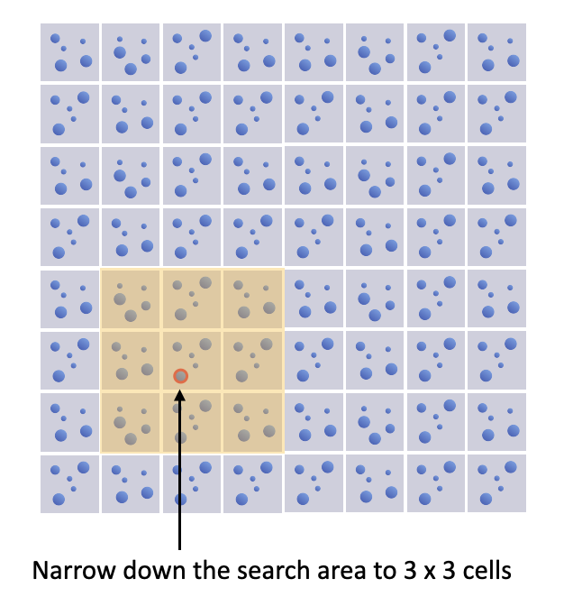
The search area for collision detection in a 8 x 8 grid
</center>

Normally, we use *dynamic memory allocation* here to record the IDs of the particles in a cell since the number of particles in each cell is subject to constant changes. But inevitably, the dynamic approach incurs expensive overhead on GPU. Can we get the recording and tracking done through *static allocation*?

Well, it is possible - with Taichi's static data container `ti.field`. Create a field `particle_id` for storing particle IDs.

After partitioning the computational domain into a grid, we use `grid_idx`, a two-bit integer vector, to represent the cell where a particle is found and use `grain_count` to denote the number of particles in a cell.

```python
grain_count = ti.field(dtype=ti.i32,
                       shape=(grid_n, grid_n),
                       name="grain_count")
for i in range(n):                                                          
    grid_idx = ti.floor(gf[i].p * grid_n, int)
    grain_count[grid_idx] += 1
```

<center>

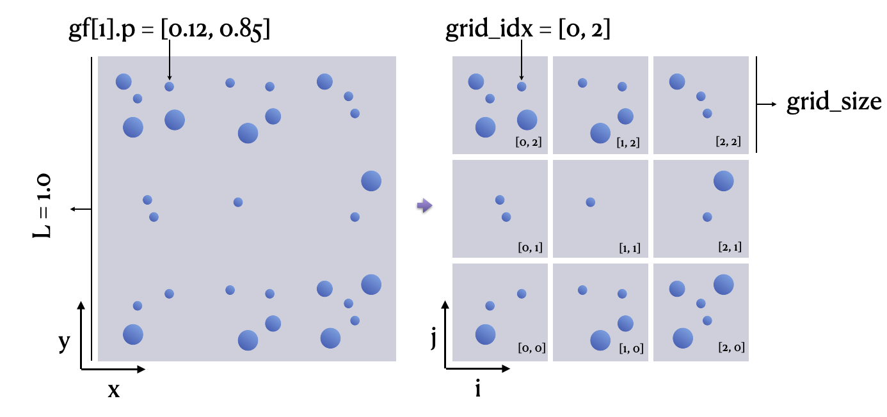
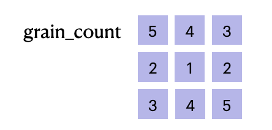
</center>

Then, we want to compute the particle IDs (i.e., `particle_id`) in each of the cells. If `particle_id` is a 2D linked list, an element can be appended in a dynamic way, as shown in the following code snippet, which may be familiar to Python/Taichi users:

```python
particle_id[cell_x, cell_y].append(gf[i]) # Append a particle in a dynamic way
ti.append(particle_id[cell_x, cell_y], i) # Taichi's dynamic SNode feature supports appending at runtime and automatically allocates memory
```

To avoid the expensive overhead from the dynamic, parallel memory allocation on GPU, we want to reserve the particle locations in `particle_id` in advance.

<center>

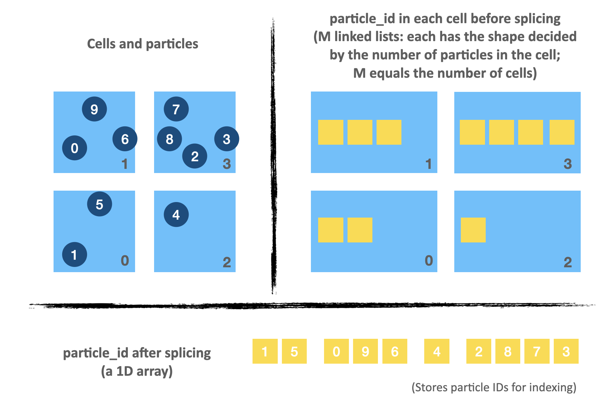
Compress M linked lists into a 1D array
</center>

As illustrated by the image above, we can record the particle indices in the search area using a 1D field `particle_id`, whose shape equals the total number of particles. The key is that we must pin down the accurate starting and ending positions of each cell in `particle_id`.

We can partition `particle_id` in either of the following two ways – serialized or parallelized.

#### Serialized partitioning of `particle_id`

We use three lists to store the beginning and terminal indices of each partition in `particle_id`:

```python
s = 0

ti.loop_config(serialize=True)
for i in range(grid_n):
    for j in range(grid_n):
        linear_idx = i * grid_n + j
        list_head[linear_idx] = s
        list_cur[linear_idx] = s
        list_tail[linear_idx] = s + grain_count[i, j]
        s += grain_count[i, j]
```

The code snippet above stores the starting and ending positions of a partition into `list_head` and `list_tail`, respectively, based on the number of particles in each cell (as given by `grain_count`) . As the computing result of each partition depends on `s` – the result of the precedent partition, we must set `ti.loop_config(serialize=True)` to serialize the program.

*Based on the particle numbers shown in the image above, we get the following lists:*

<center>

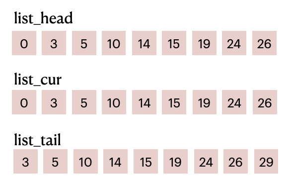
List items before filling in `particle_id`
</center>

`list_head` and `list_tail` combined divide `particle_id` into M parts (M equals the number of cells). For example, elements in the range of [0, 3) of `particle_id` represent the particle IDs in the first cell; elements in the range of [3, 5) represent the particle IDs in the second cell; and so on and so forth.

#### Parallelized partitioning of `particle_id` 

When more cells are involved (say, a 200 x 200 grid or even larger), the workload of serial execution of the code snippet above might pose a performance bottleneck. The major obstacle to parallelizing the program lies in `s`, which is a prefix sum where elements need to be processed sequentially. To reduce the serial workload, we can create `column_sum` for storing the sum of particles in each column before using it to compute a 2D prefix sum `prefix_sum`, whose value equals `s` in each loop. In this way, we manage to parallelize all the computation steps except for the beginning cell of each column in `prefix_sum`.

```python
column_sum = ti.field(dtype=ti.i32, shape=grid_n, name="column_sum")
prefix_sum = ti.field(dtype=ti.i32, shape=(grid_n, grid_n), name="prefix_sum")
@ti.kernel
def contact():
    ...
    
    # Compute column sum in parallel
    for i in range(grid_n):
    sum = 0
        for j in range(grid_n):
            sum += grain_count[i, j]
        column_sum[i] = sum
        
    # Compute the beginning cell of each column of prefix_sum in SERIAL
    prefix_sum[0, 0] = 0
    ti.loop_config(serialize=True)
    for i in range(1, grid_n):
        prefix_sum[i, 0] = prefix_sum[i - 1, 0] + column_sum[i - 1]
    
    # Compute the rest of perfix_sum in parallel
    for i in range(grid_n):
        for j in range(grid_n):
            if j == 0:
                prefix_sum[i, j] += grain_count[i, j]
            else:
                prefix_sum[i, j] = prefix_sum[i, j - 1] + grain_count[i, j]
```

We still take the same 3 x 3 cells for example. The following is a visualization of `grain_count`, `column_sum`, and `prefix_sum` derived from the code snippet above:

<center>

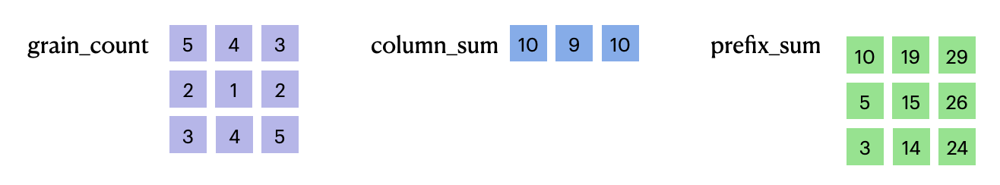
Computing the column sum in parallel before computing the prefix sum
</center>

Create a parallel linked list based on `prefix_sum`:

```python
for i in range(grid_n):
    for j in range(grid_n): 
        linear_idx = i * grid_n + j 
        list_head[linear_idx] = prefix_sum[i, j] - grain_count[i, j]
        list_cur[linear_idx]  = list_head[linear_idx]
        list_tail[linear_idx] = prefix_sum[i, j]
```

<center>


List items before filling in `particle_id`
</center>

Most importantly, the linked list no longer relies on the result of the precedent computing step but can be processed in parallel.

So far, we have demonstrated two ways of partitioning `particle_id`, through serial and parallel execution respectively. They serve exactly the same purpose despite the slower performance of the serial approach. Now, we are prepared to fill in particle IDs and conduct collision detection.

#### Filling in `particle_id` and neighborhood search

The code snippet below shows how we fill in `particle_id`, the data container for indexing particle IDs. Based on `grid_idx`, which helps us locate a particle in the computational domain, we can get its location in `particle_id` (as denoted by `grain_location`) and store its index `i`:

```python
for i in range(n):
    grid_idx = ti.floor(gf[i].p * grid_n, int)   
    linear_idx = grid_idx[0] * grid_n + grid_idx[1]
    grain_location = ti.atomic_add(list_cur[linear_idx], 1)
    particle_id[grain_location] = i
```

We can see that the value of `list_cur` grows by 1 each time a particle is appended because of `ti.atomic_add`. During this process, `list_cur` moves gradually from `list_head` to `list_tail`. In other words, `list_cur` serves as the rear pointer of each cell.

<center>

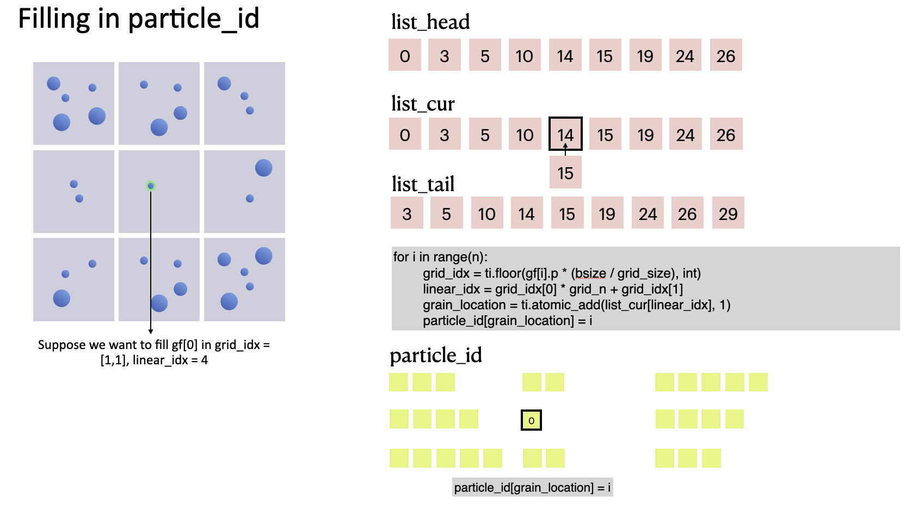
The process of filling the first particle in `particle_id`
</center>

After filling in `particle_id`, we can look for a given particle's neighbors. `grid_idx` helps narrow the search area down to 3 x 3 = 9 cells surrounding the particle, and `resolve(i, j)` iterates over all the particles in the area, significantly reducing the computational workload versus the brute-force method and effectively accelerating the DEM-based collision detection performance.

```python
# Grid-based fast collision detection
for i in range(n):
    grid_idx = ti.floor(gf[i].p * grid_n, int)
    x_begin = max(grid_idx[0] - 1, 0)
    x_end = min(grid_idx[0] + 2, grid_n)
    y_begin = max(grid_idx[1] - 1, 0)
    y_end = min(grid_idx[1] + 2, grid_n)
    
    for neigh_i in range(x_begin, x_end):
        for neigh_j in range(y_begin, y_end):
            neigh_linear_idx = neigh_i * grid_n + neigh_j
            for p_idx in range(list_head[neigh_linear_idx],
                               list_tail[neigh_linear_idx]):
                j = particle_id[p_idx]
                if i < j:
                    resolve(i, j) 
```

<center>

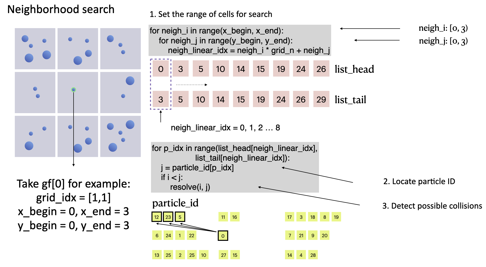
collision detection of particle `gf[0]`
</center>

We run a DEM simulation program involving 32,768 particles for performance evaluation. With the acceleration solution we proposed, the program almost achieved real-time simulation (reaching 25 FPS) on an M1 Macbook, dozens or even hundreds of times faster than the brute-force implementation.

## Conclusion

This article demonstrates how to implement collision detection in Taichi based on a minimal DEM model. Taichi's data structures, when used appropriately, can accelerate neighborhood search dramatically; the more particles are involved, the higher the speedup ratio will be. What's more, it would not take much of your effort to pick up Taichi - the key part of the acceleration algorithm is completed in less than 40 lines of code. 

To briefly summarize our approach, we partition the computational domain into a grid and store particle IDs according to their spatial locations. We also provide two means of partitioning `particle_id`, i.e., serialization and parallelization. The complete code is available at <https://github.com/taichi-dev/taichi_dem>.

## Taichi DEM optimization challenge

As this is only a minimal solver, there is plenty to optimize. For example:

- Further halve the neighborhood search area;
- Take the translational motion and irregular shapes of particles into consideration;
- Implement the same features with Taichi's [dynamic SNodes](https://docs.taichi-lang.org/docs/internal#data-structure-organization) as Taichi supports dynamic data structures on GPU ([taichi_elements](https://github.com/taichi-dev/taichi_elements) is a good reference);
- Apply the same approach to accelerate the position-based fluid (PBF) method
- Parallelize the whole program by using `ti.atomic_add`
- Upgrade the demo to a 3D one
- ...

To our delight, after we released the source code, many community members showed great interest and shared with us their optimized versions. We marveled at their creativity and sophisticated use of Taichi. Below are some selected community submissions.

- [Denver Pilphis](https://github.com/Denver-Pilphis) and [MuGdxy](https://github.com/MuGdxy) added 11 new features to the solver, including an upgrade to 3D and the introduction of complex DEM contact models.

<center>


[The free fall of a Stanford bunny-shaped bonded agglomerate onto a flat surface](https://github.com/Denver-Pilphis/taichi_dem/tree/submit/Denver-Pilphis_MuGdxy)
</center>

- [Linus-Civil](https://github.com/Linus-Civil) implemented a blazing fast parallel neighborhood search algorithm powered by GPUs and dealt with complex geometries for boundary treatment.

<center>


[3D blender](https://github.com/Linus-Civil/GeoBlender)
</center>

- Inspired by the movie Tai Chi Master, [mrzhuzhe](https://github.com/mrzhuzhe) created this beautiful sandy ball simulation, implementing the neighborhood search with atomic locks, PBF (position-based fluids), and Taichi's Snode system. 

<center>

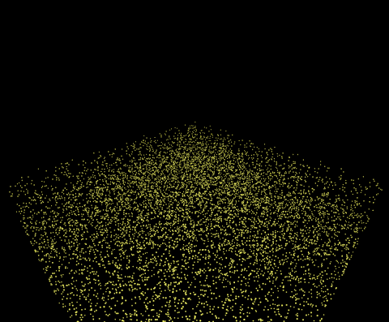
[Sandy ball simulation](https://github.com/mrzhuzhe/taichi_dem)
</center>

---
If you have any questions or want to share with us your DEM projects, join our [slack channel](https://taichicommunity.slack.com/ssb/redirect#/shared-invite/email) or post your ideas on [taichi_lang](https://www.reddit.com/r/taichi_lang/) subreddit!
