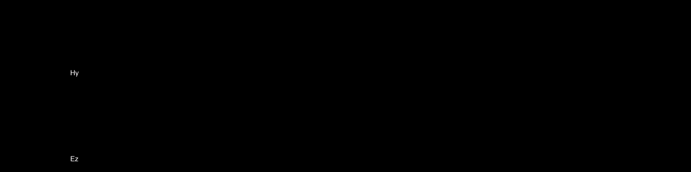

# Taichi Newsletter for August

## 📌 Highlights

- A milestone - Taichi announced its release of v1.1.0 🎉! Upgrade now: `pip install --upgrade taichi`

- Taichi has gathered over 20k GitHub stars! Thanks for your great support 🙌.

- We have revamped our documentation site: https://docs.taichi-lang.org. Explore it and let us know how you feel!

## ⚙️ Releases & development

- **Get the latest version of Taichi to upgrade your experience!**

    Taichi made important progress in v.1.1.0, further improving your development efficiency and boosting program performance. Long-awaited new features include:

    [Quantized data types](https://docs.taichi-lang.org/docs/master/quant): Define your own integers, fixed-point numbers, or floating-point numbers of an arbitrary number of bits;

    [Offline cache](https://docs.taichi-lang.org/docs/master/performance#offline-cache): Dumps the compilation cache to the disk, drastically reducing launch overhead in subsequent runs;

    [Forward-mode automatic differentiation](https://docs.taichi-lang.org/docs/master/differentiable_programming#forward-mode-autodiff): Compute Jacobian-vector product (Jvp) when evaluating derivatives, more efficient than reverse mode if the number of a function's outputs is greater than its inputs.

    More features and improvements are detailed in the [release notes](https://github.com/taichi-dev/taichi/releases/tag/v1.1.0). After launching v1.1.0, Taichi has made several bug fixes in later releases. Get the latest version v1.1.2 to play around with the new features: `pip install taichi==1.1.2`

- **Taichi's new documentation site launched - easier navigation with a use case-driven layout**

    We have revamped our documentation site by re-categorizing the articles and re-arranging the modules. There is also a brand new navigation page to help you quickly locate the information you are looking for. Bookmark [the page](https://docs.taichi-lang.org/) so you can visit it whenever you need!

## 🌟 Featured repos & projects

- **Projects facilitated by Taichi have been accepted by SIGGRAPH 2022!**

    [*Automatic Quantization for Physics-Based Simulation*](https://arxiv.org/pdf/2207.04658.pdf) by Jiafeng Liu et al. proposes an auto-quantization system that can generate a quantization scheme based on users' specifications of either error or memory constraints. The project utilizes Taichi's automatic differentiation system to estimate the quantization error introduced in every frame of the simulation; it also adopts a memory storage optimization strategy inspired by Taichi, saving tons of manual labor and achieving up to 2.5x memory compression rate.

    [*A General Two-stage Initialization for Sag-Free Deformable Simulations*](https://graphics.cs.utah.edu/research/projects/sag-free-simulations/sig22_sagfree_sim.pdf) by Jerry Hsu and Nghia Truong et al. tackles the sagging problem, i.e., the undesirable deformation under gravity, with a novel solution applicable to various simulation systems and materials. Notably, the authors open-sourced their method in Python using Taichi Lang.

- **Implement the finite-difference time-domain (FDTD) method in Taichi**

    *Understanding the FDTD Method* by John B. Schneider provides a comprehensive introduction to the FDTD method, a numerical analysis technique used to solve electromagnetic problems. Using Taichi Lang, [lucifer1004](https://github.com/lucifer1004) implemented several 1D FDTD simulations based on the algorithms and concepts detailed in Chapters 3 & 6 of the book, including the bare-bones, addictive source, total-field/scattered-field (TFSF) boundary, and first-order & second-order ABC. The contributor also provided a Julia version through the wrapper [Taichi.jl](https://github.com/lucifer1004/Taichi.jl). Details are available in the [Github project repo](https://github.com/lucifer1004/uFDTD-Taichi#first-order-abc).

    
    
1D bare-bones simulation

    
    
1D TFSF boundary implementation

- **Use Taichi to simulate basic solutions of the Laplace equation**

    The steady irrotational flow of an ideal incompressible fluid can be defined by the stream function ψ(x, y), which satisfies the Laplace equation. [bismarckkk](https://github.com/bismarckkk) presented [this demo](https://github.com/bismarckkk/ti_laplace_equation) to simulate some of the basic solutions of the Laplace equation, such as sources, sinks, vortices, and dipoles. You can also interact with the demo by creating/deleting the solutions and then observe the changing flows.

   

- **Reproduce the Taichi logo in a more intuitive way**

    Community member [lgyStoic](https://github.com/lgyStoic) found the source code for the Taichi logo is not intuitive enough and proposed a [new version](https://github.com/lgyStoic/taichi_rotation) to reproduce the logo. The logic is straightforward: Draw five circles and define the colors of the points falling in/outside the circles. IgyStoic also makes the logo rotate slowly and adopts the SSAA method to smoothen the edges.

    

## 📝 Blogs

- [**A complete scan of Taichi and PyTorch: How do they compare?**](https://docs.taichi-lang.org/blog/tags/py-torch)

    "How does Taichi differ from PyTorch? They are both embedded in Python and can run on GPU! And when should I choose Taichi over PyTorch or the other way around?" Our users and potential users often turn to us for answers to such questions. Taichi developer [Ailing Zhang](https://github.com/ailzhang) provides a detailed comparison in her blog series Taichi vs. PyTorch, where she explains the [design philosophies](https://docs.taichi-lang.org/blog/taichi_vs_torch_01) of the two Python packages and the [working principles](https://docs.taichi-lang.org/blog/taichi_vs_torch_02) of their data containers. Already looking forward to her third post on how to use Taichi to accelerate PyTorch, which is scheduled to come out in early September. Stay tuned!

- [**From molecular simulation to black hole rendering - Taichi-Lang makes life easier for digital content creators**](https://docs.taichi-lang.org/blog/what-taichi-is-capable-of)

    In this blog, Taichi Lang's creator, [Yuanming Hu](https://github.com/yuanming-hu), looks back on where the open-source project started and looks ahead to where it is heading. However, don't mistake this piece for a sentimental personal expression. Rather, it can serve as a comprehensive guide to what Taichi can do and who are the target users. [Check it out](https://docs.taichi-lang.org/blog/what-taichi-is-capable-of) to learn more!

- [**Accelerate Python code 100x by import taichi as ti**](https://docs.taichi-lang.org/blog/accelerate-python-code-100x)

    Have you ever been troubled by a massive computation-intensive for loop? Or have you struggled to rewrite C++/Fortran code in Python without slowing down performance? Then you should read this blog by [Yuanming Hu](https://github.com/yuanming-hu) for a highly efficient solution. There is no exaggeration about the 100x speedup facilitated by Taichi. The author elaborates on three examples to show how Taichi makes it happen with ease and why a user should choose Taichi over other Python packages.

## 🗓 Events

- **Taichi's Numerical Simulation SIG (Special Interest Group) open to external developers!**

    We have created this dedicated space for anyone interested in using Taichi for numerical simulation. Group members can communicate with each other, have their questions answered by internal engineers promptly, and forge something incredible of their own. You can visit our [Computational Fluid Dynamics repo](https://github.com/houkensjtu/taichi-fluid) to check what Taichi is capable of.

    To get a place in our SIG,  join [Taichi Community on Slack](https://taichicommunity.slack.com/join/shared_invite/zt-14ic8j6no-Fd~wKNpfskXLfqDr58Tddg#/shared-invite/email) first and then search for the channel  #sig-numerical-simulation.

## 🎉 Community contribution

- [mshoe](https://github.com/mshoe): Enable gravity option in stable_fluid_ggui.py ([#5836](https://github.com/taichi-dev/taichi/pull/5836))

- [Hyiker](https://github.com/Hyiker): Add GGUI set_image support for non-Vector fields and NumPy Ndarrays ([#5654](https://github.com/taichi-dev/taichi/pull/5654))

## 🧑‍💻 Become a contributor!

Your contribution is indispensable to the prosperity of the Taichi community. Following are some useful references.

- **[Our contribution guidelines](https://docs.taichi-lang.org/docs/contributor_guide)**

  Information about what to contribute and how to contribute to Taichi.

- **[Taichi Lang's Kanban](https://github.com/orgs/taichi-dev/projects/1)**

  Identify untaken, ongoing, closed, or fixed issues at a glance.

- **[Join our discussions](https://github.com/taichi-dev/taichi/discussions)**

  Our global forum for discussions about our features, bugs,  roadmaps, and more.

- **[Good first issues](https://github.com/taichi-dev/taichi/contribute)**

  A great way to start contributing to Taichi is to pick up an issue tagged with **[good first issue](https://github.com/taichi-dev/taichi/issues?q=is:open+is:issue+label:"good+first+issue")** (easy to start with) or with **[welcome contribution](https://github.com/taichi-dev/taichi/issues?q=is:open+is:issue+label:"welcome+contribution")** (slightly more challenging).

- **[Awesome Taichi](https://github.com/taichi-dev/awesome-taichi)**

  A curated list of awesome Taichi applications and resources.

Farewell to the fruitful August. See you in a month! 👋