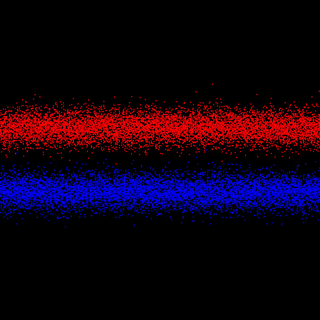

# Taichi Newsletter for September

## 📌 Highlights

- Upgrade to the latest version: `pip install taichi==1.1.3`
- [MeshTaichi](https://www.youtube.com/watch?v=vjBrk7k8SPE&t=47s), a compiler developed by Taichi researchers, accelerates mesh-based operations.
- Open up new possibilities with Taichi: Use Taichi to [accelerate PyTorch](https://docs.taichi-lang.org/blog/accelerate-pytorch-with-taichi) and [facilitate CFD simulation](https://docs.taichi-lang.org/blog/can-taichi-play-a-part-in-cfd).

## ⚙️ Releases & development

- **Taichi v1.1.3 released**

    Last month, Taichi launched [v1.1.0](https://github.com/taichi-dev/taichi/releases/tag/v1.1.0), which includes long-awaited new features like [quantized data types](https://docs.taichi-lang.org/docs/master/quant) and [offline cache](https://docs.taichi-lang.org/docs/master/performance#offline-cache). Subsequently, batches of improvements have been made to fix bugs and create a smoother user experience. The latest version 1.1.3 was released not long ago with minor yet meaningful changes. For example, new texture interfaces were added to C-API ([#5520](https://github.com/taichi-dev/taichi/pull/5520)), and the wrong typecasting in codegen of storing quant floats was fixed ([#5818](https://github.com/taichi-dev/taichi/pull/5818)).

    See the full [changelog](https://github.com/taichi-dev/taichi/releases/tag/v1.1.3) and upgrade to v1.1.3! `pip install -U taichi==1.1.3`

- **MeshTaichi makes mesh-based operations more efficient - findings accepted by SIGGRAPH Asia 2022**

    Mesh-based operations are often slow due to unstructured memory access patterns. Taichi researchers propose a novel mesh compiler, MeshTaichi, which uses an intuitive programming model for handling relations on meshes. Thanks to low-level data access optimizations, MeshTaichi achieves 1.4x to 6x faster performance than the state-of-art compilers and data structures. 

    Take a look at our selected demos:

    <video src="siggraph.mp4"></video>

## 🌟 Featured repos & projects

- **High-performance SPH simulation implemented with Taichi Lang**

    [erizmr](https://github.com/erizmr) is working on a high-performance SPH (smoothed-particle hydrodynamics) simulator implemented in Taichi. Keeping everything in Python, the creator presents two extraordinary solid-fluid coupling simulations supported by massive parallel GPU computing. Both demos run on Taichi's CUDA backend. More details are available in the [project repo](https://github.com/erizmr/SPH_Taichi).
    
    

    
Armadillo Bath: ~1.74 M particles, ~80 FPS on RTX 3090 GPU, with timestep 4e-4

    

    
Dragon Bath: ~420 K particles, ~280 FPS on RTX 3090 GPU, with timestep 4e-4

- **A [3D blender demo](https://github.com/Linus-Civil/GeoBlender) based on Taichi's DEM solver**

    Taichi provides a minimal DEM (distinct element method) solver [template](https://github.com/taichi-dev/taichi_dem), which leaves plenty of room for adaptation and upgrading. Starting from the template, [Linus-Civil](https://github.com/Linus-Civil) implements a blazing fast parallel neighbor search algorithm powered by GPUs and deals with complex geometries for boundary treatment.

    

    Learn about the prerequisites and assumptions of the [template](https://github.com/taichi-dev/taichi_dem) and build your own awesome DEM solver!

- **A two-stream instability simulation implemented with Taichi Lang**

    Two-stream instability occurs when there are counter-streaming plasma flows consisting of particles with random velocities. [JiaoLuhuai](https://github.com/JiaoLuhuai) adopts the PIC (particle-in-cell) method to simulate this physical phenomenon and presents the results as below. Refer to the [source code](https://github.com/JiaoLuhuai/pic88/blob/main/pic88.py).

    

## 📝 Blogs

- **[Accelerate PyTorch with Taichi](https://docs.taichi-lang.org/blog/accelerate-pytorch-with-taichi)**

    Having explained the major differences in the [design philosophies](https://docs.taichi-lang.org/blog/taichi_vs_torch_01) and [data containers](https://docs.taichi-lang.org/blog/taichi_vs_torch_02) between Taichi and PyTorch, [Ailing Zhang](https://github.com/ailzhang) takes a step further and illustrates how to get the best of both worlds with two real-life scenarios: data preprocessing and customization of high-performance ML operators. Zhang co-authored this blog with [Haidong Lan](https://github.com/turbo0628), and they provide a detailed performance comparison before and after using Taichi. See the [full text](https://docs.taichi-lang.org/blog/accelerate-pytorch-with-taichi).

- **[Can Taichi play a role in CFD?](https://docs.taichi-lang.org/blog/can-taichi-play-a-part-in-cfd)**

    The [collection of CFD projects facilitated by Taichi](https://github.com/houkensjtu/taichi-fluid) is enlarging. However, many users still have no clue how a programming language designed for computer graphics can achieve high-performance computation and even write CFD programs directly. To demonstrate that Taichi can contribute to CFD simulations, [Qian Bao](https://github.com/houkensjtu) explains what a typical CFD project entails and how Taichi meets the needs. To put it simply, Taichi helps in three respects:
    
    - Taichi's data containers make it intuitive to describe a flow field.
    - Taichi's automatic parallelization mechanism significantly saves compute time.
    - Taichi's built-in GUI system offers a convenient visualization solution for tracking fluid dynamics with only a few lines of code.

## 🗓 Events

- **Taichi's Numerical Simulation SIG (Special Interest Group) open to external developers!**

    We have created this dedicated space for anyone interested in using Taichi for numerical simulation. Group members can communicate with each other, have their questions answered by internal engineers promptly, and forge something incredible of their own. You can visit our [Computational Fluid Dynamics repo](https://github.com/houkensjtu/taichi-fluid) to check what Taichi is capable of. 

    To get a place in our SIG,  join [Taichi Community on Slack](https://taichicommunity.slack.com/join/shared_invite/zt-14ic8j6no-Fd~wKNpfskXLfqDr58Tddg#/shared-invite/email) and then search for the channel  #sig-numerical-simulation. We hold regular sharing sessions with group members. If you are interested in becoming a lecturer, join the SIG and contact the group administrator; you will be rewarded with a fulfilling experience and nice souvenirs!

## 🎉 Community contribution

- [Hanke98](https://github.com/Hanke98): Support basic sparse matrix operations on GPU ([#6082](https://github.com/taichi-dev/taichi/pull/6082))
- [lucifer1004](https://github.com/lucifer1004): Change deprecated `make_camera()` to `Camera()` ([#6009](https://github.com/taichi-dev/taichi/pull/6009))

## 🧑‍💻 Become a contributor!

Your contribution is indispensable to the prosperity of the Taichi community. Following are some useful references.

- **[Our contribution guidelines](https://docs.taichi-lang.org/docs/contributor_guide)**

  Information about what to contribute and how to contribute to Taichi.

- **[Taichi Lang's Kanban](https://github.com/orgs/taichi-dev/projects/1)**

  Identify untaken, ongoing, closed, or fixed issues at a glance.

- **[Join our discussions](https://github.com/taichi-dev/taichi/discussions)**

  Our global forum for discussions about our features, bugs,  roadmaps, and more.

- **[Good first issues](https://github.com/taichi-dev/taichi/contribute)**

  A great way to start contributing to Taichi is to pick up an issue tagged with **[good first issue](https://github.com/taichi-dev/taichi/issues?q=is:open+is:issue+label:"good+first+issue")** (easy to start with) or with **[welcome contribution](https://github.com/taichi-dev/taichi/issues?q=is:open+is:issue+label:"welcome+contribution")** (slightly more challenging).

- **[Awesome Taichi](https://github.com/taichi-dev/awesome-taichi)**

  A curated list of awesome Taichi applications and resources.

See you in October👋. Until then, stay in the loop!