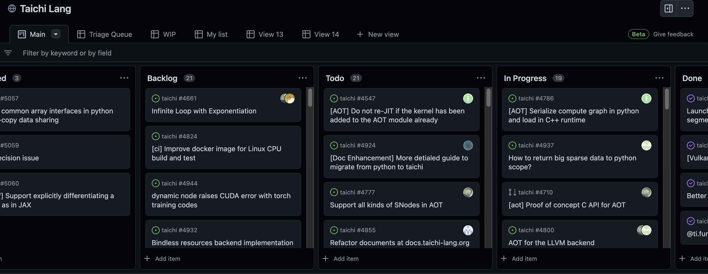
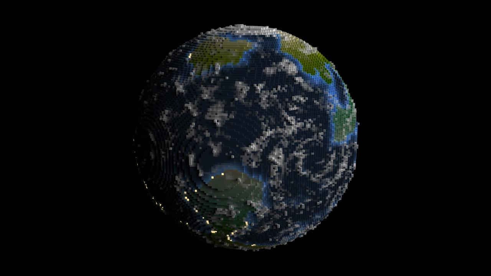

# Taichi Newsletter for May

## 📌 Highlights

- Voxel Challenge 2022 closed. Check out the final list [here](https://github.com/taichi-dev/community/blob/main/events/voxel-challenge/winners-2022.md?utm_source=newsletter)!
- Taichi Lang v1.0.2 released: `pip install taichi==1.0.2`
- Taichi's Slack workspace ready. [Join us](https://taichicommunity.slack.com/join/shared_invite/zt-14ic8j6no-Fd~wKNpfskXLfqDr58Tddg#/shared-invite/email) to keep up-to-date with the latest progress of the Taichi community.

## ⚙️ Releases & development

- **Taichi Lang v1.0.2 released!**

    This patch release improves Taichi's compatibility with multiple platforms.  Particularly, if you run into stability issues with GGUI and Vulkan on v1.0.1, you can upgrade to v1.0.2. For other fixes and improvements, see [here](https://github.com/taichi-dev/taichi/releases/tag/v1.0.2).

- **Taichi switched to GitHub Projects to encourage more transparent project management**

    From 'Backlog' to 'In Progress', all you need to know about the development status of Taichi Lang is at its Kanban [here](https://github.com/orgs/taichi-dev/projects/1).

    

## 🗓 Events

- **Voxel Challenge 2022 closed on May 25th**

    Voxel Challenge 2022 is for original, ingenious, and Taichi Lang-based voxel artworks. The participants are required to complete their voxel entries within 99 lines of Taichi Lang code.

    The competition took place from April 29th to May 25th. We received from 88 participants 112 entries and 10 blogs. From all these submissions, we see immense creativity and infinite possibilities that Taichi Lang could bring.

    Take a look at the final list [here](https://github.com/taichi-dev/community/blob/main/events/voxel-challenge/winners-2022.md?utm_source=newsletter), and we are sure you will be inspired!

    
    **Half-broken** by [SuperSodaSea](https://github.com/SuperSodaSea)

    
    **Another world** by [peng-bo](https://github.com/peng-bo)

    
    **Magic cube** by [MemoryIt](https://github.com/MemoryIt)

    
    **Tiny Jinjia** by [0xrabbyte](https://github.com/0xrabbyte)

    
    **Little night lamp** by [ying-lei](https://github.com/ying-lei)

## 📝 Blogs

- **[Is Taichi Lang comparable to or even faster than CUDA?](https://docs.taichi-lang.org/blog/is-taichi-lang-comparable-to-or-even-faster-than-cuda)**

    Oftentimes, we were asked how Taichi Lang compares to CUDA? With his benchmark project, [Haidong Lan](https://github.com/turbo0628) took a stab at comparing Taichi Lang with CUDA's reference implementations of nine algorithms.

- **[How I created the tranquil autumn air within 99 lines of Python code](https://docs.taichi-lang.org/blog/how-i-created-the-tranquil-autumn-air-within-99-lines-of-python-code)**

    [Yuanming Hu](https://github.com/yuanming-hu), creator of Taichi Lang, shares how to build a voxel autumn theme from zero to hero.

## 🌟 Featured projects

- **[takah29](https://github.com/takah29)'s [2D fluid simulator](https://github.com/takah29/2d-fluid-simulator)**

    It has long been asked whether Taichi Lang can be used for fluid simulation. Developer [takah29](https://github.com/takah29) has given his answer 'yes' with his [2d-fluid-simulator](https://github.com/takah29/2d-fluid-simulator) project.

    The project implements a CFD (Computational Fluid Dynamics) solver using [Taichi Lang](https://github.com/taichi-dev/taichi). With relatively a few lines of code, takah29 implements 2D fluid dynamics simulations based on Marker-And-Cell(MAC) method in situations of single cylindrical obstacle, multiple cylindrical obstacles, and multiple plate obstacles. takah29 nicely encapsulates the CFD solver in object-oriented style (OOP) and separates corresponding functions in different modules.

    Taichi Lang was born in the area of Computer Graphics, but has already reached out into many high-performance scientific computing areas, thanks to its innate support for parallel computing on multiple platforms. Unlike many other players in the market, which require deep domain knowledge, Taichi Lang is unbelievably intuitive and, at the same time, highly efficient.

    Want to try it out and be featured in a future newsletter? Taichi is just one command line away! 👉 `pip install taichi 1.0.2`

    
    
Flow field around a single cylindrical obstacle

    
    
Flow field around multiple cylindrical obstacles

## 🎉 New contributors

- [Mike-Leo-Smith](https://github.com/Mike-Leo-Smith): Optimized the MPM kernels on CUDA in PR ([#7](https://github.com/taichi-dev/taichi_benchmark/pull/7))

- [BioGeek](https://github.com/BioGeek): Corrected Python code snippets in PR ([#327](https://github.com/taichi-dev/docs.taichi.graphics/pull/327))

## 🧑‍💻 Become a contributor!

Your contribution is indispensable to the prosperity of the Taichi community. Following are some useful references.

- **[Our contribution guidelines](https://docs.taichi-lang.org/docs/contributor_guide)**

  Information about what to contribute and how to contribute to Taichi.

- **[Taichi Lang's Kanban](https://github.com/orgs/taichi-dev/projects/1)**

  Identify untaken, ongoing, closed, or fixed issues at a glance.

- **[Join our discussions](https://github.com/taichi-dev/taichi/discussions)**

  Our global forum for discussions about our features, bugs,  roadmaps, and more.

- **[Good first issues](https://github.com/taichi-dev/taichi/contribute)**

  A great way to start contributing to Taichi is to pick up an issue tagged with **[good first issue](https://github.com/taichi-dev/taichi/issues?q=is:open+is:issue+label:"good+first+issue")** (easy to start with) or with **[welcome contribution](https://github.com/taichi-dev/taichi/issues?q=is:open+is:issue+label:"welcome+contribution")** (slightly more challenging).

👐 Looking forward to seeing you soon!

👋 Until next time!
