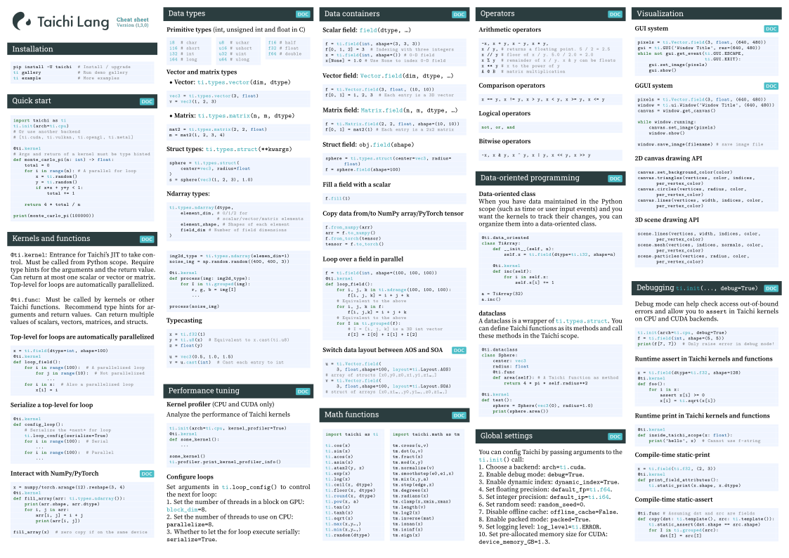
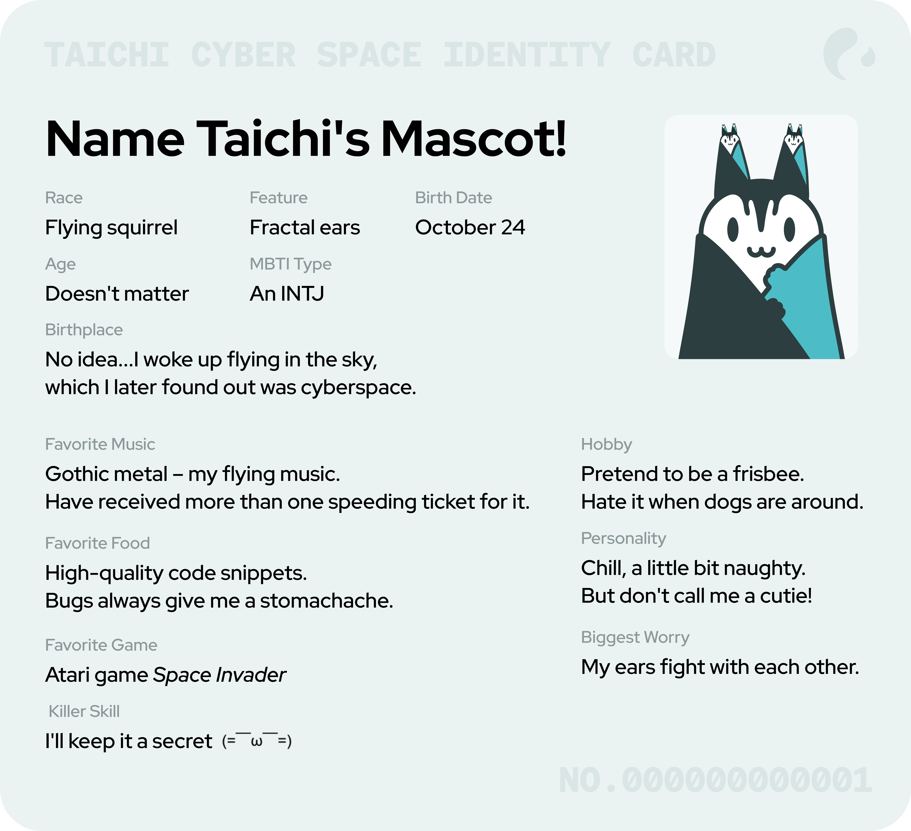
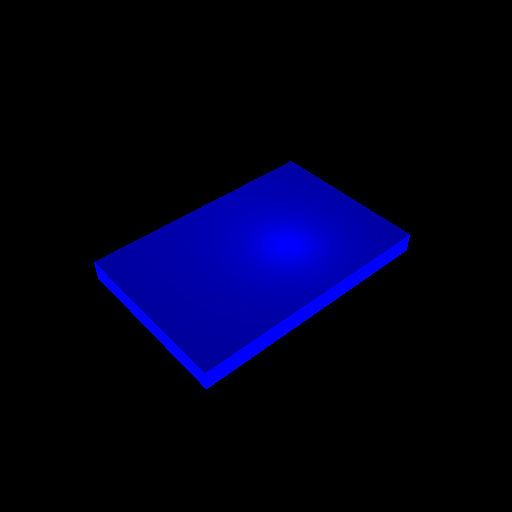

# Taichi Newsletter for November 

## 📌 Highlights

- Upgrade to v1.3.0: `pip install taichi==1.3.0`
- The DEM challenge closed, and winners announced!
- Taichi + OpenCV = Accelerated image processing! View [details](https://docs.taichi-lang.org/blog/how-taichi-fuels-gpu-accelerated-image-processing-a-beginner-to-expert-guide).

## ⚙️ Releases & development

- **See what's new in the latest Taichi release**

    Taichi v1.3.0 is now available 👉 `pip install -U taichi==1.3.0`
    - Sparse data structures on the Metal backend are now deprecated.
    - Taichi now provides more flexible dynamic SNodes to support variable-length fields of struct or matrix elements.
    - Packed mode becomes the default setting after runtime overhead is eliminated.
    - Sparse matrices are now supported on the CUDA backend.

    For more details of the release, check out the [changelog](https://github.com/taichi-dev/taichi/releases/tag/v1.3.0).

- **51 issues and 231 PRs have been closed this month**

- **Join r/taichi_lang subreddit, an aggregate of everything related to Taichi**

    Taichi Lang subreddit is online! It is intended to be a vibrant, open, and friendly community, where Taichi users and developers gather to ask questions, seek advice, share projects, or just roam around to see what others are busy with. Search r/taichi_lang or click [this link](https://www.reddit.com/r/taichi_lang/) to join fellow users!

- **[Taichi cheatsheet](https://github.com/taichi-dev/cheatsheet) – language fundamentals and the most used APIs in one pag**
    

## 🎁 Mascot name wanted

- **Taichi debuted its official mascot – tell us what you want to call it!**

    Meet Taichi's official mascot, a flying squirrel with fractal ears! It glides with elegance and agility and feeds on code snippets. When folding the "wings", it looks like an adorable bamboo shoot.

    We want you to name it! Leave your ideas under [this thread](https://twitter.com/TaichiGraphics/status/1590259453605326850), or give others' proposals a like. The winner will receive nice Taichi souvenirs!

    

## 🌟 Featured repos & projects

- **Simulating the angle of repose**

    Based on Taichi's DEM model and the material point method (MPM), [Yihao-Shi](https://github.com/Yihao-Shi) implemented a linear contact model to simulate the angle of repose of spherical particles. Notably, the creator used the Verlet table to reduce neighbor list updates and considered the rotation of particles with quaternion functions written in Taichi. Refer to the [project page](https://github.com/Yihao-Shi/TaichiDEM/tree/version-updated) for more details.

    [Yihao-Shi](https://github.com/Yihao-Shi) did not stop here but updated the linear contact version by incorporating Coulomb friction and taking into account the rolling and twisting motion of particles. [This repo](https://github.com/Yihao-Shi/ti-DEMPM/tree/main/Validation/DEM) provides validation.

    

- **A finite element solver based on Taichi**

   Taichi contributor [mo-hanxuan](https://github.com/mo-hanxuan) developed an FEM (finite element method) solver for structural analysis in continuum mechanics. It is portable thanks to Taichi's cross-platform support and open to manipulation for customized needs. Multiple types of elements are factored in, and both small and large deformations are enabled. For more features and supported elements, visit [this repo](https://github.com/mo-hanxuan/FEMcy).

   

- **A novel C++ MPM physics engine, supported by Taichi's AOT mode**

    Based on [Taichi's AOT](https://docs.taichi-lang.org/blog/taichi-aot-the-solution-for-deploying-kernels-in-mobile-devices) (ahead-of-time) mode, a mobile deployment solution, Taichi developers implement a C++ 2D MPM physics engine, which achieves high performance and can interact steadily with arbitrary kinematic collisions. More features of the engine are under development. Stay tuned!

    

- **A 10-million particle fluid simulation implemented with Taichi**

    Taichi developers crafted this aesthetic scene of dynamic liquid beating against and flooding over static sculptures, with fluid simulation algorithms and surface reconstruction implemented in Taichi. It involves 10 million particles and features Taichi's GPU prefix-sum and SpGrid.

    

## 📝 Blogs

- [**How Taichi Fuels GPU-accelerated Image Processing: A Beginner to Expert Guide**](https://docs.taichi-lang.org/blog/how-taichi-fuels-gpu-accelerated-image-processing-a-beginner-to-expert-guide)

    Oftentimes, an OpenCV package for Python is far from enough to get all image processing tasks done without hurdles. Imagine iterating over pixels in Python and putting up with the extra overhead from Python's interpreter - not very enjoyable, isn't it? But we do not want to give up the intuitiveness and readability, either. The good news is, Taichi offers a way out! With automatic parallelization and JIT compilation, Taichi preserves the simplicity of coding in Python, but also achieves high performance on par with C++/CUDA.

    [Yuanming Hu](https://github.com/yuanming-hu) and [Liang Zhao](https://github.com/neozhaoliang) provided [this comprehensive tutorial](https://docs.taichi-lang.org/blog/how-taichi-fuels-gpu-accelerated-image-processing-a-beginner-to-expert-guide), elaborating on how Taichi fuels image processing algorithms, including the Gaussian filter, the bilateral filter, and the bilateral grid, in ascending order of difficulty. Whether you are a newbie who is interested in image processing or a well-versed OpenCV user, you will find something useful!
    Wanna see the source code first? Check out [this repo](https://github.com/taichi-dev/image-processing-with-taichi).

- [**Taichi's Quantized Data Types: Same Computational Code, Optimized GPU Memory Usage**](https://docs.taichi-lang.org/blog/taichi-quantized-data-types)

    Starting from v1.1.0, Taichi provides quantized data types, which allow you to store data of arbitrarily low precision bits without changing the code for computation. In some cases, this feature can reduce GPU memory usage by up to 8x. [Yi Xu](https://github.com/strongoier) shares with us in [this blog](https://docs.taichi-lang.org/blog/taichi-quantized-data-types) the basics of Taichi's quantized data types with a simple Taichi program as an example. Next time you use Taichi for physical simulation, you may want to try this feature and see how it turns out; or just start with one of the Taichi examples (`ti example`) and tell us how you manage to minimize their GPU memory consumption. For a detailed explanation, more examples, and advanced uses, refer to the [document on quantized data types](https://docs.taichi-lang.org/docs/quant).

## 🗓 Events

- **DEM Challenge successfully closed**

    In the context of numerical simulation and computer graphics, particle collision detection is often in need of optimization or otherwise constitutes a performance bottleneck. The Discrete Element Method (DEM) treats large amounts of rigid bodies as discontinuous media and facilitates simulation according to Newton's laws of notion.

    Taichi provided a minimal [DEM template](https://github.com/taichi-dev/taichi_dem) and called for community members to optimize (part of) it and build something interesting and innovative on it. We received a number of high-quality submissions and announced the top three winners after community voting:

  - Champion: [3D complex DEM contact models](https://github.com/Denver-Pilphis/taichi_dem/tree/submit/Denver-Pilphis_MuGdxy) developed by [Denver Pilphis](https://github.com/Denver-Pilphis) and [MuGdxy](https://github.com/MuGdxy)
  - 2nd runner-up: [A 3D blender](https://github.com/Linus-Civil/GeoBlender), by [Linus-Civil](https://github.com/Linus-Civil)
  - 3rd runner-up: [Implementation of shear force](https://github.com/chenqing253/taichiDEM), by [chenqing253](https://github.com/chenqing253)

- **Taichi's Numerical Simulation SIG (Special Interest Group) open to external developers!**

    We have created this dedicated space for anyone interested in using Taichi for numerical simulation. Group members can communicate with each other, have their questions answered by internal engineers promptly, and forge something incredible of their own. You can visit our [Computational Fluid Dynamics repo](https://github.com/houkensjtu/taichi-fluid) to check what Taichi is capable of.

    To get a place in our SIG,  join [Taichi Community on Slack](https://taichicommunity.slack.com/join/shared_invite/zt-14ic8j6no-Fd~wKNpfskXLfqDr58Tddg#/shared-invite/email) and then search for the channel  #sig-numerical-simulation. We hold regular sharing sessions with group members. If you are interested in becoming a lecturer, join the SIG and contact the group administrator; you will be rewarded with a fulfilling experience and nice souvenirs!

## 🙌 Welcome contribution

- `taichi.lang.util.warning` doesn't respect stdlib     `warnings` filters ([#4543](https://github.com/taichi-dev/taichi/issues/4543))
- Unexpect exit of ggui window after clicking Alt, Shift or Ctrl ([#6513](https://github.com/taichi-dev/taichi/issues/6513))

## 🧑‍💻 Become a contributor!

Your contribution is indispensable to the prosperity of the Taichi community. Following are some useful references.

- **[Our contribution guidelines](https://docs.taichi-lang.org/docs/contributor_guide)**

  Information about what to contribute and how to contribute to Taichi.

- **[Taichi Lang's Kanban](https://github.com/orgs/taichi-dev/projects/1)**

  Identify untaken, ongoing, closed, or fixed issues at a glance.

- **[Join our discussions](https://github.com/taichi-dev/taichi/discussions)**

  Our global forum for discussions about our features, bugs,  roadmaps, and more.

- **[Good first issues](https://github.com/taichi-dev/taichi/contribute)**

  A great way to start contributing to Taichi is to pick up an issue tagged with **[good first issue](https://github.com/taichi-dev/taichi/issues?q=is:open+is:issue+label:"good+first+issue")** (easy to start with) or with **[welcome contribution](https://github.com/taichi-dev/taichi/issues?q=is:open+is:issue+label:"welcome+contribution")** (slightly more challenging).

- **[Awesome Taichi](https://github.com/taichi-dev/awesome-taichi)**

  A curated list of awesome Taichi applications and resources.

Until next time! 👋
