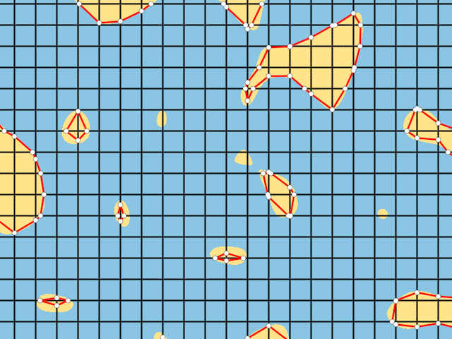
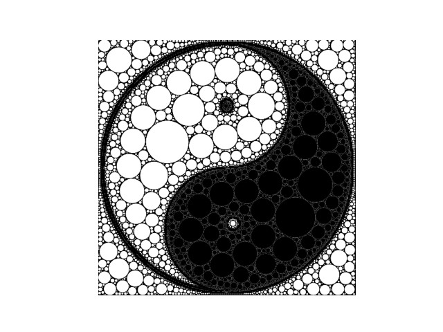

# Taichi Newsletter for November

## 📌 Highlights

- Taichi v1.4.0: Taichi AOT officially released the Taichi Runtime (TiRT) library for the Vulkan backend with C API.
- We are considering migrating the Taichi community from Slack to Discord. Let us know about your thoughts 👉  https://github.com/taichi-dev/taichi/issues/7206
- [Research paper](https://ieeexplore.ieee.org/document/10017344) on optical tactile sensors based on Taichi published in IEEE RA-L.

## ⚙️ Releases & development

- Taichi v1.4.0 is available! See what's new:
  - Taichi AOT now provides a native Taichi Runtime (TiRT) library with C API. Compiled Taichi kernels can be launched directly without a Python interpreter.
  - Compilation of Taichi kernels speeds up significantly, roughly 2x faster when ti.Matrix is heavily used.
  - Taichi ndarray, an array object that holds contiguous multi-dimensional data, is now released, allowing easy data exchange with external libraries.
  - Dynamic indexing is now supported on all backends. dynamic_index=True is no longer needed to access a vector/matrix with a runtime variable.
  - Support for sparse SNodes on the Metal backend has been removed.

Upgrade now 👉 pip install -U taichi==1.4.0. For more details and improvements, see the release note.

- 231 PRs have been merged and 39 issues resolved this month.👏
- The total number of commits surpassed 10,000. 🎉

## 🌟 Featured repos & projects

- **Research paper on optical tactile sensors based on MLS-MPM and implemented with Taichi has been published by IEEE RA-L**.

    Optical tactile sensors provide touch perception with sensing information derived from images. The simulation of such sensors often leverages optical simulation or data-driven image processing techniques, yet fails to consider elastomer deformation physics; the finite element method (FEM) is frequently used as well, which incurs high computational cost and yields unsatisfactory performance. [This paper](https://ieeexplore.ieee.org/document/10017344) proposes an optical tactile sensor simulator, Tacchi, based on the Moving Least Squares Material Point Method (MLS-MPM) and supported by the parallel computing language Taichi. It takes into account the elastomer deformation to generate realistic tactile images and reproduce the roughness of real-life object surfaces.

- **Marching squares algorithm implemented with Taichi**

    Taichi added a new example, marching squares, which generates contour lines of a 2D scalar field. The newly released feature [dynamic SNode](https://docs.taichi-lang.org/docs/sparse#dynamic-snode) is used to represent line segments, and linear interpolation is applied to smoothen the boundaries.

    

- **Image processing with circle packing**

    This project redraws an input image with circle packing, i.e., arranging circles to make some or all of them mutually tangent without creating overlaps. The program first runs Canny edge detection to detect the edges in the image and uses distance transform to get the minimum distance from each pixel to the edges. Circles are then packed into the image without creating any overlap. See the [source code](https://gist.github.com/neozhaoliang/02754b488de2de857a57e98ac6e59168).

    

- **A 3D fractal scene rendered in Taichi using space-folding and orbit-coloring**

  This is a 3D fractal scene rendered in Taichi by [@neozhaoliang](https://gist.github.com/neozhaoliang), adapted from artwork by [@gaziya5](https://twitter.com/gaziya5). The space-folding and orbit-coloring techniques are used: The project applies a series of transformations like translation, scaling, and sphere inversion to geometric shapes to form a fractal-like object, and tracks the orbit information of a point for coloring. Try [run this program on your device](https://gist.github.com/neozhaoliang/80d1f3299874c94640199c895b4d5709).

  

## 📝 Blogs

- **[Pythonic Supercomputing: Scaling Taichi Programs with MPI4Py](https://docs.taichi-lang.org/blog/scale-taichi-programs-with-mpi4py)**

  Can we run a Taichi program on a cluster of powerful GPU machines? [Haidong Lan](https://github.com/turbo0628) experimented with the combo of Taichi and MPI4y, and got exciting computing performance with dozens of lines of Python code. Read [this blog](https://docs.taichi-lang.org/blog/scale-taichi-programs-with-mpi4py) for more details

- **[GPU-Accelerated Collision Detection and Taichi DEM Optimization Challenge](https://docs.taichi-lang.org/blog/acclerate-collision-detection-with-taichi)**

  Collision detection of a large number of particles often imposes an algorithmic bottleneck. A commonly-used technique to reduce the time complexity of collision detection is grid-based neighborhood search, which confines the search for collision-prone particles to a small area. In this blog, [Yuanming Hu](https://github.com/yuanming-hu) and [Qian Bao](https://github.com/houkensjtu) demonstrate how to implement collision detection in Taichi based on a minimal DEM model and accelerate neighborhood search effectively using Taichi fields. See the complete code at https://github.com/taichi-dev/taichi_dem - acceleration achieved in less than 40 lines of code.

## 🙌 Welcome contribution

It's not complicated to contribute to Taichi at all! Go to [this page](https://github.com/taichi-dev/taichi/contribute) for issues tagged with good first issue (easy to start with) or with welcome contribution (slightly more challenging), and pick up whatever you are capable of.

We've selected a few:

- GGUI - mouse wheel event [#6938](https://github.com/taichi-dev/taichi/issues/6938)
- Supporting tuple types as struct members [#6856](https://github.com/taichi-dev/taichi/issues/6856)
- Request for the feature to get the size of ndarray in Taichi kernel. [#6799](https://github.com/taichi-dev/taichi/issues/6799)

Taichi values your contribution, which is indispensable to the prosperity of a healthy and vibrant community. Following are some useful references to help you get a more rewarding experience.

  - [Our contribution guidelines](https://docs.taichi-lang.org/docs/contributor_guide)

    Information about what to contribute and how to contribute to Taichi.

- [Taichi Lang's Kanban](https://github.com/orgs/taichi-dev/projects/1)

    Identify untaken, ongoing, closed, or fixed issues at a glance.

- [Join our discussions](https://github.com/taichi-dev/taichi/discussions)

    Our global forum for discussions about our features, bugs,  roadmaps, and more.

- [Awesome Taichi](https://github.com/taichi-dev/awesome-taichi)

  A curated list of awesome Taichi applications and resources.

Until next time! 👋