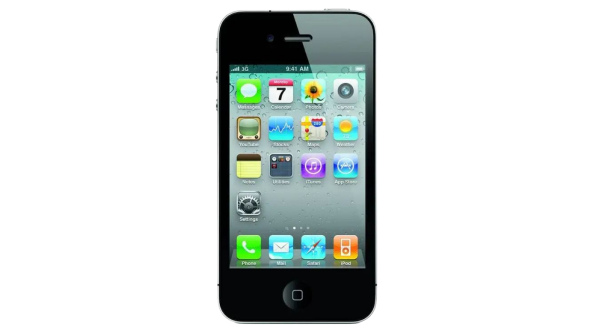
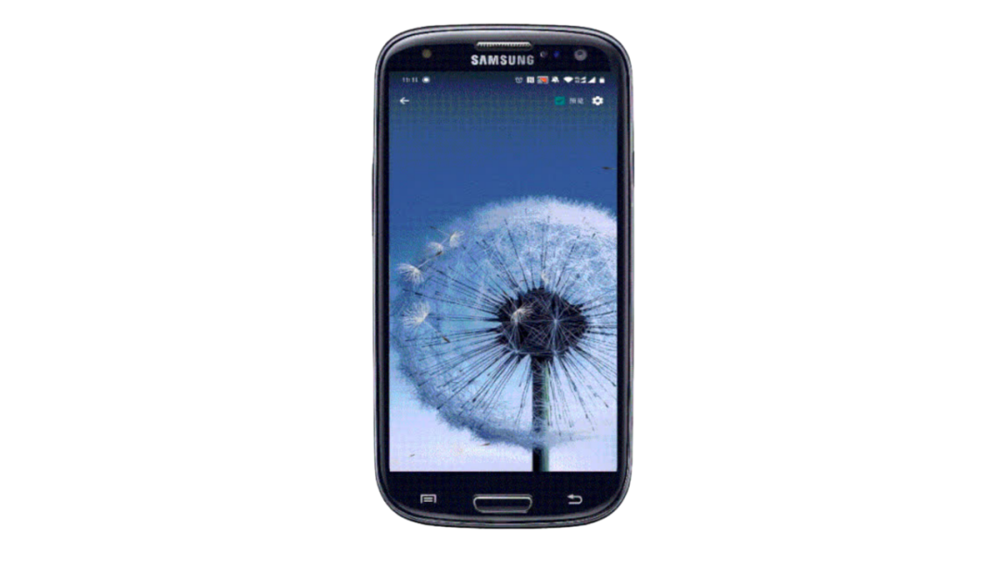
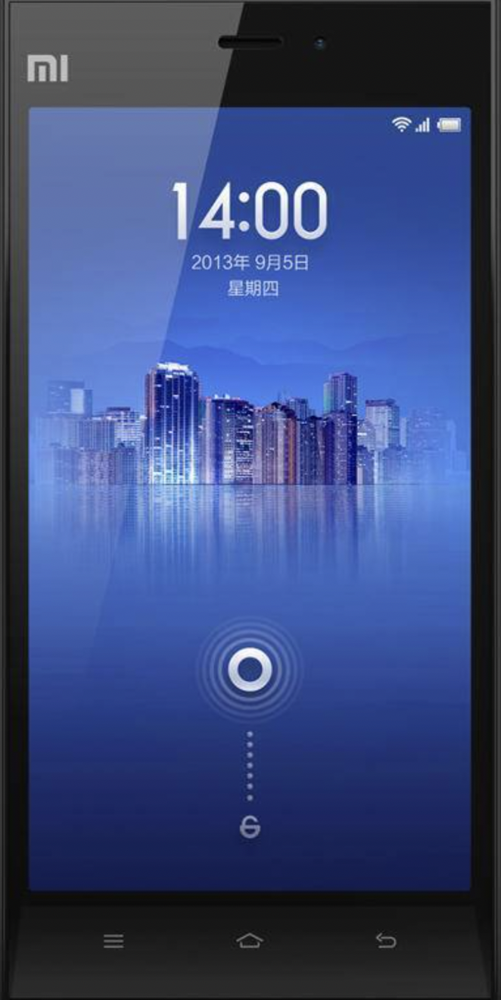
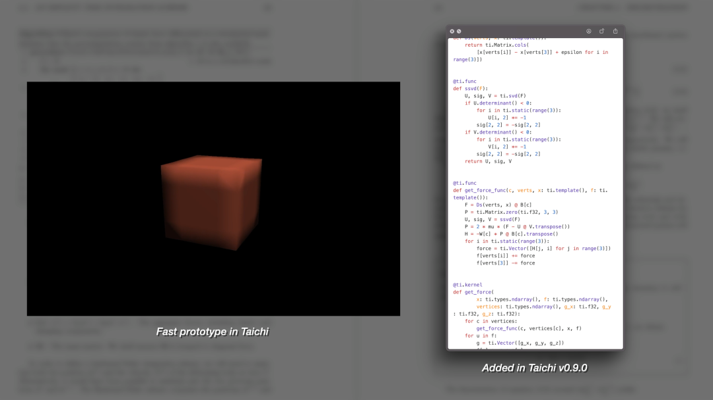

当你看到这张图片，有没有感觉似曾相识 🤔

换一张再看看👀

换成这样，你想起来了吗 😼

第一张雨滴壁纸最早出现在 iPhone 4，也就是乔布斯发布的最后一款手机，其简洁清爽的风格和奉行「极简主义」 的 iPhone 一起，开启了智能手机的新时代。第二张蒲公英的动态壁纸最早出现在三星 Galaxy S3，伴随手指的滑动，屏幕上泛起阵阵涟漪，两张标志性的壁纸承载了人们对苹果、三星争霸智能手机天下的初代回忆。

无独有偶，2013 年小米悬赏一百万征集手机壁纸，最后一张名为「山水楼」的壁纸拔得头筹。手机壁纸——一个看起来平淡无奇但其实大有不同的「符号」，与技术的变革一起，成为了一代又一代人的记忆烙印。

小米悬赏百万公开征集手机壁纸的获胜作品

>当壁纸成为印象工具，技术与审美双双突破创新。

2022 年 8 月，**由 OPPO 和 Taichi 编程语言联合开发、部署的物理壁纸在 OPPO 手机应用商店正式上线**。继 2021 年和快手合作魔法表情后，基于 Taichi 的物理仿真特效又一次在工业界落地，出现在公众视线。

本次共有 6 款手机壁纸基于 Taichi 编程语言联合开发、部署，通过物理模拟的方法，结合重力感应、触控，实时模拟物体在真实世界的运动，在手机上就可以体验影视级特效。

<video src="/video/oppo.mp4" controls></video>

「仿真原型」由经典的物质点法（Material Point Method）转变而来，仅用 128 行代码就在壁纸中模拟了雪、水、果冻的效果，并逼真地还原了物质间的碰撞交互。「流体模拟」壁纸可以直接用手指在屏幕上绘制五颜六色的漩涡，「雨滴」壁纸则呈现了烟雨濛濛的大上海，雨水渐浓，模糊视线，仿佛身临其境。「星系」壁纸中美轮美奂的鲸鱼、玫瑰、蝴蝶造型，「沙漏」壁纸中流光溢彩的液体，都采用了粒子法进行模拟。「太空」壁纸融合了物理模拟和光线追踪技术，呈现了宇航员的太空漫步，用户可以清晰地看到「Q 弹」的小宇航员以及他掠过飞船时映射的倒影。

值得一提的是，上述壁纸都是在 PC 上的 Python 环境中进行调试开发，通过 ti.aot.Module 导出 shader 后在手机端脱离 Python 环境运行的。**相比需要手写 shader 的传统移动端特效开发部署过程，Taichi 允许用户在所见即所得的 Python 环境中不断调试、迭代自己的算法，然后轻松地将其部署到基于不同硬件的移动端设备上。**

最早的 AOT 原型，壁纸中的宇航员由此演变而来

[Taichi AOT](https://docs.taichi-lang.org/blog/taichi-aot-the-solution-for-deploying-kernels-in-mobile-devices) 功能在今年 4 月发布的 Taichi v1.0.0 第一次与大家见面，这一功能将 Taichi 语言最擅长的物理模拟和移动端结合，在手机上即可呈现真实物理世界的交互和炫酷的视觉特效。在其背后，Taichi 的简单易用、跨平台的 GPU 加速支持等特性都是这些应用场景不可或缺的部分。

目前 Taichi 开发团队也依据项目落地过程中得到的反馈，正在进一步简化从 Python 到部署端的流程，提供更稳定的 API（包括新增对纹理的支持）、适配更广机型、提供性能更强的运行时库。欢迎感兴趣的开发者提前联系我们试用提供反馈。

目前，Taichi 与 OPPO 联合开发、部署的体验尝鲜性物理壁纸已经可以在 OPPO 应用商店下载，搜索「物光壁纸」即可体验。
