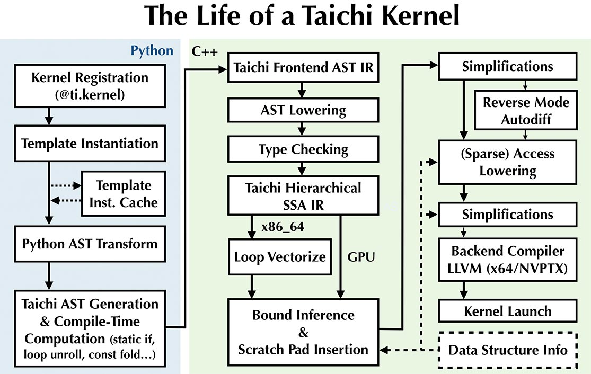

# Documentation Writing Guide

Thank you for your contribution! This article briefly introduces syntax that will help you write documentation on this website. Thank you for your contribution! This article briefly introduces syntax that will help you write documentation on this website. Note, the documentation is written in an extended version of [Markdown](https://daringfireball.net/projects/markdown/syntax), so for most of the time, you don't need special syntax besides the basic markdown syntax.

## 1. 1. Insert code blocks

This site supports inserting code blocks with highlighted lines, for examples, the following:

````md
```python {1-2,4,6}
@ti.kernel
def paint(t: float):
    for i, j in pixels:  # Parallized over all pixels
        c = ti.Vector([-0.8, ti.cos(t) * 0.2])
        z = ti.Vector([i / n - 1, j / n - 0.5]) * 2
        iterations = 0
        while z.norm() < 20 and iterations < 50:
            z = complex_sqr(z) + c
            iterations += 1
        pixels[i, j] = 1 - iterations * 0.02
````
````

will result in a code block like:

```python {1-2,4,6}
@ti.kernel
def paint(t: float):
    for i, j in pixels:  # Parallized over all pixels
        c = ti.Vector([-0.8, ti.cos(t) * 0.2])
        z = ti.Vector([i / n - 1, j / n - 0.5]) * 2
        iterations = 0
        while z.norm() < 20 and iterations < 50:
            z = complex_sqr(z) + c
            iterations += 1
        pixels[i, j] = 1 - iterations * 0.02
````

## 2. 2. Insert tables

```md
| Some Table Col 1 | Some Table Col 2 |
| :--------------: | :--------------: |
|       Val1       |       Val4       |
|       Val2       |       Val5       |
|       Val3       |       Val6       |
```

| Some Table Col 1 | Some Table Col 2 |
|:----------------:|:----------------:|
|       Val1       |       Val4       |
|       Val2       |       Val5       |
|       Val3       |       Val6       |

::: tip TIP It's worth mentioning that [Tables Generator](https://www.tablesgenerator.com/markdown_tables) is a great tool for generating and re-formatting markdown tables. ::: :::

## 3. 3. Cross-reference and anchor

To link to another section within the same article, you would use `[Return to ## 1. To link to another section within the same article, you would use <code>[Return to ## 1. Insert code blocks](#_1-insert-code-blocks)`: [Return to ## 1. Insert code blocks](#_1-insert-code-blocks). Insert code blocks</a>.

To link to sections in other articles, use the following syntax (note the relative paths):

- `[Return to Contribution guidelines](./contributor_guide)`: [Return to Contribution guidelines](./contributor_guide)
- `[Return to Contribution guidelines](./contributor_guide.md)`: [Return to Contribution guidelines](./contributor_guide.md)
- `[Return to The Documentation](../docs/develop/documentation/overview/hello.md#portability)`: [Return to The Documentation](../docs/develop/documentation/overview/hello.md#portability)

## 4. 4. Centered text block

To make a text block centered, use:

```md
<center>
Centered Text Block!
</center>
</center>
```

<center>
Centered Text Block!
</center>

::: danger NOTE For images, you **HAVE TO** insert blank lines to make them work:

```md
<center>


</center>
```

:::

## 5. 5. Text with color backgorund

You could use the following to highlight your text:

```html
<span id="inline-blue"> Text with blue background </span>,
<span id="inline-purple"> Text with purple background </span>,
<span id="inline-yellow"> Text with yellow background </span>,
<span id="inline-green"> Text with green background </span>
```

<span id="inline-blue"> Text with blue background </span>, <span id="inline-purple"> Text with purple background </span>, <span id="inline-yellow"> Text with yellow background </span>, <span id="inline-green"> Text with green background </span>

You could also use the markdown-it syntax `==My text==` to achieve similar result: ==My text==.

## 6. 6. Custom containers

As we already saw in this guide several places, we could add custom containers:

```md
::: tip
This is a tip without title!
:::
:::
```

::: tip This is a tip without title! ::: :::

```md
::: tip
This is a tip with a title!
:::
:::
```

::: tip TITLE This is a tip with a title! ::: :::

```md
::: note
This is a note!
:::
:::
```

::: note This is a note! ::: :::

```md WARNING
::: warning
This is a warning!
:::
:::
```

::: warning WARNING This is a warning! ::: :::

```md
::: danger DANGER
This is a danger!
:::
:::
```

::: danger DANGER This is a danger! ::: :::

```md
::: details SUMMARY
Details by default are hidden!
:::
:::
```

::: details SUMMARY Details by default are hidden! ::: :::

## 7. 7. Code groups

You could also insert tab-based code groups:

<code-group>
<code-block title="Python"></p>

<pre><code class="python" spaces="0" spaces-closing-marker="0" marker="```" spaces-after-opening-marker="0" line-breaks-before="1">print("Hello World")
</code></pre>
</code-block>

<code-block title="C++">&lt;/p>

&lt;pre>&lt;code class="cpp" spaces="0" spaces-closing-marker="0" marker="```" spaces-after-opening-marker="0" line-breaks-before="1">#include&lt;iostream&gt;

using namespace std;

int main()
{
// prints hello world
cout&lt;&lt;"Hello World";

    return 0;

}

</code></pre>
</code-block> </code-group>

## 8. 8. Footnotes

It is important to cite the references, to do so, use the `markdown-it`'s footnotes syntax:

```md
This sentence has a footnote[^1]. (See footnote at the bottom of this guide.)

[^1]: I'm a footnote! (See footnote at the bottom of this guide.)

[^1]: I'm a footnote!
```

which results in:

---

This sentence has a footnote[^1]. (See footnote at the bottom of this guide.) (See footnote at the bottom of this guide.)

---

We could also write in-line footnotes, which is much easier to write without counting back and forth:

```md
This sentence has another footnote ^[I'm another footnote] (See footnote at the bottom of this page.)
```

which has the same effect:

---

This sentence has another footnote ^\[I'm another footnote\] (See footnote at the bottom of this page.)

---

## 9. 9. Insert images

Insert images is as straight-forward as using the ordinary markdown syntax:

```md

```


you could also use syntax like the following to resize:

```md

```

!\[kernel\](./life_of_kernel_lowres.jpg =500x300)

## 10. 10. Insert Table of Contents (ToC)

You could use:

```md
[[toc]]
```

to insert in-line ToC:

[[toc]]

## 11. 11. Insert badges

You could add a variety of badges along with the text:

```md
<Badge text="hello!" type="tip"/>
<Badge text="hello!" type="tip" vertical="middle"/>
```

<Badge text="hello!" type="tip"/> <Badge text="hello!" type="tip" vertical="middle"/>

```md
<Badge text="hello!" type="warning"/>
<Badge text="hello!" type="warning" vertical="middle"/>
```

<Badge text="hello!" type="warning"/> <Badge text="hello!" type="warning" vertical="middle"/>

```md
<Badge text="hello!" type="error"/>
<Badge text="hello!" type="error" vertical="middle"/>
```

<Badge text="hello!" type="error"/> <Badge text="hello!" type="error" vertical="middle"/>

[^1]: I'm a footnote!
